# 如何在 VirtualBox 中安装 Parrot OS？

> 原文:[https://www . geeksforgeeks . org/如何安装-parrot-os-in-virtualbox/](https://www.geeksforgeeks.org/how-to-install-parrot-os-in-virtualbox/)

**Parrot OS :**
Parrot 类似于 Kali Linux，这意味着它也被用于安全目的和道德黑客。与 Kali 类似，它也是一个基于 Linux 的发行版。现在问题来了，卡利和鹦鹉哪个更好。这两个操作系统都支持 32 位和 64 位架构，支持云虚拟专用网，支持嵌入式和物联网设备，并预装了一系列黑客工具。所以，从软件的角度来看，两者大致不同。
说到硬件，他们略有不同:

<figure class="table">

| **鹦鹉 OS** | **卡利** |
| 不需要图形加速 | 需要图形加速 |
| 320MB RAM

 | 1GB RAM |
| 1GHZ 双核 CPU | 1GHZ 双核 CPU |
| 可以在旧版和 UEFI 中启动 | 可以在旧版和 UEFI 中启动 |
| 16GB 硬盘空间 | 20GB 硬盘空间 |

因此，我们可以清楚地看到，在硬件上，鹦鹉操作系统相当成功，因为由于其轻量级的特性，它需要更少的内存来工作，并且它的安装也相当容易。因此，任何人都可以安装 Parrot OS，无论是初学者还是安全专业人士。

我们也可以在双引导中使用 Parrot OS，但是对于初学者来说，最好将其安装在 VirtualBox 中，以便他们首先学习如何使用 Linux 命令，学习使用其安全工具等等。使用 VirtualBox 的好处是，如果操作系统以某种方式损坏或崩溃，那么它不会损害您的基本操作系统，因为它安装在虚拟环境中，我们可以随时删除它。

**鹦鹉 OS 的先决条件:**

*   在另一个操作系统上至少应该有 16GB 的可用磁盘空间。
*   可以从[这里](https://download.parrot.sh/parrot/iso/4.11.2/Parrot-security-4.11.2_amd64.iso.mirrorlist)下载的 Parrot OS ISO 文件
*   在 Windows 上安装虚拟盒。参考文章–[安装虚拟盒](https://www.geeksforgeeks.org/how-to-install-virtualbox-on-windows/)
*   硬盘上至少有 5-10 GB 的可用空间
*   建议至少使用 4GB 的内存，但最好使用 8GB 的内存，以便顺利工作。

**鹦鹉是给谁做的:**

*   安全专家
*   数字取证专家
*   计算机科学/工程学生
*   研究人员
*   想成为黑客的人
*   软件开发人员
*   记者、黑客主义者和告密者
*   警官和安全机构

有关 Parrot OS 的更多信息，请访问其网站[此处](https://www.parrotsec.org/)，要了解其用法，您可以参考其[文档](https://docs.parrotlinux.org/)。

**在 VirtualBox 中安装 Parrot OS:**
**1。**打开虚拟框，点击新建按钮。

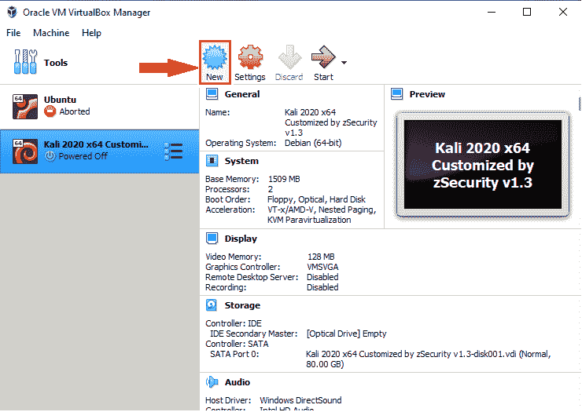

**2。**给你的虚拟机命名，添加机器文件夹，类型=Linux，版本为 Debian (64 位)。点击下一步。
机器文件夹是保存虚拟操作系统实例的位置。您不需要提供它，它会自动选择其默认位置。

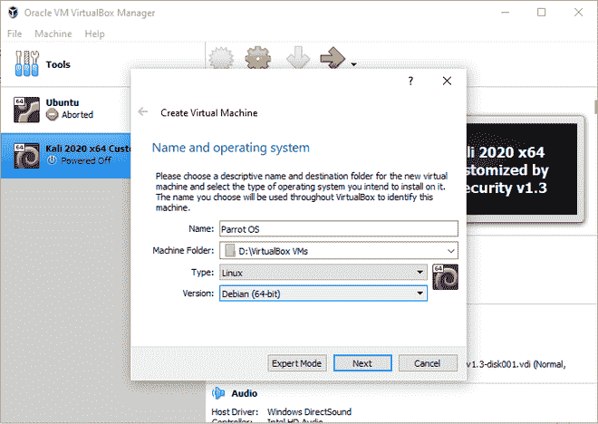

**3。**现在，要为虚拟机分配内存大小，如果您有 4GB 的内存，请至少提供 15045MB 的内存大小，以便您的虚拟机以及您的本地机器都能顺利工作。对于 8GB 及以上的内存，可以给出 2048MB 到 4096MB 的内存大小。点击下一步。

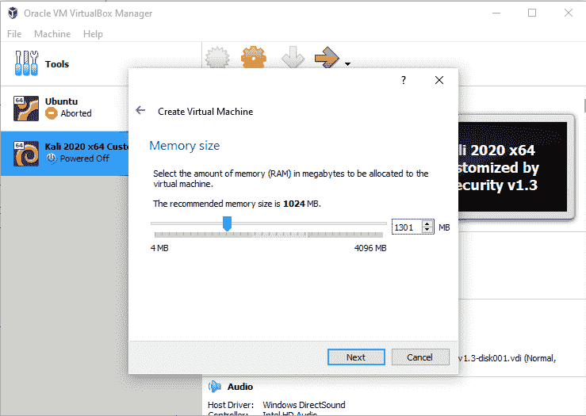

**4。**选择“立即创建虚拟硬盘”选项，然后点击创建按钮。

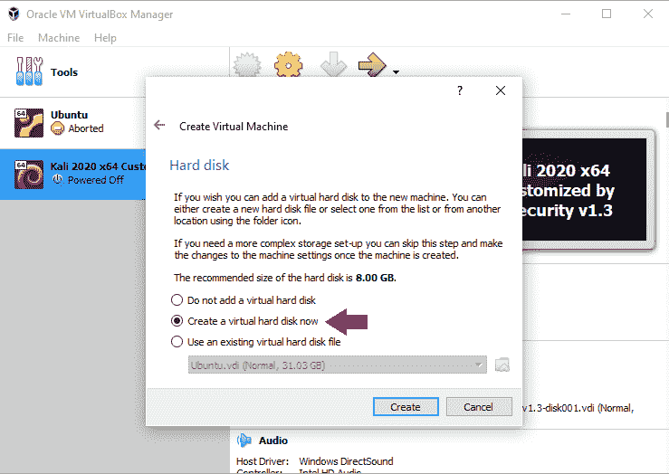

**5。**现在选择虚拟硬盘的硬盘类型(日常使用最好选择 VDI)。点击下一步

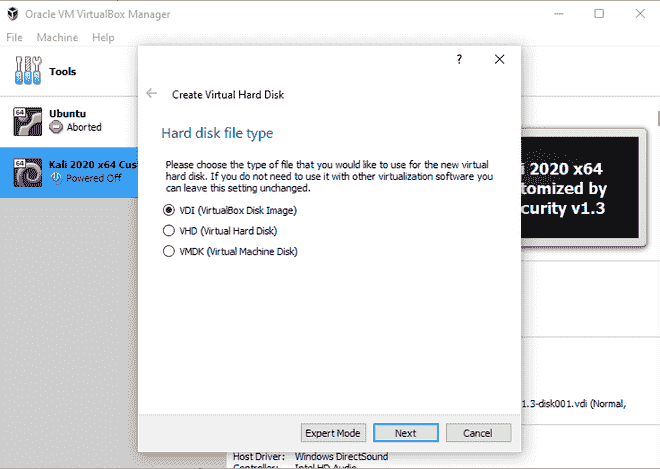

**6。**现在选择物理硬盘上动态分配的存储空间。

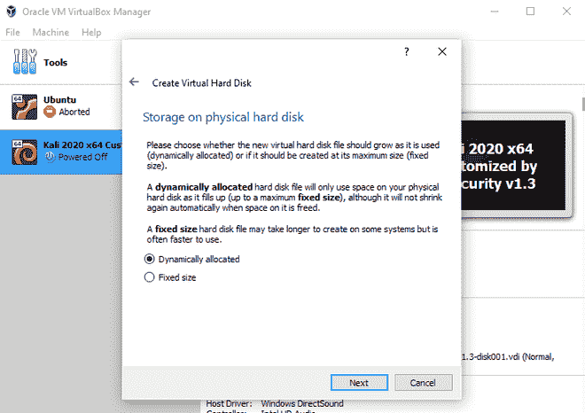

**7。**给虚拟硬盘大小，推荐大小是 20GB 但是你也可以给的比它大。该位置应保留为默认位置。现在点击创建按钮。

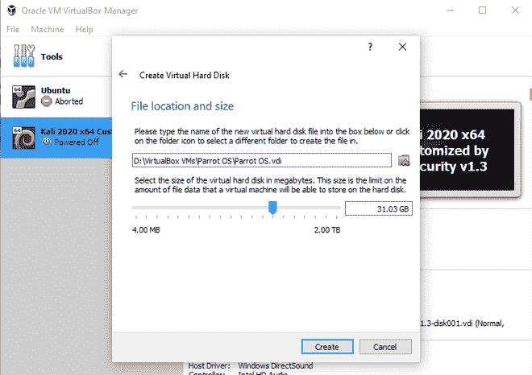

**8。**过程完成后，右键单击您创建的机器名称并打开设置。

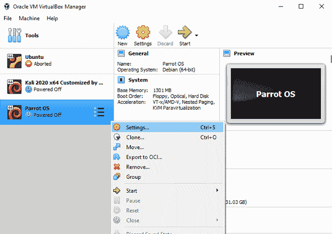

**9。**在左窗格的设置窗口中，选择系统，然后在主板中，单击引导顺序中的网络选项以启用它。

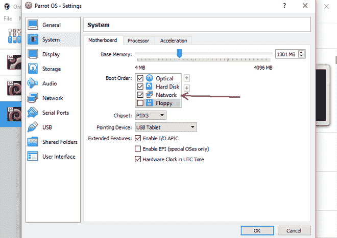

**10。**在处理器部分，提供 2 个处理器，以实现流畅的性能。

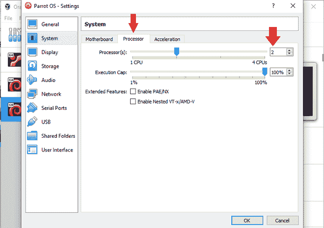

**11 时。**在左窗格中，再次单击存储选项，然后选择中间窗格中“控制器:IDE”下给出的“空”选项，然后单击“光驱”右侧右窗格中给出的光盘映像。
下图中用 1、2、3 的顺序标注。

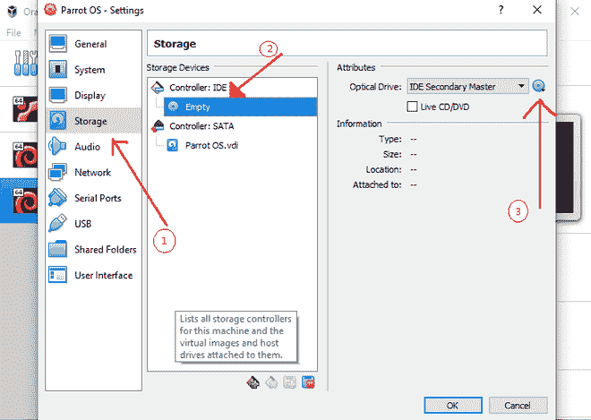

**12 时。**点击选择一个磁盘文件，并将其导航到您下载的 Parrot OS ISO 映像所在的位置。然后点击打开

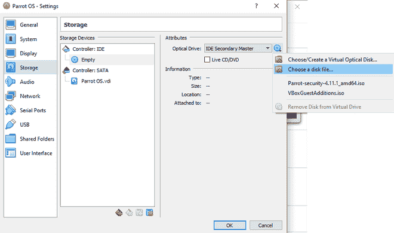 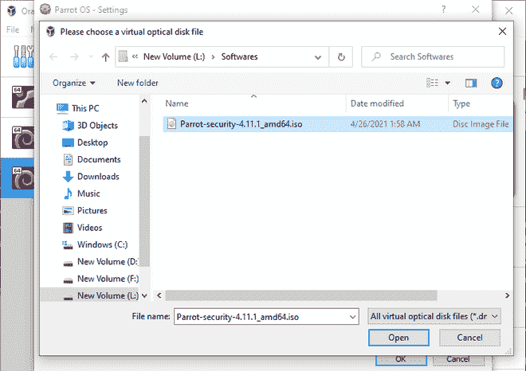

**13。**在左窗格的网络部分，选择桥接适配器在虚拟机中使用互联网。如果你不能在你的虚拟设备上上网，那是没有用的。现在点击底部的确定。

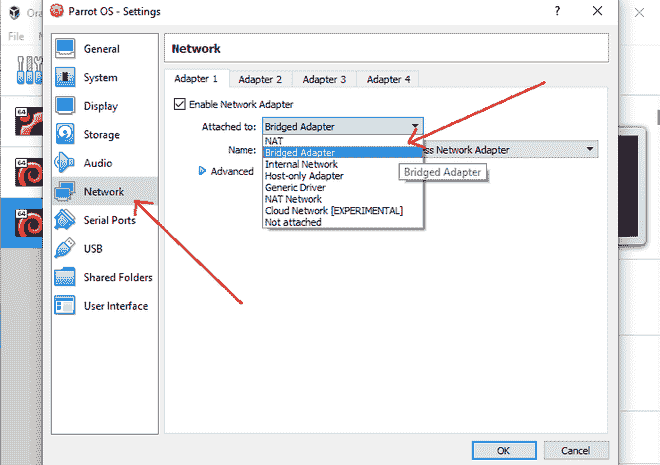

**14。**现在所有的设置都完成了，并且提供了 ISO 位置。单击开始开始安装。

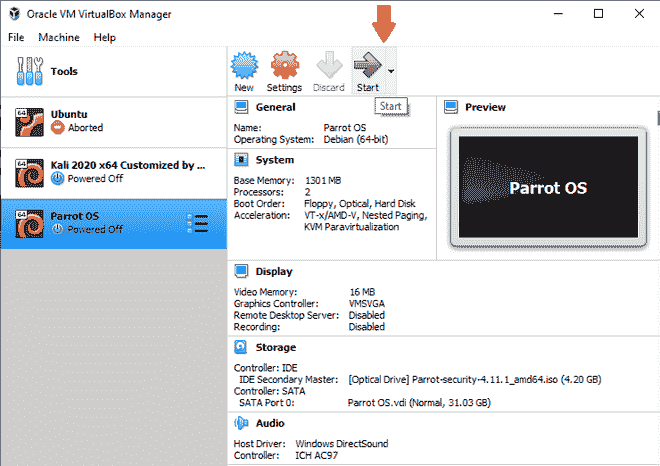

**15。**有两种安装方式，第一种是选择实时模式，第二种是选择安装选项，两种方式都一样。我们将使用第一种方法
在左窗格中选择 Parrot 操作系统，然后单击开始进行安装。

**16。**一旦安装开始，它会提示您选择要安装的国际标准化组织文件，因为我们已经在设置中给出了它的路径。我们可以看到选定的 iso 映像，因此单击开始按钮启动安装。

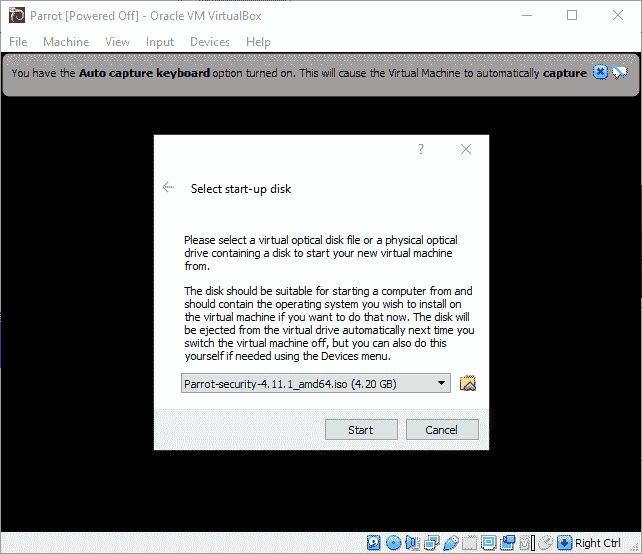

**17。**点击直播模式。它将直接启动你的鹦鹉操作系统，你可以看到它的主屏幕。从那里我们可以继续安装。

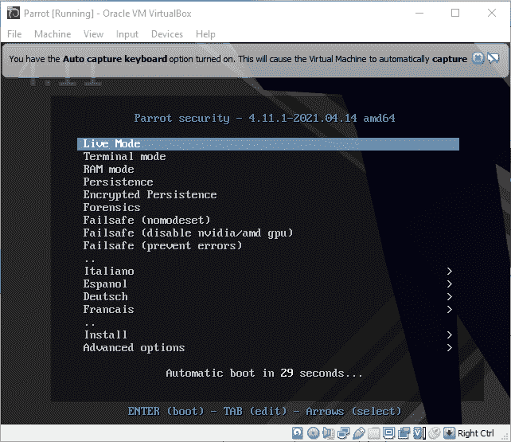

**18。**在其主屏幕中，选择安装鹦鹉开始安装。

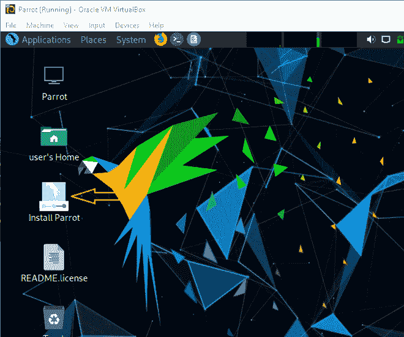

**18。**提供您的位置。点击下一步。

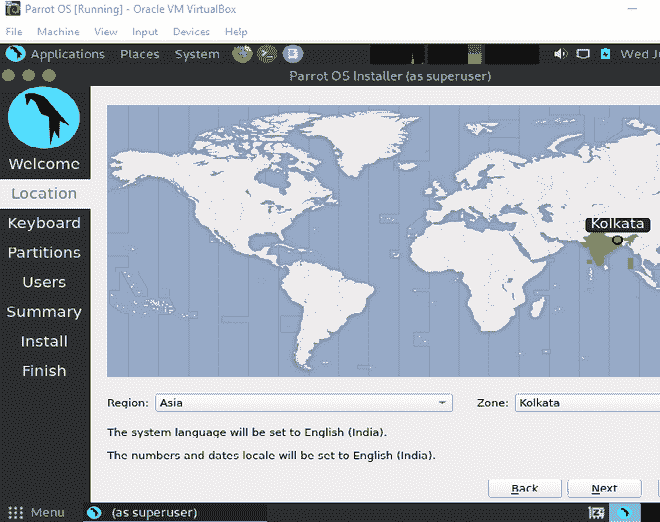

**19。**根据你的键盘选择默认语言(以下为 QUERTY 键盘布局选择。

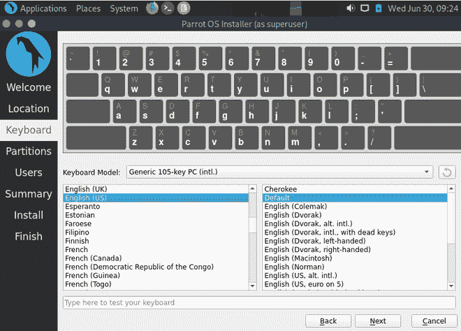

**20。**点击“擦除磁盘”单选按钮(推荐初学者使用)。它会根据您提供给它的大小自动对您的虚拟磁盘进行分区。点击下一步。

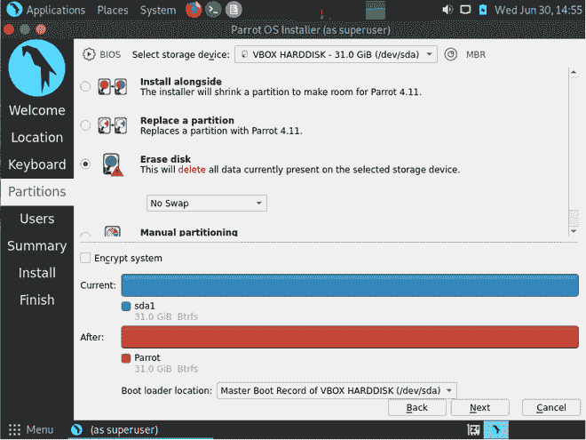

**21。**最后，您只需要创建一个用户(根用户)和密码，就可以随时访问它，这样就可以保存您的数据。

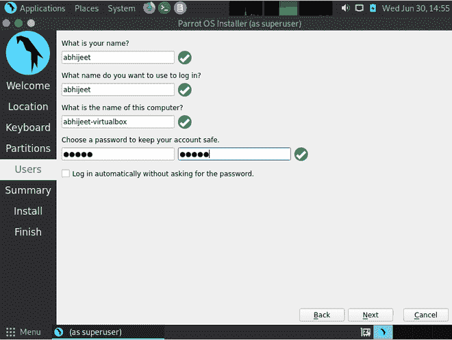

**22。**在最后一页，它将显示您迄今为止选择或完成的所有设置，以便您可以在最终安装程序开始之前最后验证一次。

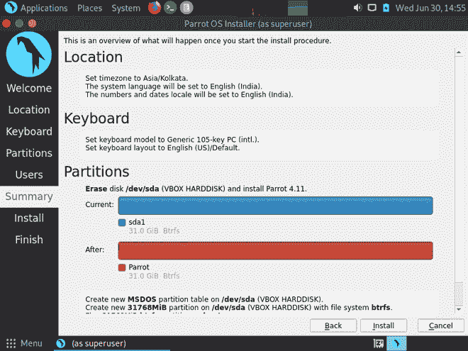

**23。**验证后，如果您不满意并更改了一些设置，那么您可以单击“上一步”按钮或单击“取消”按钮。如果满意，则点击安装按钮，它会提示您继续安装，然后点击立即安装，开始安装。

**24。**现在我们只需要等待至少 20-30 分钟就可以完成安装。完成后，会提示重启。单击它重新启动，这样您的虚拟机将保存所有必要的更改。

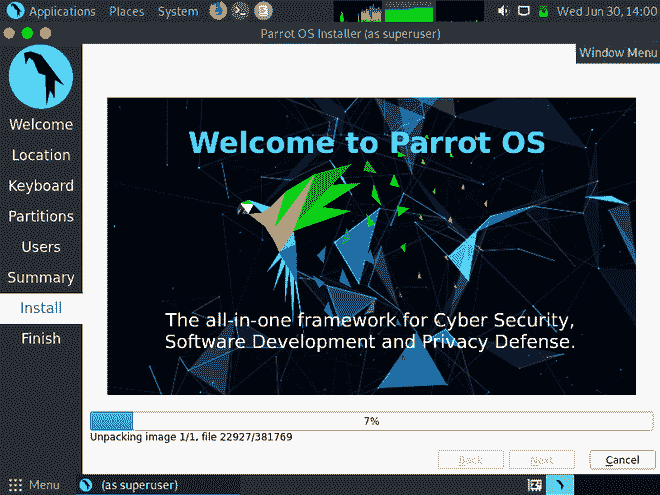

**25。**重启后你会看到它不是全屏的，在上面工作也挺烦人的。因此，为了解决这样的问题，VirtualBox 包括 Guest Additions iso 来安装它，并使其全屏以增强其用户体验。

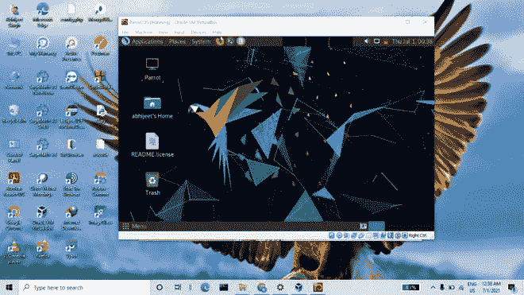

**将 VirtualBox 调整为全屏:**
**1。**启动你的 Parrot OS 虚拟机，点击“Parrot GNU/Linux”选项或者什么都不做，因为它会在 5 秒后自动打开 Parrot GNU/Linux。

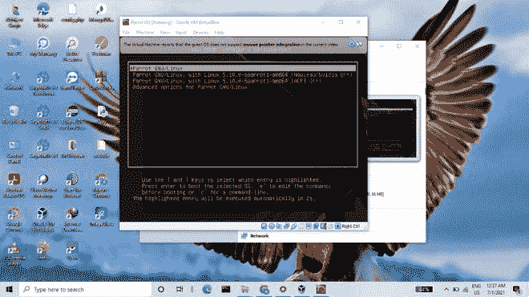

**2。**登录系统，在菜单栏顶部，点击设备，选择“插入来宾添加光盘映像”。这将为您的 Linux 发行版添加来宾添加 iso 映像，帮助它适应屏幕。

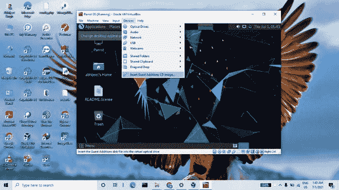

**3。**现在打开文件夹路径“/media/ <用户名> /”到达添加此映像的文件夹位置(用户名是您在安装过程中创建用户时提供的名称)。

**4。**右键点击页面，选择“终端打开”。
现在我们运行几个命令来安装来宾操作系统，它将为您的虚拟机启用全屏模式。

**命令–**
**$ sudo su**
会提示你输入密码:<密码>(密码文本隐藏，不要慌)然后点击回车。
通过这种方式，你成为了根用户

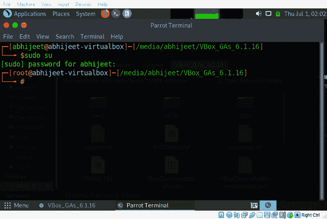

5.将文件“VBoxLinuxAdditions.run”的模式更改为可执行，然后运行该文件安装 Guest Additions。
**命令–**
**# chmod+x vboxlinuxadditions . run**
它会将上述文件的模式改为可执行。
**#。运行**
它将安装来宾添加

 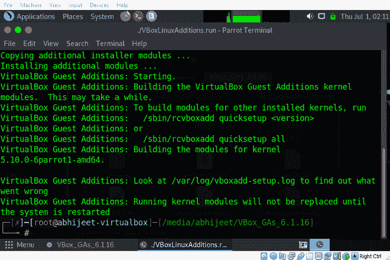

**6。**安装完成以应用更改后，重新启动虚拟机。

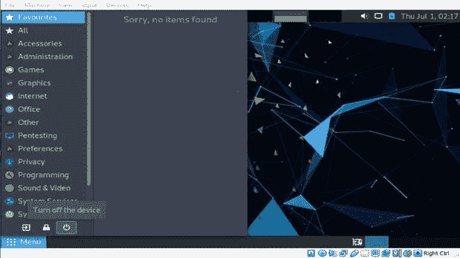

**7。**重启后，要让你的虚拟机全屏要么点击右上角。最大化按钮或按键盘上的“主机+F”(主机按钮是右下方的 CTRL 按钮)。

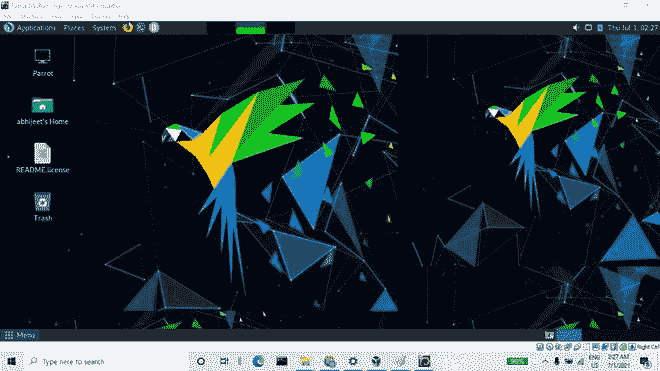

现在，您的鹦鹉操作系统已成功安装在 VirtualBox 中，并具备所需的所有基本功能。要关闭您的鹦鹉操作系统，请执行步骤 6，它将自动关闭您的虚拟机。

</figure>