# 如何在 VMware 中安装 Parrot OS？

> 原文:[https://www . geesforgeks . org/如何安装-parrot-OS-in-VMware-workstation/](https://www.geeksforgeeks.org/how-to-install-parrot-os-in-vmware-workstation/)

Parrot Linux 是一个基于 Debian Testing 的免费开源 GNU/Linux 发行版。该操作系统主要用于安全研究和渗透测试。是安全初学者和专家的最佳 Linux 操作系统。它已经预装了渗透和道德黑客所需的各种工具。甚至你可以开发自己的脚本和程序。

### VMware 工作站:

VMware 是 Hyper-V 的，它能够在不丢失主机系统的情况下运行不同的操作系统。它可以用于跨一系列不同的设备、平台和云构建、测试和演示软件。IT 专业人员、开发人员和企业依靠工作站来轻松运行复杂的本地虚拟环境来模拟操作系统。保存您的工作很容易，不会丢失任何数据或物理硬件。您可以随时添加或删除任何操作系统。

### 鹦鹉操作系统的先决条件:

1.  从这里下载鹦鹉操作系统 ISO-[鹦鹉下载](https://www.parrotsec.org/download/)。
2.  从这里安装 VMware Workstation 的最新版本- [VMware 下载](https://www.vmware.com/in/products/workstation-pro/workstation-pro-evaluation.html)。
3.  你至少需要一个 1GHz 的 CPU。
4.  至少你需要 1GB 的内存。
5.  硬盘中至少有 20-30GB 的可用空间。

### 安装:

按照步骤在 Vmware 工作站中安装鹦鹉操作系统

**注:**部分照片未提及，减少步骤和流程。跟着台阶走。

这有助于初学者安全轻松地安装。

**步骤 1:** 确保您已经启用了虚拟化。

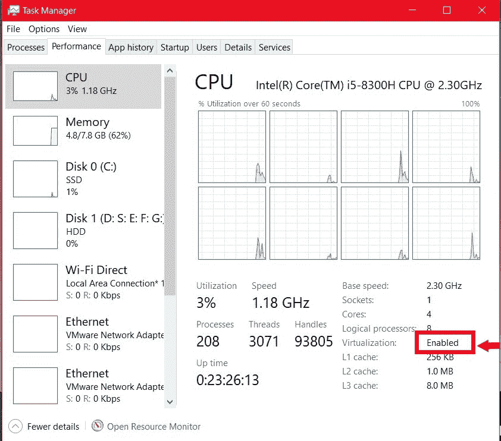

如果它被禁用，请参阅文章末尾

**步骤 2:** 只需以管理员权限运行 VMware 工作站。界面如下图所示。单击“创建新虚拟机”。

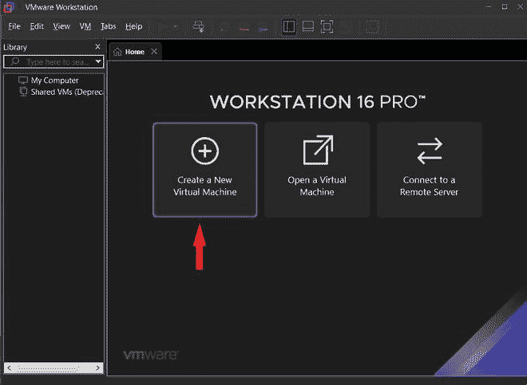

**步骤 3:** 浏览 Parrot OS ISO 文件的位置。请确保它是从官方页面下载的，并且应该完全下载，没有任何网络错误。它可能会引起文件的费力。单击下一步

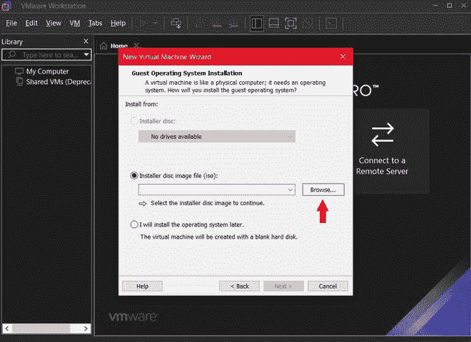

**第四步:**只需忽略图中所示的小心⚠。因为 VMware 已经将其预配置标识为哪个操作系统/国际标准化组织。单击下一步

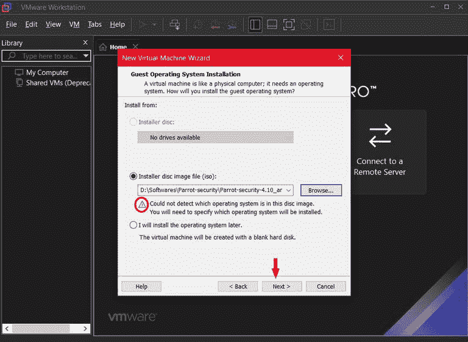

**第五步:**现在需要选择 Guest OS 作为“Linux”，版本可以选择是 Ubuntu 还是 Ubuntu 64 位。

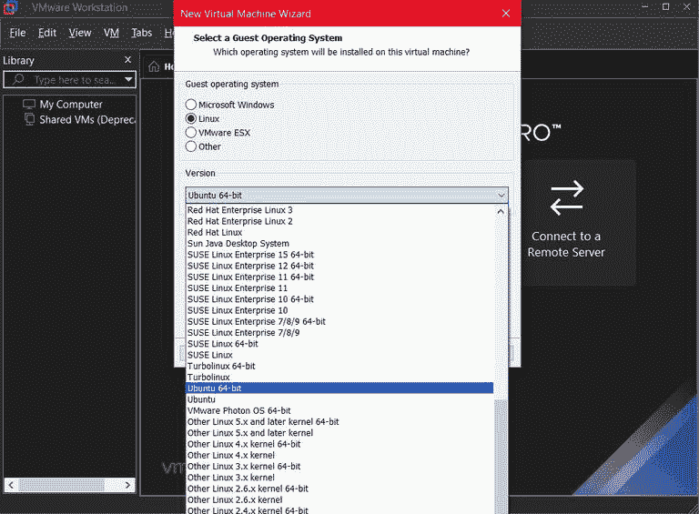

**步骤 6:** 给出您的客户操作系统的名称。比如让我参考一下是哪个操作系统。因为我习惯在 VMware 中安装不同的操作系统。因此，有了这个名字，我们就可以识别它是哪个操作系统。**位置**:如果需要在特定目录下安装/添加，选择浏览图中所示选项点击下一步。

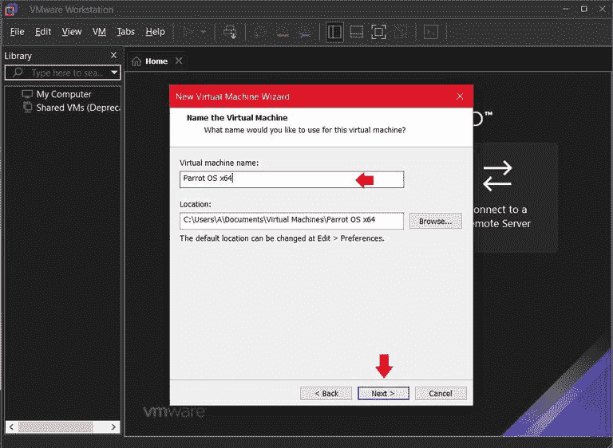

**第七步:**这里主要是你要分配一定的存储量我已经分配了 20GB。甚至您可以在创建虚拟机后扩展存储。单击下一步。

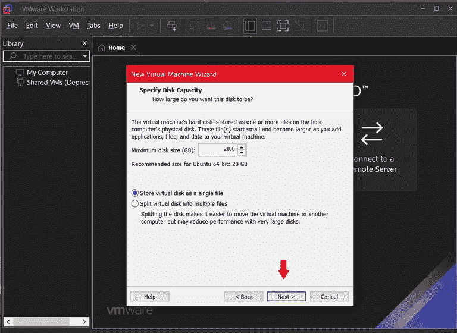

**第 8 步:**您可以总结硬件属性名称、位置、操作系统、内存、网络适配器和其他设备。单击完成。

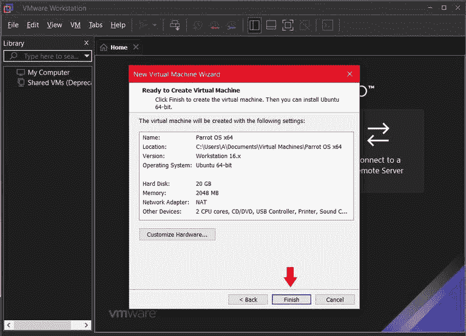

**第九步:**不要担心是否需要根据需要更改一些设置。单击编辑虚拟机。

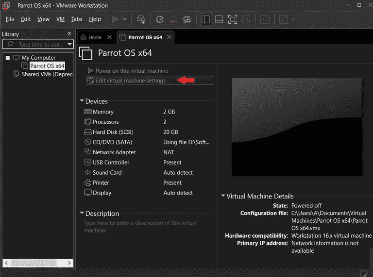

**第 10 步:**完成上述步骤后。您可以根据需要添加或扩展内存或存储空间。这里是找到影响客户操作系统的每个选项的地方。一个新的界面将弹出点击添加选项显示在底部。这是添加硬件要求，您可以选择硬件类型。如果你需要一台打印机。

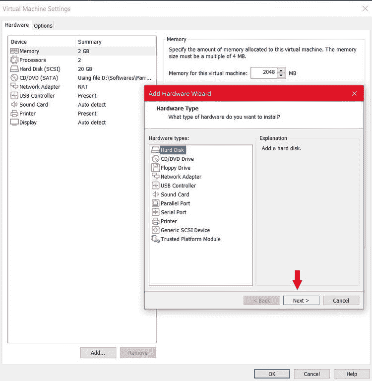

**第 11 步:**该步为可选项。因为用户可以对其做出决定。

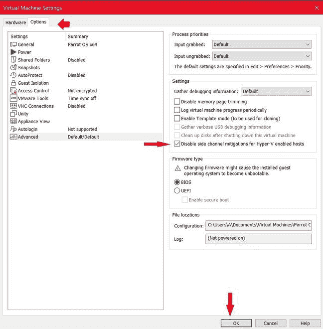

**步骤 12:** 现在启动 Parrot VM。

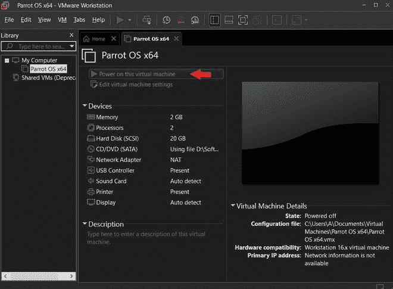

**第 13 步:**选择需要可选安装。

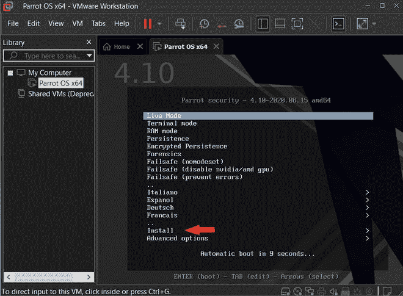

在下一步中，您将到达安装者选择**标准安装者。**在下一步中，你需要选择 *<u>语言、位置、键盘</u>* 。

**第 14 步:**您需要创建 ***ROOT 用户名和密码。***

**注意:**一定要时刻记住。

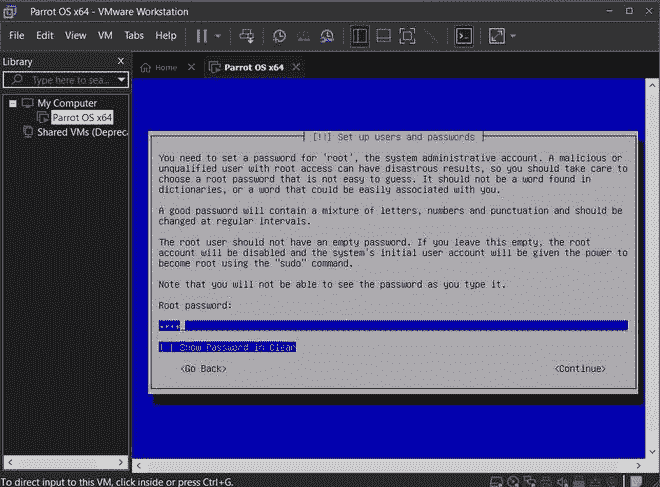

**第 15 步:**这里是**用户。**输入您的全名，接下来，您可以输入用户帐户的**昵称和密码**。

*   它应该不同于根密码。
*   确保您需要记住用户密码。

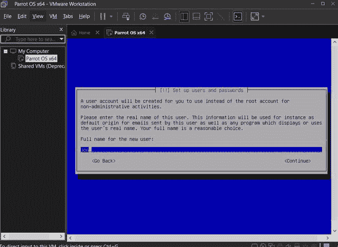

**步骤 16:** 分区磁盘:使用整个磁盘。

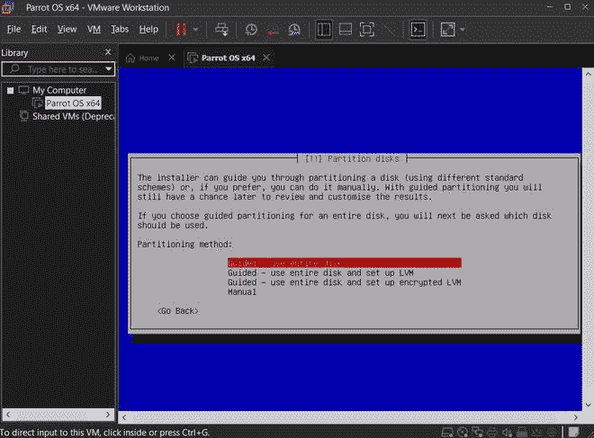 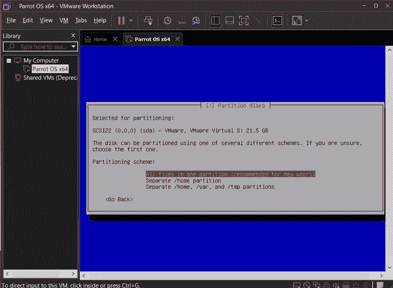

完成磁盘分区选择后，单击完成。

**第 17 步:交换空间:**如果你给的内存小于 4GB。您可以创建一个交换内存。现代电脑不需要。如果不想给交换空间，选择选项 ***否*** 将更改写入分区。

**步骤 18: GRUB 引导加载程序:**可以在分区磁盘中安装 GRUB 加载程序。

*   如果您需要在另一个分区安装 GRUB，请选择手动。选择安装 GRUB 所需的磁盘。

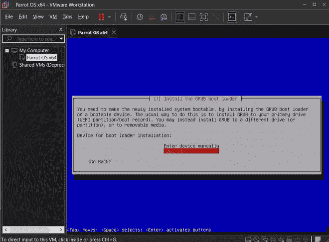

**第 19 步:**这里是安装结束。我认为它很小，但它是一个安全的装置。现在它重新启动系统。

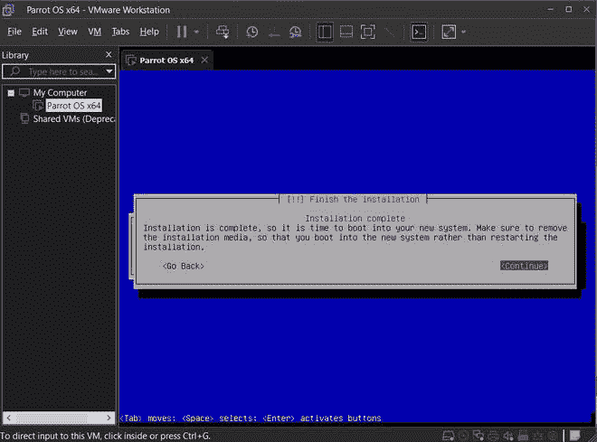

**第 20 步:**这是**用户**登录的视图。我们将获得在第 16 步中给出的用户名。现在您需要输入用户密码。

*   记住根密码和用户密码必须不同。

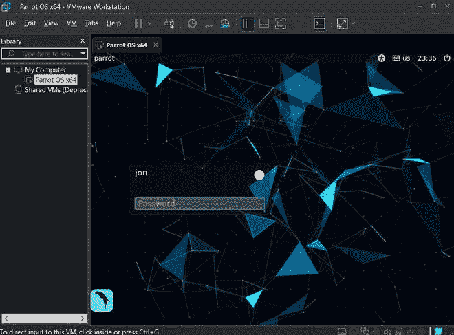