# 如何在 Windows 10 中修改 MAC 地址(有线和无线适配器)？

> 原文:[https://www . geesforgeks . org/如何修改 windows 10 中的 mac 地址-有线和无线适配器/](https://www.geeksforgeeks.org/how-to-modify-mac-address-in-windows-10-both-wired-and-wireless-adapter/)

先决条件–[介绍媒体访问控制地址](https://www.geeksforgeeks.org/introduction-of-mac-address-in-computer-network/)，以及[媒体访问控制地址和 IP 地址的区别](https://www.geeksforgeeks.org/difference-between-mac-address-and-ip-address/)

媒体访问控制地址本质上是唯一的，它分配给网络接口卡，在网络通信中用作网络地址。在开放系统互连网络模型中，这些地址在数据链路层下使用。具有多个网络接口的网络节点，如路由器和多层交换机，每个网卡应该有一个 MAC 地址。媒体访问控制地址通常用于不同的目的:

*   **静态 IP 分配:**
    路由器允许您为电脑分配静态 IP。
*   **媒体访问控制地址过滤:**
    网络可以利用这个选项，只允许具有显式媒体访问控制地址的小工具与系统接口。
*   **MAC 认证:**
    一些互联网专家合作可能需要使用 MAC 地址进行验证，并且只允许具有该 MAC 地址的小工具与互联网相关联。
*   **设备识别:**
    许多航空终端 Wi-Fi 系统和其他开放式 Wi-Fi 系统利用小工具的 MAC 地址来识别它。
*   **设备追踪:**
    因为它们在本质上是与众不同的，MAC 可以用来跟踪你。

**注意:仅出于道德目的使用以下步骤。**

**简易方法:**

**步骤 1:** 右键单击位于屏幕左下角的窗口开始按钮。

**步骤 2:** 选择设备管理器选项。

**现在，首先我们要更改以太网(有线介质)适配器的 MAC 地址。**

**步骤 3:** 点击网络适配器。

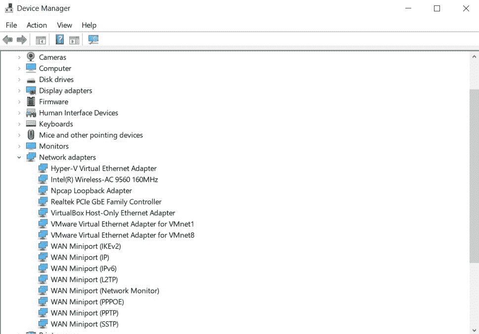

**步骤 4:** 右键单击要更改的网络适配器(在本例中为以太网卡，即“Realtek PCIe Gbe 系列控制器”)，然后选择属性选项。

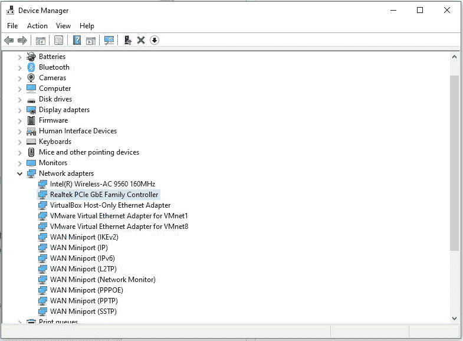

**步骤 5:** 进入高级选项卡，然后选择本地管理地址(网络地址)。


**步骤 6:** 指定新的媒体访问控制地址，然后单击确定。如果媒体访问控制地址更改失败，请尝试将第二个字符设置为 2 或 6 或 A 或 E(确保在空的值字段中输入 12 位数字)。

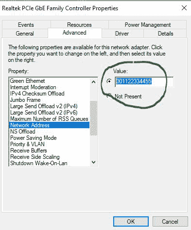

**步骤 7.0:** 使用命令提示符命令验证 MAC 地址更改。

**步骤 7.1:** 使用以下命令验证媒体访问控制地址是否已更改:

```
getmac
```

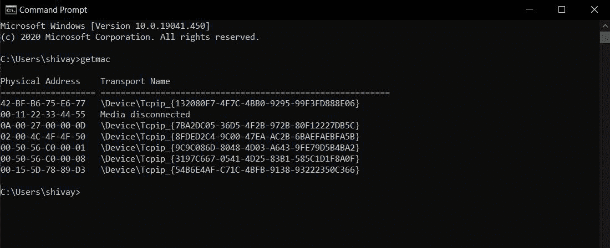

现在，我们可以看到所需网卡的媒体访问控制地址已经更改。

**棘手方法:**

**第一步:**在搜索栏中输入‘cmd’并点击打开，打开命令提示符。

**步骤 2:** 键入以下命令，以查找媒体访问控制地址和传输名称:

```
getmac
```

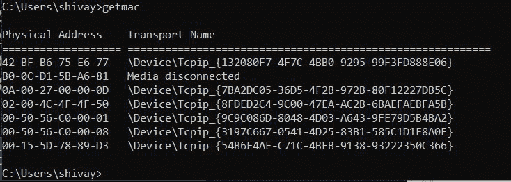

**第三步:**点击设备管理器。

**现在第二个**，**我们要更改无线媒体网络适配器的 MAC 地址。**

**步骤 4:** 右键单击网络适配器，并选择属性选项。(这里，在这种情况下，网卡是“英特尔(R)无线-AC 9560 160MHZ”。)

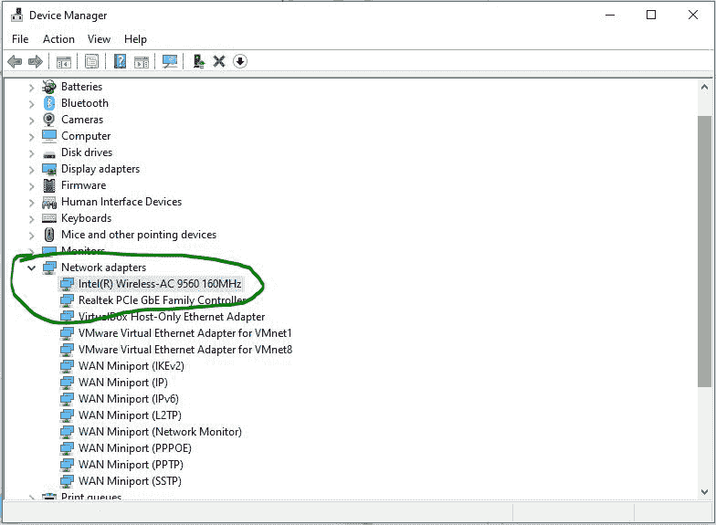

**第五步:**现在，我们可以进入高级选项卡，然后我们可以像前面一样更改 MAC 地址。

但是，在这里，在这个网卡的情况下，我们没有任何网络地址选项，如前一种情况，所以我们必须遵循 Windows 10 注册表中的值更改过程。


**这是硬方法，这使用了 Windows 注册表，所以我们在进行所需的更改时必须小心。**

**第一步:**首先，打开一个命令提示符外壳，然后键入“getmac”以查看传输地址和 mac 地址。


**步骤 2:** 现在，为了知道无线网卡的 MAC 地址是什么，我们可以导航到网络&互联网设置，然后右键单击 Wifi 选项，从那里选择属性选项，该选项将向您显示所需的详细信息。

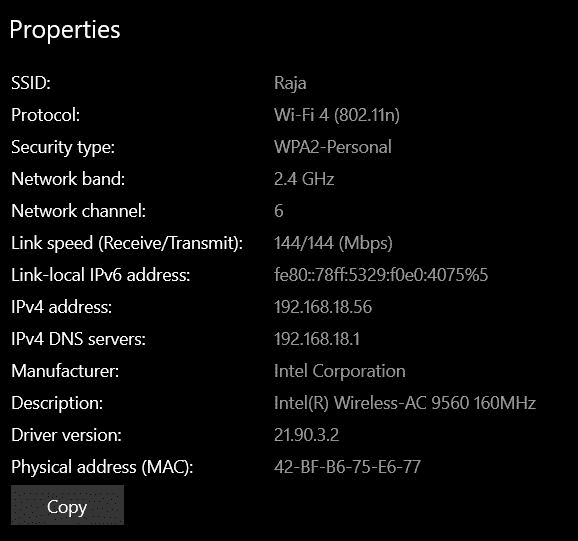

**第三步:**现在，首先点击开始按钮，输入“注册表编辑器”并打开。

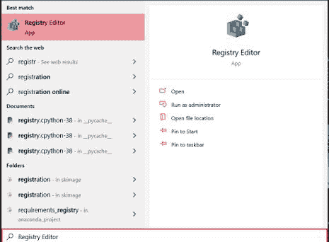

步骤 4.0:现在，我们必须导航到一个特定的文件夹，它是:

```
"HKEY_LOCAL_MACHINE/SYSTEM/ControlSet001/Control/Class/{4D36E972-E325-11CE-BFC1-08002BE10318}"
```

**第 4.1 步:**首先，为了进入正确的文件夹，我们可以很容易地指向类目录，从那里我们可以遵循以下步骤:


**步骤 4.2:** 右键单击类文件夹并选择查找选项，然后将无线网络 MAC 地址行中提到的传输名称的第一部分复制到物理地址中。

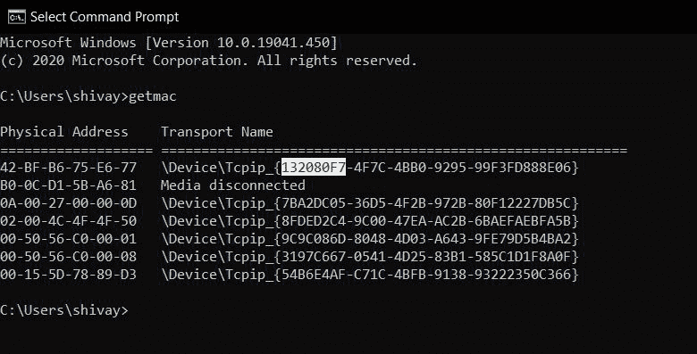

**步骤 4.3:** 现在，将高亮显示的文本粘贴到先前选择的查找选项的空搜索栏中:


**第 4.4 步:**现在点击“查找下一个”按钮，然后会自动重定向到需要的文件夹和子目录。

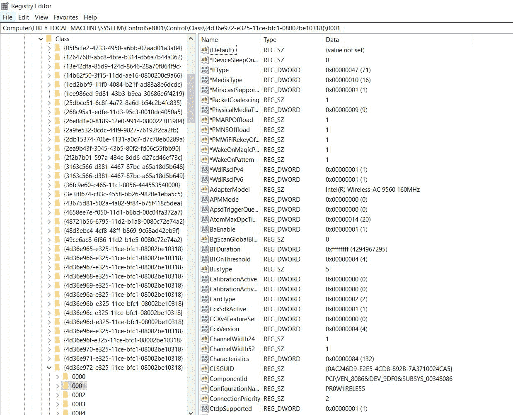

**步骤 4.5:** 验证“NetCfgInstanceId”(这将显示在窗口的右侧)与“getmac”命令中显示的值相同。

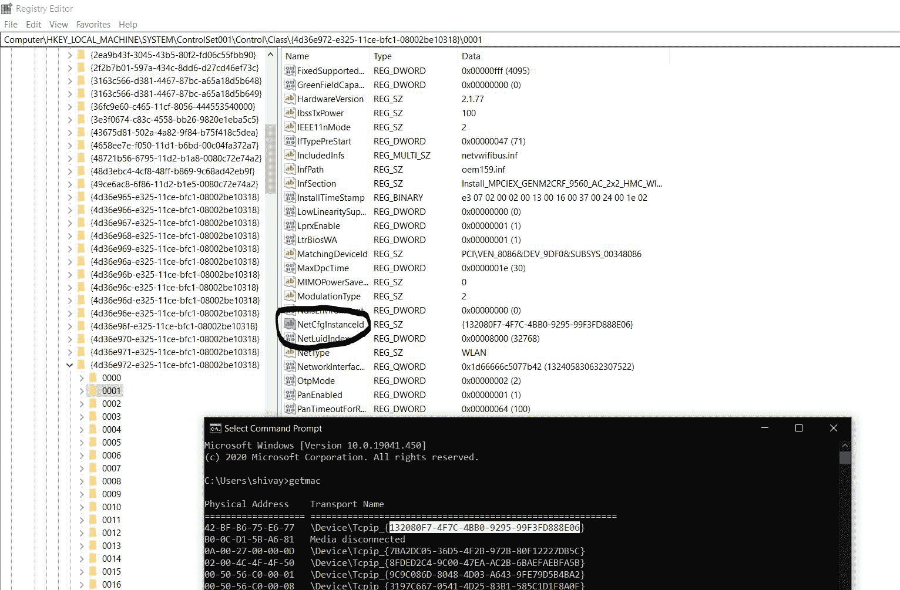

**步骤 5:** 现在，右键单击打开的窗口右侧的空白区域，选择创建一个名为 NetworkAddress 的字符串值。

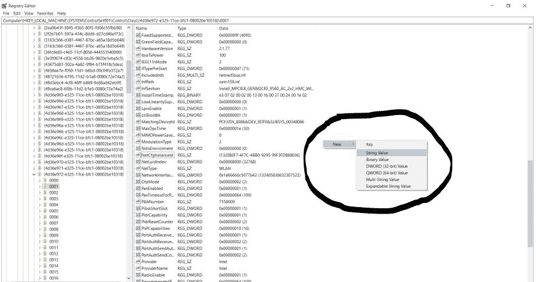 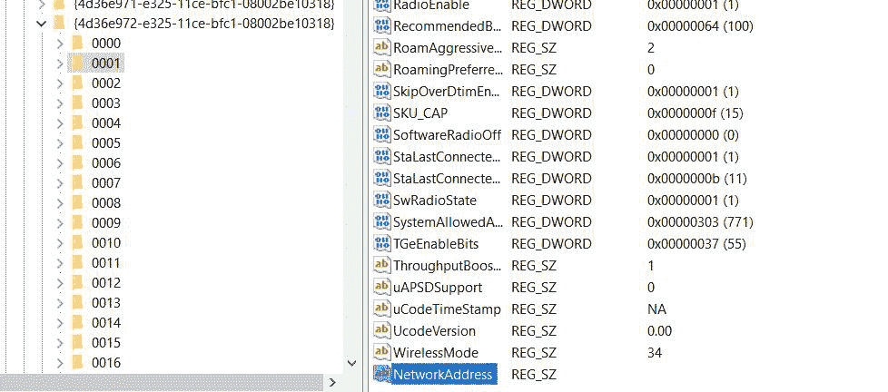

**步骤 6:** 右键单击创建的网络地址字符串，然后选择修改选项，然后指定您的媒体访问控制地址。

**注意:** <u>如果 MAC 地址更改失败，尝试将第二个字符设置为 2 或 6 或 A 或 e。</u>

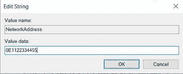

**第 7 步:**现在，MAC 地址已经更改，因此，为了验证我们对控制面板中的无线网络适配器选项的更改，并通过右键单击将其禁用，然后几秒钟后，我们将双击同一图标以重新启用无线网卡。


**第 8 步:**右键单击同一图标，进入属性，验证已更改的媒体访问控制地址。

现在，我们可以看到物理地址已相应更改。

**步骤 9:** 使用‘getmac’命令验证 mac 地址是否已更改。

**现在，MAC 地址更改成功！**

**来源:**

1.https://en . Wikipedia . org/wiki/MAC _ address