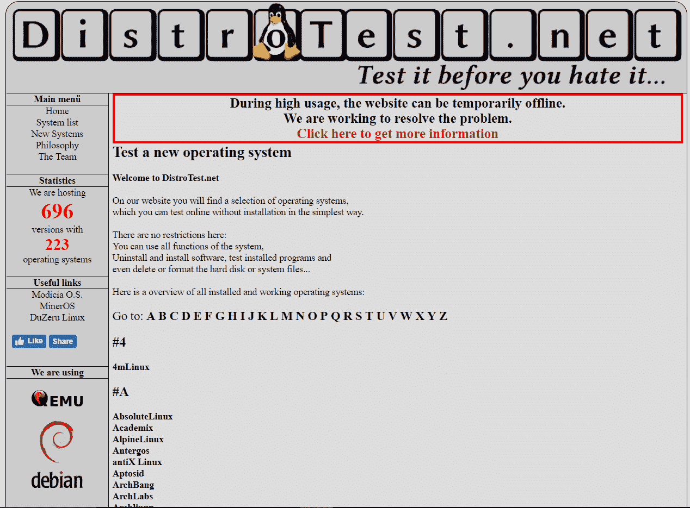
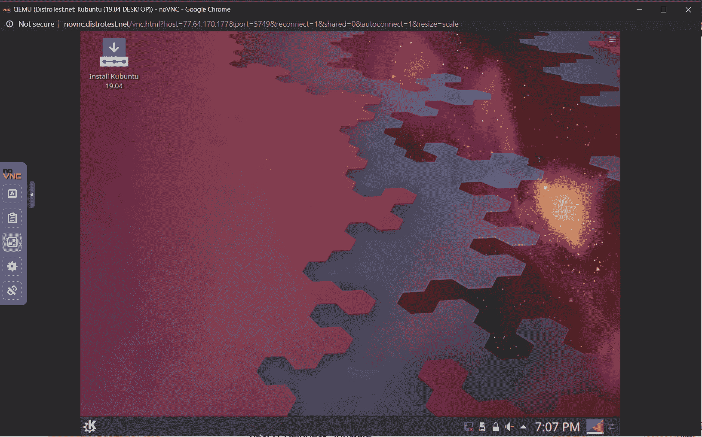
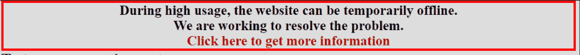
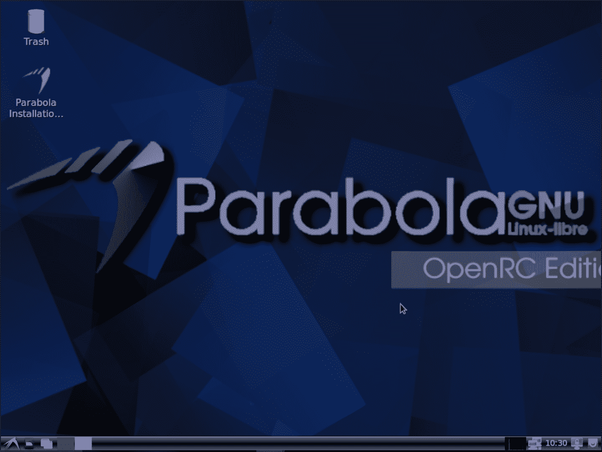
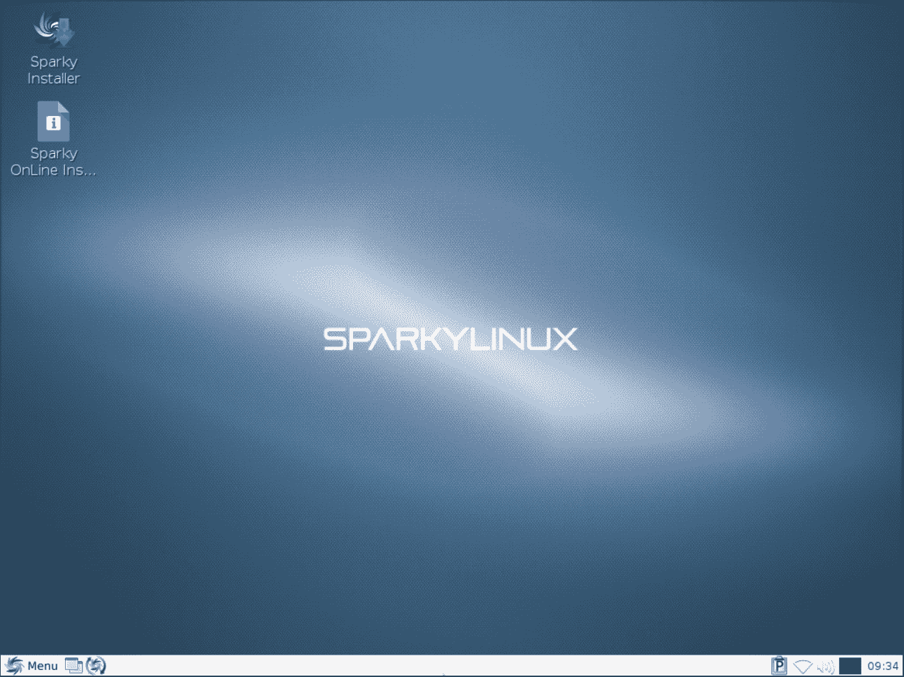

# 如何在不下载的情况下测试所有的 Linux 发行版？

> 原文:[https://www . geesforgeks . org/如何在不下载的情况下测试所有 linux 发行版/](https://www.geeksforgeeks.org/how-to-test-all-linux-distributions-without-downloading-them/)

有许多 Linux 发行版可供使用，但是找到完美的发行版非常困难。您必须为每个发行版下载将近 2GB 的文件，并且在测试期间，您找不到任何好的东西。如果您可以测试一个 Linux 发行版，而无需实际下载和设置一个 VMware 或浪费大量时间将其安装为主操作系统，会怎么样？**[【Distrotest.net】](https://distrotest.net/)**是一个为你提供测试 225 个操作系统的 700 多个版本的网站。它有每一个不同版本的操作系统。

### 如何使用 Distrotest.net？

Distrotest.net 在一个基于服务的网站上工作，在那里你可以从各种不同的 Linux 发行版中选择进行测试。只需从 A-Z 列表中选择您的发行版并启动您的系统。该网站提供了操作系统的所有功能，包括安装、分区和您在实际系统中所做的一切。在选择了你想要的操作系统后，你进入一个队列，在那里你会得到一个插槽号，你必须等待一会儿，直到轮到你。这些插槽是由于许多用户运行系统而提供的，并使服务器加载。有时大量使用会导致网站和服务器离线，但几个小时后，这个问题就解决了。此外，如果您在网站上遇到任何问题，您可以联系他们的支持。

### 使用 distrotest.net 面临的问题

使用 distrotest.net 非常容易，但是在使用时会遇到一些问题:

1.  **慢系统**:服务器中启动的操作系统运行非常慢。移动光标后，您可能需要等待一秒钟的响应，这将耗费大量时间。
2.  **等待队列:**一旦你进入“系统启动”选项卡，你就进入了一个队列，在这个队列中你会得到一个数字，没有人知道其他用户关闭系统需要多长时间，但是，每个用户都有 30 分钟的时间限制。
    T3】
3.  **Server offline:** when there is more traffic and heavy usage, the servers can go offline, but the support tries to fix the issue soon.
    

    一个伟大的项目有一些问题，但这些问题很快就会得到解决。如果你面临任何问题，或者你有任何建议，你总能得到他们的支持，他们很乐意帮助你。以下是我在写这篇文章时尝试的一些系统截图:

    

    