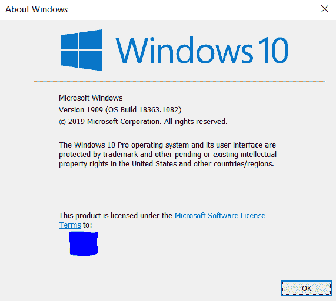
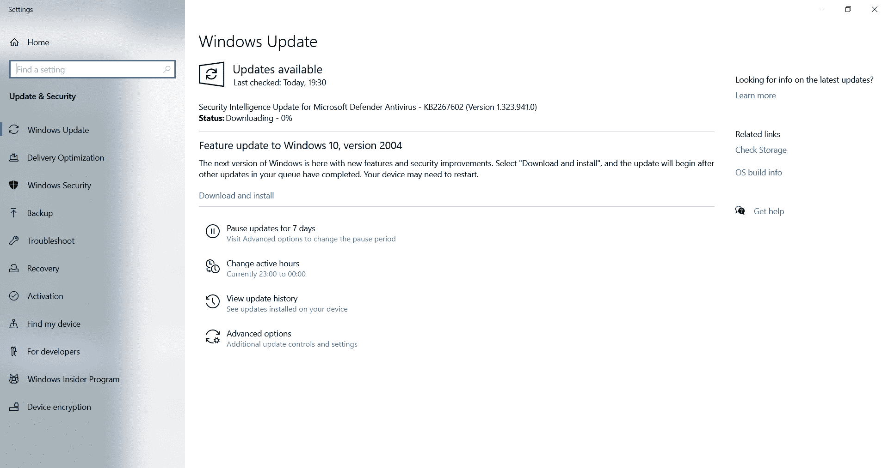
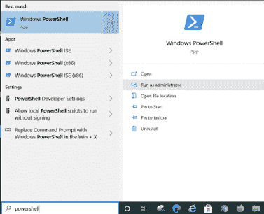
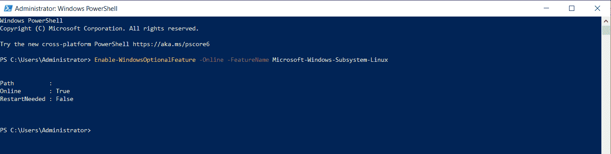
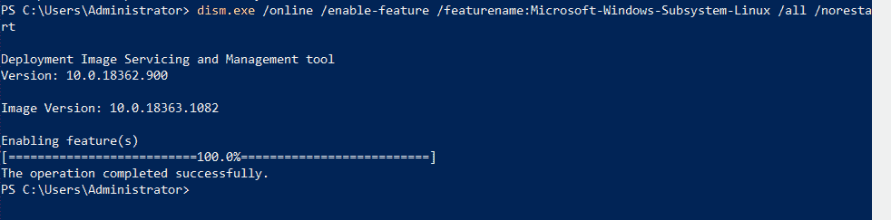
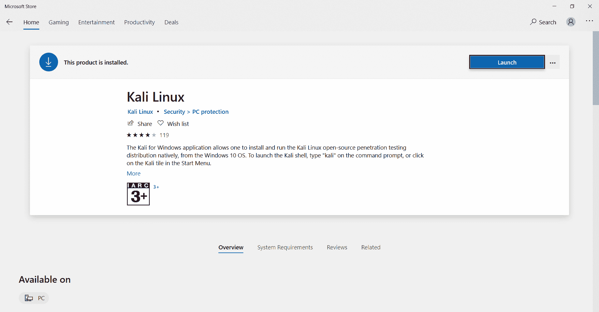
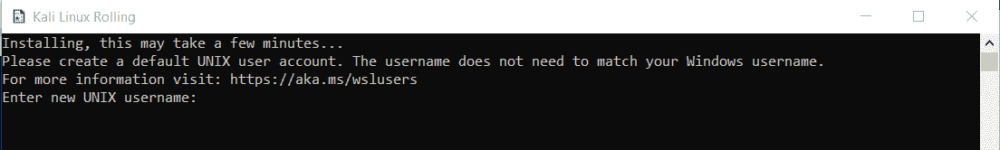
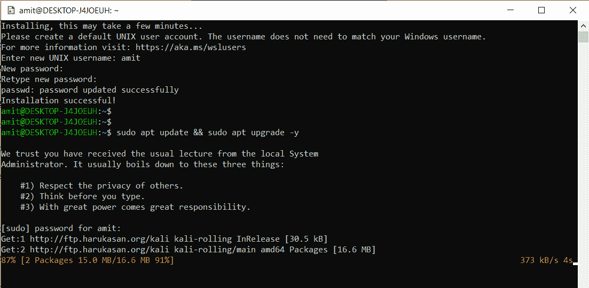
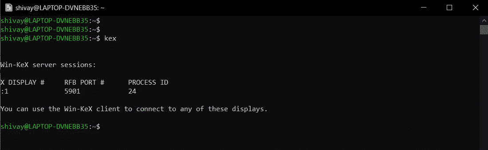
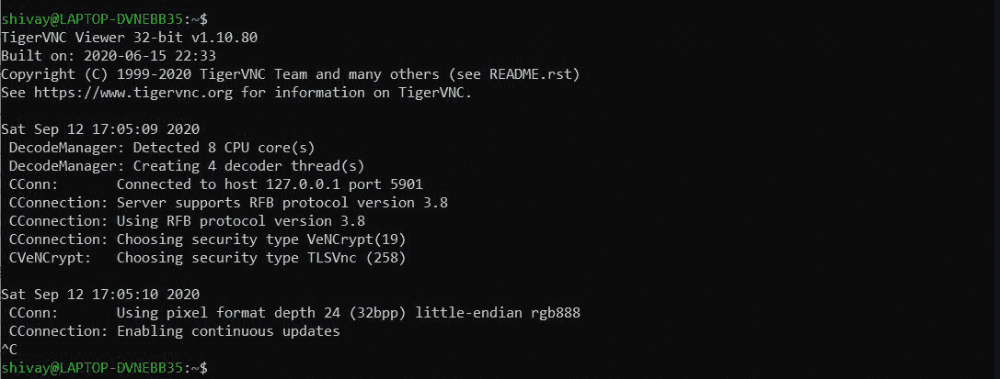

# 如何用 WSL 2 在 Windows 中使用 Kali Linux？

> 原文:[https://www . geesforgeks . org/如何使用-kali-Linux-in-windows-with-wsl-2/](https://www.geeksforgeeks.org/how-to-use-kali-linux-in-windows-with-wsl-2/)

面向 Linux 的 Windows 子系统允许开发人员运行一个 GNU/Linux 环境，包括大多数命令行工具等。直接在 Windows 上运行，未修改，没有普通虚拟机或双引导系统的开销。

**WSL 的用途:**

*   从微软商店挑选你喜欢的 GNU/Linux 发行版。
*   运行基本的命令行工具，例如，grep、sed、awk 或其他 ELF-64 替身。
*   运行 Bash shell 和 GNU/Linux 命令行应用程序，如 tmux、emacs、SSHD、MySQL，也可以使用语言编译器。
*   使用类似 Unix 的命令行外壳调用 Windows 应用程序。
*   在 Windows 上召唤 GNU/Linux 应用。

wsl 2

WSL 2 是 Linux 工程的 Windows 子系统的另一种形式，它控制 Linux 的 Windows 子系统在 Windows 上运行 ELF64 Linux 二进制文件。它的基本目标是构建文件系统执行，就像包括完全的框架调用兼容性一样。这种新的设计改变了这些 Linux 二进制文件与 Windows 和您的电脑设备的关联方式，同时提供了与 WSL 1(当前可广泛访问的版本)相似的客户端体验。

**WSL 2 的要求:**

*   WSL 2 只能在 Windows 10、版本 1903、版本 18362 或更高版本中访问。
*   如果您使用的是 Windows 10 表单 1903 或 1909，请确保您的次要内部版本号为 1049 或更高。
*   运行 Windows 10，刷新到 2004 版或更高版本，版本 19041，适用于 ARM64 系统。
*   WSL 2 将与 VMWare 15.5.5+和 VirtualBox 6+配合使用。

### 验证系统兼容性:

**第一步:**按住 Windows logo 键(键盘上)+ R 打开运行对话框，然后输入以下命令，选择确定。

```
winver

```



**第二步:**如果你的 OS 构建版本不兼容，那我们就得更新 Windows 了。

**第三步:**要进行更新，请点击屏幕左下角的 Windows 徽标，然后键入以下命令并按 enter 键:

```
check for updates

```

**步骤 4:** 现在，从列出的菜单中选择“检查更新”选项，然后将出现一个对话框。



**第五步:**点击屏幕上的“检查更新”按钮，更新成功完成后，“重启”机器。但是，如果您没有获得任何关于更新的信息，那么在重新启动后，您将被提示更新。

### 设置 WSL:

**第一步:**点击屏幕左下角的 Windows 徽标，然后输入以下命令:

```
powershell

```

现在，当列表出现在菜单中时，**右键单击“Windows Power Shell”选项，**选择**“以管理员身份运行”。**



**步骤 2:** 现在，一旦电源外壳打开并准备使用，键入以下命令并按回车键:

```
Enable-WindowsOptionalFeature -Online -FeatureName Microsoft-Windows-Subsystem-Linux

```



**第三步:**重启机器。

**步骤 4:** 重启后，在管理员模式下再次运行“Windows PowerShell”，然后键入以下命令:

```
dism.exe /online /enable-feature /featurename:VirtualMachinePlatform /all /norestart

```


**第 5 步:**现在，输入下一个命令:

```
dism.exe /online /enable-feature /featurename:Microsoft-Windows-Subsystem-Linux /all /norestart

```



**第六步:**现在，再次重启机器。

**第七步:**为了更新内核包，访问[https://aka.ms/wsl2kernel](https://aka.ms/wsl2kernel)，下载内核包并安装。

**步骤 8:** 为了激活 WSL 2，在以管理员模式运行的 Windows Powershell 中执行以下命令。

```
wsl --set-default-version 2

```

### 安装和设置卡利 Linux 命令行界面:

**步骤 1:** 点击键盘上的 Windows 徽标按钮，然后键入以下命令，然后从菜单中选择“Microsoft Store”选项。

```
microsoft store

```

**第二步:**微软商店打开后，在搜索栏搜索“Kali Linux”。

**第三步:**在 Kali Linux 页面，点击“获取”选项，下载 Kali Linux app。

**第四步:**一旦下载了 Kali Linux 应用，关闭微软商店。



**第五步:**点击屏幕左下角的 Windows 徽标，然后输入以下命令并按回车键:

```
Kali Linux

```

**第六步:**打开 Kali Linux app 后，几秒钟就能完全安装好发行版。



**第 7 步:**然后，键入您想要设置的登录凭据。现在，您将能够在命令行提示符下轻松地使用 Kali Linux，并且还可以执行基本命令而不会出错。

**注意:**基础映像不包含任何工具，也不包含图形界面以保持映像较小，但是可以通过“apt”命令轻松下载和安装。

### 设置 Kali Linux(图形用户界面):

**第一步:**打开 Kali Linux 应用，用你的凭据登录。

**第 2 步:**输入以下命令，然后按回车键:

```
sudo apt update && sudo apt upgrade -y

```

 

**步骤 3:** 成功完成上述命令后，键入以下命令并按回车键:

```
sudo apt upgrade && sudo apt install kali-win-kex -y

```

**第 4 步:**现在，一旦上述命令完成安装，然后输入以下内容:

```
kex

```

 

这将启动打开安装的 Kali Linux 发行版的图形用户界面环境的过程。

**重要:**

**1。**现在，每当我们必须关闭打开的图形用户界面时，我们都会用“f8”按下“fn”键，以选择“退出查看器”选项。

**2。**然后，退出查看器后，键入以下命令以完全关闭正在运行的服务:

```
kex stop

```


**3。**此后，每当我们想要启动 GUI Kali Linux 环境时，那么我们将首先打开 Kali Linux 应用程序，然后按顺序键入以下命令:【否则会出现错误。]

```
kex stop [In any case you forgot to stop the kex services running before.]
kex

```

**注意:**上述 GUI 设置将在 Kali Linux 或更高版本上工作。