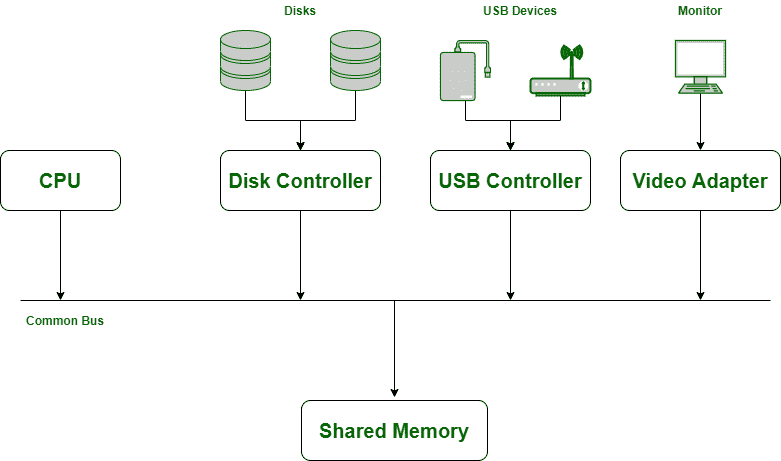

# 操作系统中的输入输出调度

> 原文:[https://www . geesforgeks . org/I-o-操作系统中的调度/](https://www.geeksforgeeks.org/i-o-scheduling-in-operating-systems/)

在理解输入/输出调度之前，了解输入/输出操作的概述非常重要。

**I/O 操作是如何执行的？**
[操作系统](https://www.geeksforgeeks.org/operating-systems/)有一部分代码专门用于管理输入/输出，以提高系统的可靠性和性能。计算机系统包含连接到公共总线通道的中央处理器和多个设备控制器，通常称为设备驱动程序。这些设备驱动程序为输入/输出设备提供了一个接口，用于与系统硬件通信，提高了通信的便利性，提供了对共享内存的访问。

公共总线控制器

**操作系统中的 I/O 请求:**
I/O 请求由设备驱动程序协同 I/O 设备内部的一些系统程序进行管理。操作系统使用三个简单的部分来处理这些请求:

*   **输入/输出流量控制器:**跟踪所有设备、控制单元和通信通道的状态。
*   **输入输出调度器:**执行操作系统用来分配和访问设备、控制单元和通信通道的策略。
*   **输入/输出设备处理器:**服务于设备中断并负责数据传输。

**操作系统中的 I/O 调度:**
调度用于高效利用计算机资源，避免死锁，为队列中等待的所有进程服务。要了解更多关于中央处理器调度的信息，请参考操作系统中的[中央处理器调度。](https://www.geeksforgeeks.org/cpu-scheduling-in-operating-systems/)

**输入输出交通控制器**有 3 个主要任务:

*   主要任务是检查是否至少有一条路径可用。
*   如果存在多条路径，它必须决定选择哪一条。
*   如果所有路径都被占用，它的任务是分析哪条路径最早可用。

**输入输出调度器**的功能类似于[进程调度器](https://www.geeksforgeeks.org/process-schedulers-in-operating-system/)，它分配设备、控制单元和通信通道。然而，在输入/输出请求负载很重的情况下，调度程序必须决定应该首先服务什么请求，为此，我们有多个队列由操作系统管理。

**进程调度器** <和 **I/O 调度器**的主要区别在于 I/O 请求不会被抢占:通道程序一旦启动，就允许继续完成。虽然这是可行的，因为程序相对较短(50 到 100 毫秒)。一些现代操作系统允许输入/输出调度程序服务更高优先级的请求。换句话说，如果一个输入/输出请求具有较高的优先级，那么它们将先于其他具有较低优先级的输入/输出请求被处理。输入/输出调度程序与输入/输出流量控制器协同工作，以跟踪当前输入/输出请求所服务的路径。

**输入/输出设备处理器**管理输入/输出中断(如果有)和调度算法。很少有输入/输出处理算法:

1.  先到先得的服务器。
2.  SSTF[最短寻道时间优先]。
3.  扫描
4.  看
    *   分步扫描
    *   C-SCAN
    *   C-LOOK

每种调度算法都以最小化手臂移动、平均响应时间、响应时间的方差为目标。所有输入/输出调度算法的概述如下:

1.  **[【先到先服务】【FCFS】](https://www.geeksforgeeks.org/fcfs-disk-scheduling-algorithms/)**
    它是最简单的[设备调度算法](https://www.geeksforgeeks.org/disk-scheduling-algorithms/)之一，因为它易于编程，对用户(输入/输出设备)基本公平。唯一的障碍可能是高寻道时间，因此任何其他能够超过最小[寻道时间](https://www.geeksforgeeks.org/difference-between-seek-time-and-rotational-latency-in-disk-scheduling/)的算法都适合调度。
2.  **[【最短寻道时间优先】【SSTF】](https://www.geeksforgeeks.org/program-for-sstf-disk-scheduling-algorithm/):**
    它在流程调度中使用了与[最短作业优先](https://www.geeksforgeeks.org/shortest-job-first-or-sjf-cpu-scheduling-non-preemptive-algorithm-using-segment-tree/)相同的思想，最短的流程首先被服务，较长的流程必须等待轮到它们。比较输入/输出调度中的 SJF 概念，轨道最接近被服务的请求(在磁盘上行进的距离最短的请求)接下来得到满足。与 FCFS 相比，它的主要优点是可以最大限度地减少总寻道时间。它倾向于容易达到的要求，并推迟到那些不碍事的旅行。
3.  **[SCAN 算法](https://www.geeksforgeeks.org/scan-elevator-disk-scheduling-algorithms/)** :
    SCAn 使用一个状态标志，它告诉手臂的方向，它告诉手臂是向磁盘中心还是向另一侧移动。该算法将 arm 从磁盘末端移动到中心磁道，以其方式服务于每个请求。当它到达最里面的磁道时，它反转方向并向磁盘上的外部磁道移动，再次为其路径中的每个请求提供服务。
4.  **[LOOK【电梯算法】](https://www.geeksforgeeks.org/look-disk-scheduling-algorithm/)** :
    这是 SCAN 算法的变体，在这里 arm 不一定会一直到达磁盘上的任何一侧，除非有请求等待处理。在服务请求之前，它会预先查看请求。一个很大的问题出现了，“为什么我们要使用 LOOK over SCAN？”。LOOK 相对于 SCAN 的主要优势在于它抛弃了 I/O 请求的无限延迟。
5.  **SCAN 的其他变体:**
    *   [**N 步扫描**](https://www.geeksforgeeks.org/n-step-scan-disk-scheduling/) **:** 它保存所有待处理的请求，直到手臂开始返回。新请求被分组用于下一轮循环。
    *   [**C-SCAN【圆形扫描】**](https://www.geeksforgeeks.org/c-scan-disk-scheduling-algorithm/) **:** 它提供了统一的等待时间，因为在向内循环期间，arm 在其途中处理请求。要了解更多信息，请参考[扫描和 C-SCAN 的区别](https://www.geeksforgeeks.org/difference-between-scan-and-cscan-disk-scheduling-algorithms/)。
    *   [**C-LOOK【C-SCAN 优化版】**](https://www.geeksforgeeks.org/c-look-disk-scheduling-algorithm/)**:Arm 不一定会回到编号最低的赛道，它会从最低的待服请求返回。它优化了 C-SCAN，因为如果不需要，机械臂不会移动到磁盘的末端。要了解更多，请参考 C-LOOK 和 C-SCAN 的[区别](https://www.geeksforgeeks.org/difference-between-c-look-and-c-scan-disk-scheduling-algorithm/)。**