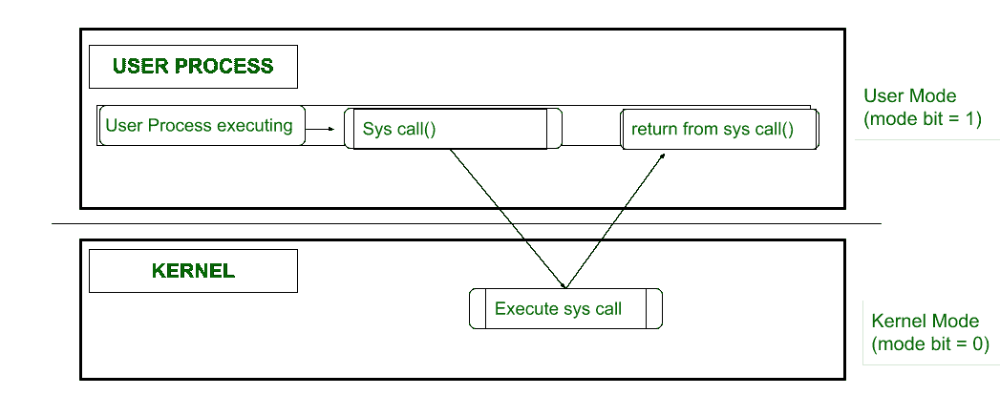
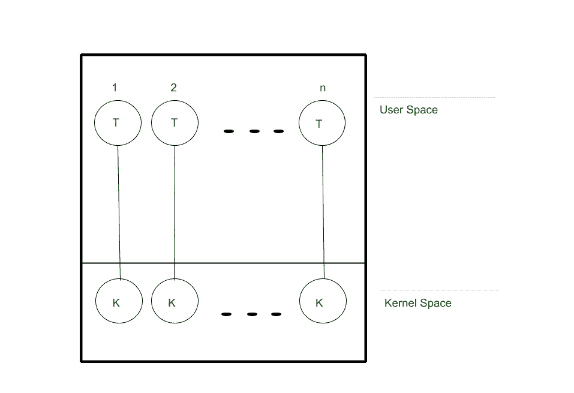
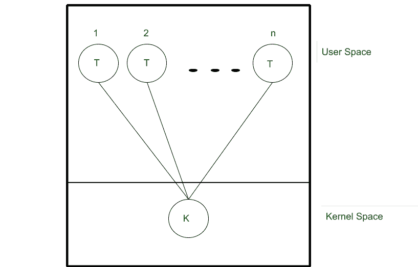
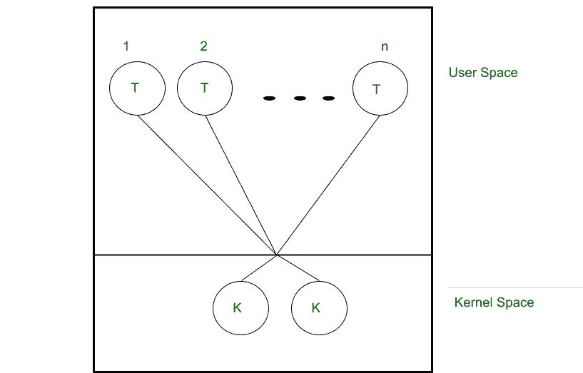
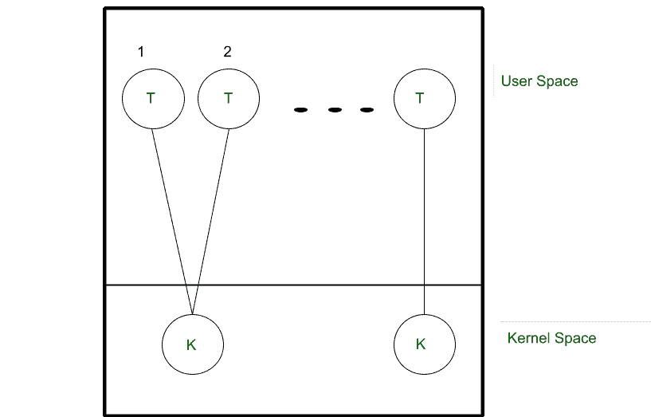

# 在用户空间实现线程

> 原文:[https://www . geesforgeks . org/implement-threads-in-user-space/](https://www.geeksforgeeks.org/implement-threads-in-user-space/)

**前提:** [进程与线程的区别](https://www.geeksforgeeks.org/difference-between-process-and-thread/)[用户级线程与内核级线程的区别](https://www.geeksforgeeks.org/difference-between-user-level-thread-and-kernel-level-thread/)

**简介:**
在一个操作系统中，有多个程序，操作系统和用户共享计算机系统的软硬件资源。为了确保不正确的程序不会损害其他程序或操作系统，它区分了用户定义代码和操作系统代码。
方法是，只为代表操作系统执行的任务提供硬件支持，称为**内核模式**，而不为代表用户应用执行的任务提供硬件支持，称为**用户模式**。

*   内核模式是一种特权模式，进程可以访问所有资源，如硬件、内核数据、操作系统内核代码。
*   基本区别在于，在内核模式下，内核可以直接访问硬件，但在用户模式下则不是这样。但是，当用户应用程序从操作系统请求服务时，系统必须从用户模式转换到内核模式。

理解这个概念的一个更好的方法是看下图。

线程是执行单元，是进程的一部分。它共享流程的资源。它是由调度程序调度的。有两种方法可以实现线程，它们要么在用户空间中，要么在内核中。

线程可以在用户空间中实现，不需要内核的支持。如果我们在用户空间中实现一个线程，会发生以下情况–

1.  相应的代码和使用的数据结构存储在用户空间中。
2.  如果调用一个应用编程接口，它会导致用户空间中的本地系统调用，而不是系统调用。
3.  线程完全由运行时系统管理，内核对此一无所知。

**用户级线程模型:**
用户空间中的线程可以使用以下四种方法中的任何一种来实现:-

1.  一对一
2.  多对一
3.  多对多
4.  两级。

在上述每个模型中，用户空间的线程与内核线程或者虚拟处理器的线程映射。

**1。一对一:**
在这种类型的模型中–

*   每个用户级线程都映射有一个单独的内核级线程。
*   用户空间中的每个线程都在单独的内核级线程上执行。
*   这里，内核必须提供一个系统调用来创建一个新的内核线程。

**2。多对一:**
在这种类型的模型中–

*   用户空间的多个线程与内核级的一个线程进行映射。
*   换句话说，所有用户级线程都在同一个内核线程上执行。
*   由于只有一个内核线程，一次只能运行一个用户级线程。
*   每个用户线程进行一次系统调用来创建一个新的内核线程。

**3。多对多:**
在这种类型的模型中–

*   *n* 个用户级线程被映射到 *m* 个内核级线程上执行。

**4。两级:**
在这类车型中–

*   这是多对多和一对一模式的混合版本。
*   只允许一组有限的用户线程绑定到一个内核线程。

**优势:**
我们已经看到了什么是线程，用户级线程与内核级和不同类型的用户线程有何不同。但是使用用户级线程背后的动机是什么呢？让我们看看它的一些优点

1.  由于不需要系统调用，因此整个过程既快速又高效。
2.  简单的组织，因为线程是在不干预内核的情况下创建、切换和管理的。
3.  它可以在操作系统不支持内核级线程的系统上实现。

**劣势:**
每一个优势都会带来相应的劣势–

1.  糟糕的调度，比如用一个空闲线程分配一个进程或者阻塞一个进程，因为一个线程持有锁。
2.  性能可能不一致。