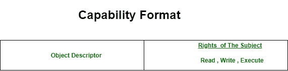
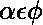

# 分布式操作系统中访问矩阵的实现

> 原文:[https://www . geeksforgeeks . org/分布式操作系统中访问矩阵的实现/](https://www.geeksforgeeks.org/implementation-of-access-matrix-in-distributed-os/)

如前所述[访问矩阵](https://www.geeksforgeeks.org/access-matrix-in-operating-system/)可能非常稀疏，并占用大量内存。因此，直接实现用于访问控制的访问矩阵是存储低效的。

低效率可以通过将访问矩阵分解为行或列来消除。可以通过删除空值来折叠行，这样可以提高列的效率。从这些分解方法中，可以形成广泛使用的访问矩阵的三种实现。它们如下:

```
1. Capabilities
2. Access Control List
3. Lock and Key Method 
```

因此，我们将简要讨论上述实现。
值得记住的是，我们是用 **s** 来表示主语，用 **O** 来表示宾语，并把它们分别放在列和行上。

1.  **能力:**
    这个方法指的是访问矩阵的逐行分解。每个主体都被分配了一个元组列表 *(o，M[s，o])* ，用于它被允许访问的所有对象。这种元组称为能力。如果一个主体拥有一种能力(o，M[s，o])，那么它被允许以 M[s，o]中描述的方式访问对象 o。主体被允许访问其拥有能力的任何对象。能力不是伪造的。

功能包含两个字段:

```
(i) Object Descriptor, 
(ii) Access Rights 
```

对象描述符可以包含对象的地址，访问权限可以包含主体对对象的权限，主要是读、写、执行。由于对象描述符包含地址，它也可以用作寻址机制。

下面是能力的格式。



*   **Access Control List:**
    This method refers to column wise decomposition of the access matrix . Each object o has a list containing tuples like *(s, M[s, o])* for all subjects s which can access the object.P[s, o] denotes the rights of the subject s on the object o.

    当主体请求访问对象时，以下列方式执行。

    *   系统搜索 o 的访问控制列表，以找出是否存在针对主题 s 的条目(s，)
    *   如果受试者 s 的条目存在，则系统检查所请求的访问是否被允许。(即)
    *   如果请求的访问被允许，则执行该请求，否则会引发适当的异常。

    下面是一个对象的访问控制列表的示例实现

    <center>

    | 学科 | 存取权 |
    | --- | --- |
    | 拉维 | 读取、写入、执行 |
    | 中国林蛙 | 阅读 |
    | 杰弗 | 写 |
    | 爱丽丝 | Execute；
     |

    </center>

    **轻松撤销**和**轻松审查访问**是访问控制列表的主要功能。

    *   **Lock and key Method:**
    The lock and key method is an hybrid of the access control list and capabilities method.

    在锁和键方法中，每个主体都有一个包含形式(o，key)元组的能力列表，表示主体可以使用 key *key* 访问对象 o。对象有一个访问控制列表，其中包含以下形式的元组(锁，，称为锁条目，表示锁*锁*可以通过设置中的模式访问。

    当主体在模式下请求访问对象 o 时，系统按以下方式执行。

    *   系统在主题的能力列表中定位元组(o，key)。如果没有找到这样的元组 id，则不允许访问。
    *   否则，只有在对象 o 的访问控制列表中存在锁条目(锁，)时才允许访问，以便*键* = *锁定*和

    这就是最常用的访问矩阵的实现。我们已经以简短紧凑的方式讨论了流程。用法和优缺点可以在后面的帖子中介绍。