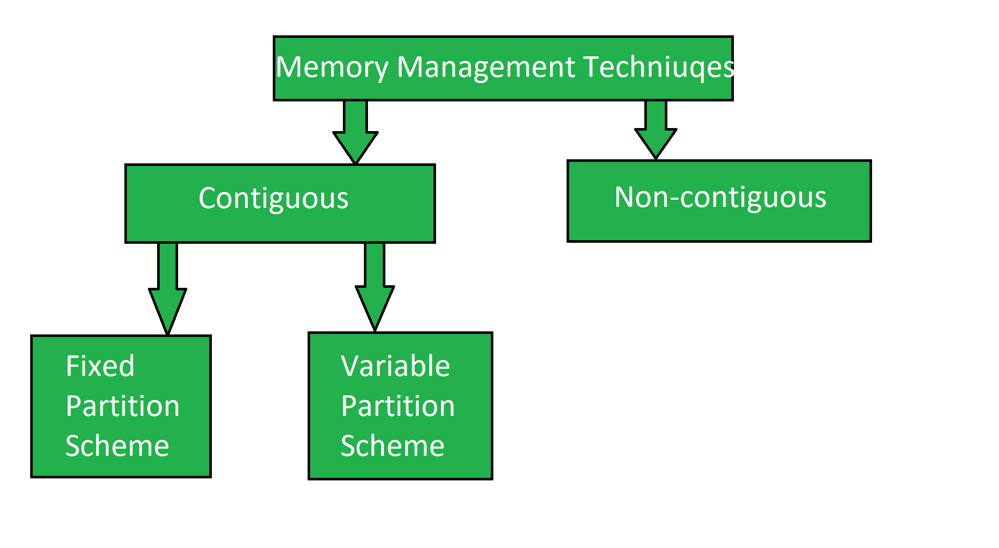
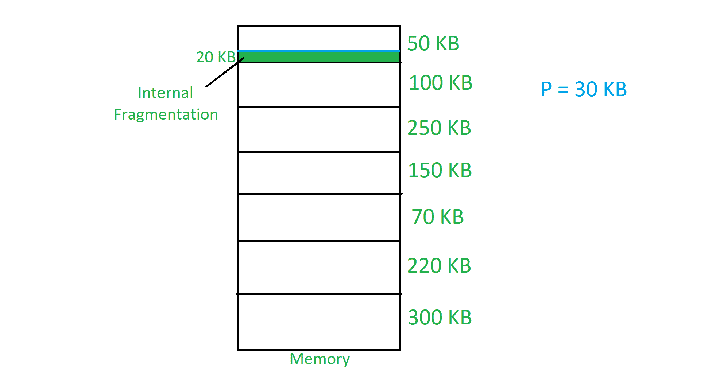
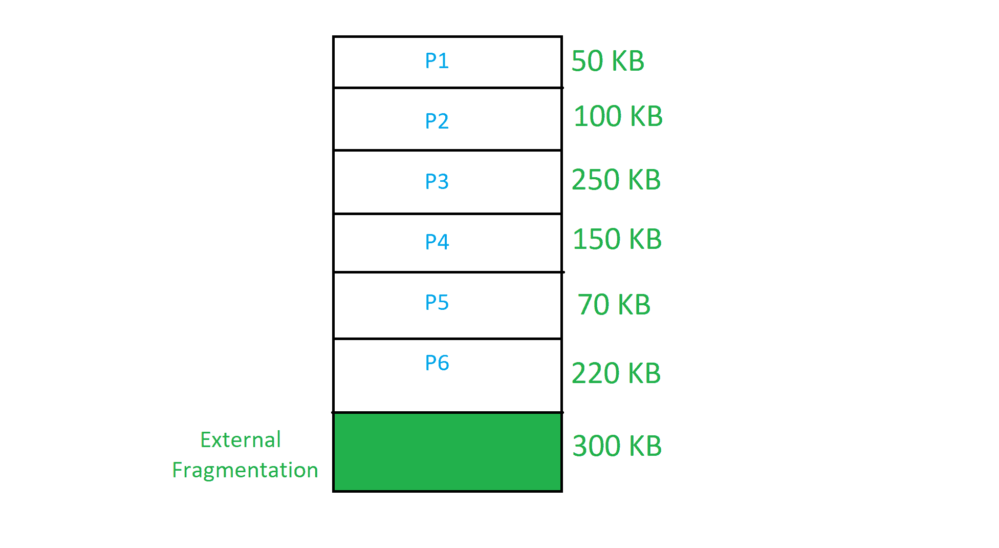

# 连续内存管理技术的实现

> 原文:[https://www . geeksforgeeks . org/实现连续内存管理技术/](https://www.geeksforgeeks.org/implementation-of-contiguous-memory-management-techniques/)

内存管理技术是用于管理操作系统内存的基本技术。内存管理技术基本上分为两类:

```
(i) Contiguous
(ii) Non-contiguous 
```

**连续内存管理技术:**
在这种技术中，内存以连续的方式分配给进程。它有两种类型:



**[固定分区方案](https://www.geeksforgeeks.org/fixed-or-static-partitioning-in-operating-system/) :**
在固定分区方案中，内存被划分为固定数量的分区。固定意味着内存中的分区数量是固定的。在固定分区中，每个分区中只容纳一个进程。多程序设计的程度受到内存中分区数量的限制。进程的最大大小受到分区最大大小的限制。每个分区都与*限制寄存器*相关联。

*   **极限寄存器:**它有两个极限:
*   **下限:**分区的起始地址。
*   **上限:**分区的结束地址。



[内部分片](https://www.geeksforgeeks.org/difference-between-internal-and-external-fragmentation/)见于固定分区方案。
为了克服内部碎片问题，采用可变分区方案代替固定分区方案。

**[可变分区方案](https://www.geeksforgeeks.org/variable-or-dynamic-partitioning-in-operating-system/) :**
在可变分区方案中，最初内存会是单个连续的空闲块。每当进程的请求到达时，就会在内存中进行相应的分区。如果更小的进程不断出现，那么更大的分区将会变成更小的分区。



[外部分片](https://www.geeksforgeeks.org/difference-between-internal-and-external-fragmentation/)见于变量分区方案。
为了克服外部碎片问题，使用了压缩技术或非连续内存管理技术。

**[压缩](https://practice.geeksforgeeks.org/problems/what-is-compaction-is-os) :**
将所有进程向顶部或底部移动，以在单个连续的地方释放可用内存，称为压缩。压缩不适合实现，因为它会中断内存中所有正在运行的进程。