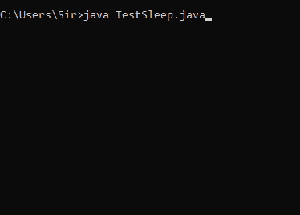

# 在操作系统

中实现睡眠(系统调用)

> 原文:[https://www . geesforgeks . org/实现睡眠系统调用操作系统/](https://www.geeksforgeeks.org/implementation-of-sleep-system-call-in-os/)

在本文中，我们将学习操作系统中的睡眠(系统调用)。在计算机科学领域，系统调用是一种在进程和操作系统之间提供接口的机制。简单来说，它基本上是一种计算机程序向操作系统内核请求服务的方法。

**什么是操作系统中的睡眠？**
Sleep 是一个计算机程序，当你调用这个方法时，它会将进程设置为等待指定的时间，然后找到其他进程来运行。
sleep 系统调用用于将时间值作为参数，指定进程在恢复执行之前休眠的最小时间量。

**语法–**

```
 sleep(time);
```

**使用的方法:**

*   **sleep()–**
    这个方法是用来让一个线程休眠指定的时间。
*   **start()–**
    这个方法用于为线程创建一个单独的调用栈。
*   **run()–**
    如果线程是使用单独的 Runnable 对象构造的，则使用该方法。否则，此方法不执行任何操作并返回。

**示例 1–**

## Java 语言(一种计算机语言，尤用于创建网站)

```
class TestSleep extends Thread{ 
 public void run(){ 
  for(int i=1;i<5;i++){ 
    try{Thread.sleep(300);}catch(InterruptedException e){System.out.println(e);} 
    System.out.println(i); 
  } 
 } 
 public static void main(String args[]){ 
  TestSleep t1=new TestSleep(); 
  TestSleep t2=new TestSleep(); 

  t1.start(); 
  t2.start(); 
 } 
} 

```

**输出–**



```
Note - In the above example you can notice that at a time only one thread has been executed and if 
       you sleep a thread for thespecified time,the thread shedular picks up another thread and 
       so on.
```

**使用 Tread.sleep()时需要记住的要点:**

*   每当使用此方法时，它都会暂停当前线程的执行。
*   当任何其他线程在休眠时中断时，将引发中断异常。