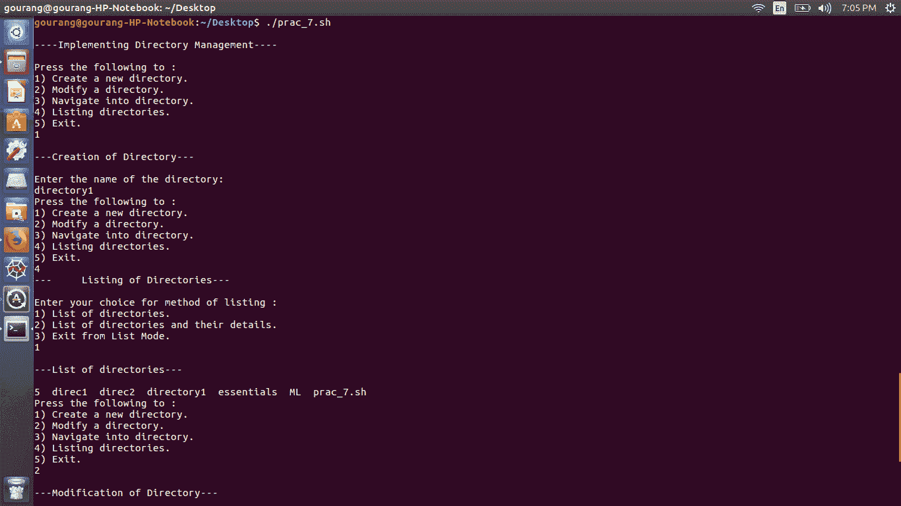
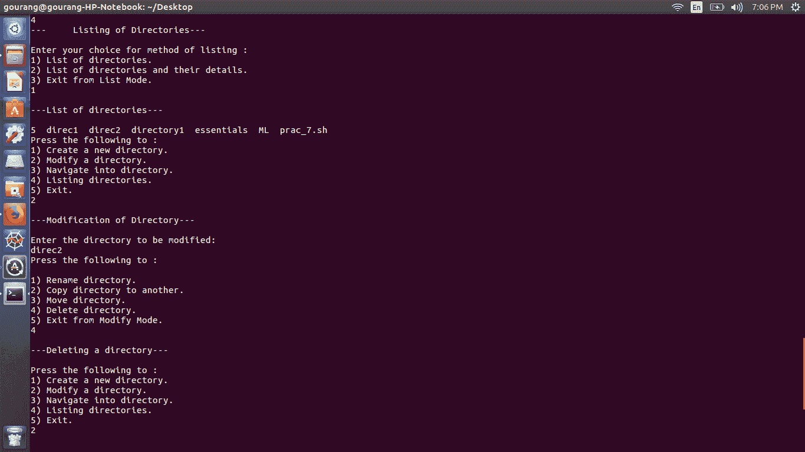
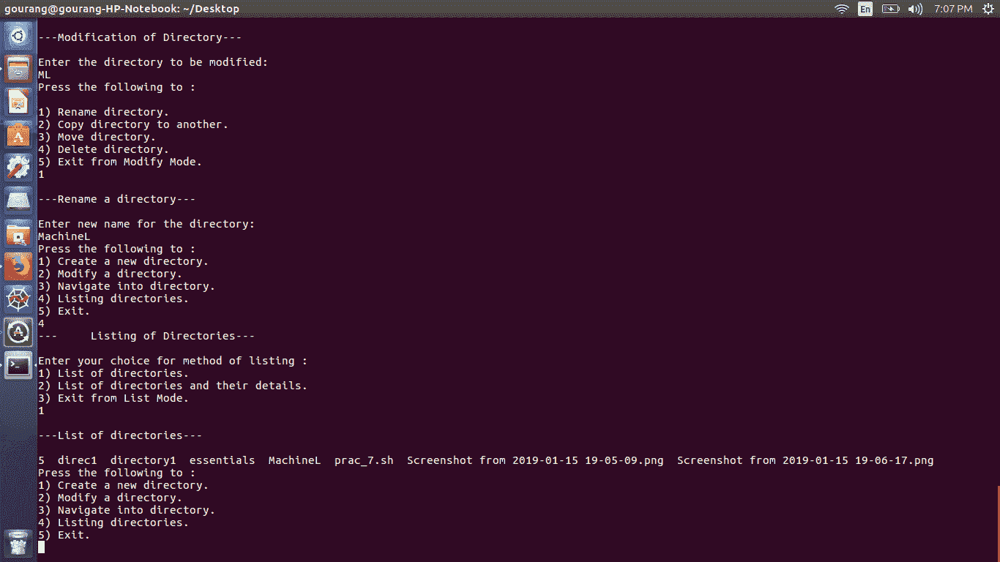
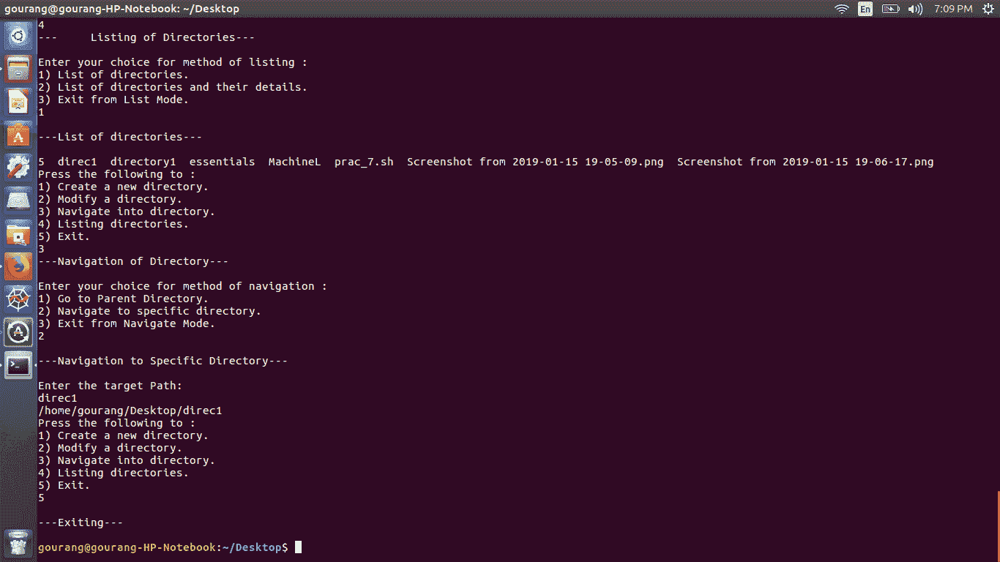

# 使用 Shell 脚本实现目录管理

> 原文:[https://www . geesforgeks . org/implementing-directory-management-use-shell-script/](https://www.geeksforgeeks.org/implementing-directory-management-using-shell-script/)

目录管理包括组织和维护各种目录的功能。目录通常包含任何类型的文件，但这可能因文件系统而异。目录的内容不会影响目录对象本身。

**部分目录功能有:**

*   航行
*   绝对/相对路径名
*   列出目录
*   创建目录
*   修改目录

可以在 *pico* 等编辑器中编写脚本。按照下面输出截图中提到的方式执行文件。*下面的 shell 脚本使用 Linux 中可用的命令来实现目录管理的这些功能。*

```
echo "    "
echo "----Implementing Directory Management----"
echo "    "
ch=0
while [ $ch -lt 6 ]
do
    echo "Press the following to :"
    echo "1) Create a new directory."
    echo "2) Modify a directory."
    echo "3) Navigate into directory."
    echo "4) Listing directories."
    echo "5) Exit."
    read ch

    case $ch in
    1) echo " " 
       echo "---Creation of Directory---"
       echo "  "
       echo "Enter the name of the directory:"
       read name
       mkdir $name
    ;;
    2) echo " "
       echo "---Modification of Directory---"
       echo "    " 
       echo "Enter the directory to be modified:"
       read orgdir
       echo "Press the following to :"
       echo "    "
       echo "1) Rename directory."
       echo "2) Copy directory to another."
       echo "3) Move directory."
       echo "4) Delete directory."
       echo "5) Exit from Modify Mode."
       read modch

        case $modch in
        1) echo "  "
           echo "---Rename a directory---"
           echo "  "
           echo "Enter new name for the directory:"
           read newname
           mv $orgdir $newname
        ;;
        2) echo "  "
           echo "---Copying a directory to another---"
           echo "  "
           echo "Enter target directory:"
           read target
           mkdir $target
           cp $orgdir $target
        ;;
        3) echo "  "
           echo "---Moving a directory---"
           echo "  "
           echo "Enter target directory:"
           read target
           mkdir $target
           mv $orgdir $target
        ;;
        4) echo "  "
           echo "---Deleting a directory---"
           echo "  "
           rmdir $orgdir
        ;;
        5) echo "  "
           echo "---Exiting from modify mode---"
           echo "  "
           exit
        ;;
        esac
      ;;
    3) 
      echo "---Navigation of Directory---"
      echo "  "
      echo "Enter your choice for method of navigation :"
      echo "1) Go to Parent Directory. "
      echo "2) Navigate to specific directory."
      echo "3) Exit from Navigate Mode."
      read navch

      case $navch in
        1) echo "  "
           echo "---Parent Directory---"
           echo "  "
           cd ..
           pwd 
        ;;
        2) echo "  "
           echo "---Navigation to Specific Directory---"
           echo "  "
           echo "Enter the target Path:"
           read path
           cd $path
           pwd
        ;;
        3) echo "  "
           echo "---Exiting from Navigate Mode---"
           echo "  "
           exit
        ;;
        esac
       ;;
    4) 
      echo "---    Listing of Directories---"
      echo "  "
      echo "Enter your choice for method of listing :"
      echo "1) List of directories. "
      echo "2) List of directories and their details."
      echo "3) Exit from List Mode."
      read lisch

      case $lisch in
        1) echo "  "
           echo "---List of directories---"
           echo "  "
           ls
        ;;
        2) echo "  "
           echo "---Detailed List of directories---"
           echo "  "
           ls -l
        ;;
        3) echo "  "
           echo "---Exiting from List Mode---"
           echo "  "
           exit
        ;;
        esac
       ;;
    5)echo "  "
      echo "---Exiting---"
      echo "  "
      exit 
    ;;
    esac
done
```

**输出:**







