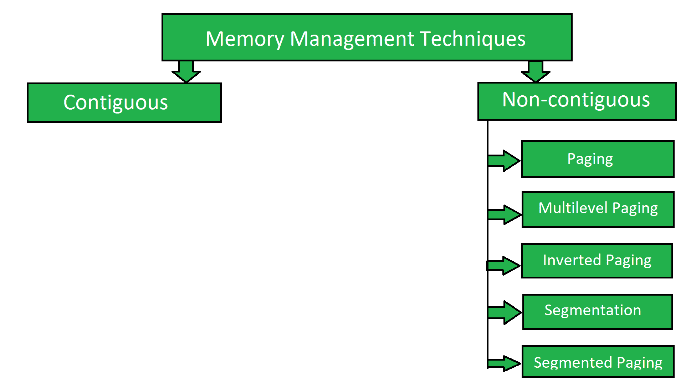

# 实现非连续内存管理技术

> 原文:[https://www . geeksforgeeks . org/implementing-非连续内存管理-technologies/](https://www.geeksforgeeks.org/implementing-non-contiguous-memory-management-techniques/)

内存管理技术是用于管理操作系统内存的基本技术。内存管理技术基本上分为两类:

```
(i) Contiguous
(ii) Non-contiguous 
```

我们已经在文章[实现连续内存管理技术](https://www.geeksforgeeks.org/implementation-of-contiguous-memory-management-techniques/)中讨论了连续的实现。这里我们将讨论非连续内存管理技术的实现。

**非连续内存管理技术:**
在这种技术中，内存以非连续的方式分配给进程。它有五种类型:



**[分页](https://www.geeksforgeeks.org/paging-in-operating-system/) :**
分页是一种非连续内存管理技术，允许进程的物理地址空间是非连续的。无论何时创建进程，都会在进程上应用分页，并创建页表。分页与每个进程相关，每个进程都有自己的页表。

分页中没有[外部碎片](https://www.geeksforgeeks.org/difference-between-internal-and-external-fragmentation/)。内部碎片存在于最后一页，分页中的内部碎片被认为是 P/2，其中 P 是页面大小。

**[多级分页:](https://www.geeksforgeeks.org/multilevel-paging-in-operating-system/)**
多级分页是一种非连续的内存管理技术，以分层方式包含两级或更多级的页表。
在多级分页中，当分页应用于页表时，最后一页称为第一级页表。在多级分页中，当分页应用于页表时，所有的页表都将存储在主存中。

**[反向分页](https://www.geeksforgeeks.org/inverted-page-table-in-operating-system/) :**
为了避免维护页表进程的开销，实现了反向分页的概念。在反向分页中，所有进程只维护一个页表。维护进程的页表所需的内存会更少，但是搜索进程的相应页所需的时间会更多。

**[分段](https://www.geeksforgeeks.org/segmentation-in-operating-system/) :**
分段是一种非连续内存管理技术，将内存划分为多个段。每个进程被分配一个段。有两种类型的分段:

```
(i) Simple
(ii) Virtual 
```

**分段分页:**
为了避免将大尺寸段带入内存的开销，实现了分段分页的概念。在分段分页中，分页将应用于该段，而不是将整个段带入内存，而是将段的页面带入内存。段的页表中的条目数与段的页数相同。

段的页面大小与物理地址空间的帧大小相同。