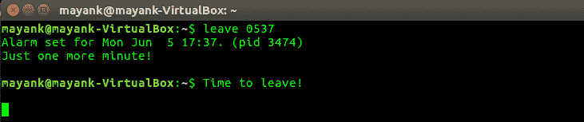
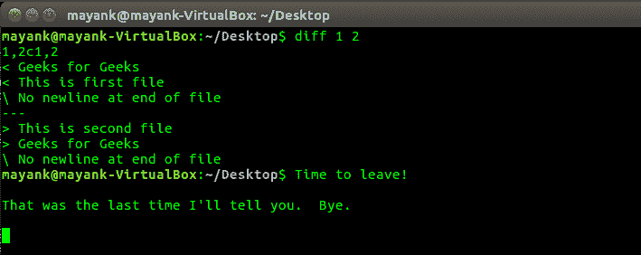
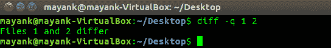
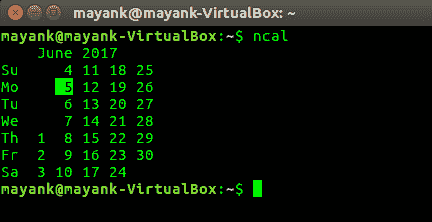
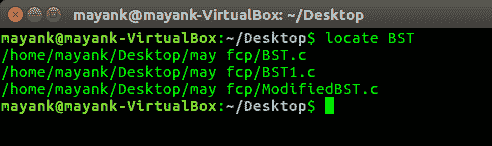
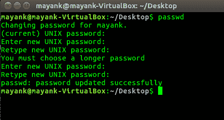
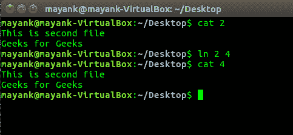

# 重要的 Linux 命令(离开、差异、调用、ncal、定位和 ln)

> 原文:[https://www . geesforgeks . org/important-Linux-commands-leaf-diff-cal-ncal-locate-ln/](https://www.geeksforgeeks.org/important-linux-commands-leave-diff-cal-ncal-locate-ln/)

Linux 提供了一些重要的技巧。以下是几个重要的例子:

1.  **leave** — remind you when you have to leave
    **Syntax:**

    ```
     leave +hhmm
    ```

    休假一直等到指定的时间(在接下来的 12 小时内)，然后通过给你执行休假的 TTY 写信提醒你必须离开。在实际时间前 5 分钟和 1 分钟、当时和之后的每一分钟都会提醒您。
    **选项:** **hhmm** 一天的时间是 hhmm 的形式，其中 hh 是以小时为单位的时间(在 12 或 24 小时制上)，mm 是分钟。

    [](https://media.geeksforgeeks.org/wp-content/uploads/Screenshot-from-2017-06-05-17-37-22.png)

2.  **[diff](https://www.geeksforgeeks.org/diff-command-linux-examples/)**–逐行比较文件
    **语法:**

```
diff file1 file2
```

逐行比较文件。

[](https://media.geeksforgeeks.org/wp-content/uploads/Screenshot-from-2017-06-05-17-46-51.png)

```
diff -q file1 file2 
```

仅当文件不同时报告

[](https://media.geeksforgeeks.org/wp-content/uploads/Screenshot-from-2017-06-05-17-47-25.png)

11.  **[cal](https://www.geeksforgeeks.org/cal-command-in-linux-with-examples/), ncal** — displays a calendar and the date of Easter
    **Syntax:**

    ```
    cal
    ```

    cal 实用程序以传统格式显示一个简单的日历，ncal 提供了另一种布局、更多选项和复活节日期。新的格式有点狭窄，但它适合 25×80 的终端。如果未指定参数，则显示当前月份。

    [](https://media.geeksforgeeks.org/wp-content/uploads/Screenshot-from-2017-06-05-17-58-45.png) 
    [](https://media.geeksforgeeks.org/wp-content/uploads/Screenshot-from-2017-06-05-17-59-07.png)

12.  **[locate](https://www.geeksforgeeks.org/locate-command-in-linux-with-examples/)** – find files by name
    **Syntax:**

    ```
    locate file_name
    ```

    locate 读取由 updatedb(8)准备的一个或多个数据库，并将与至少一个 PATTERNs 匹配的文件名写入标准输出，每行一个。

    [](https://media.geeksforgeeks.org/wp-content/uploads/Screenshot-from-2017-06-05-18-21-29.png)

13.  **[passwd](https://www.geeksforgeeks.org/passwd-command-in-linux-with-examples/)** – change user password
    **Syntax:**

    ```
    passwd
    ```

    passwd 命令更改用户帐户的密码。普通用户只能更改自己帐户的密码，而超级用户可以更改任何帐户的密码。passwd 还会更改帐户或关联的密码有效期。

    [](https://media.geeksforgeeks.org/wp-content/uploads/Screenshot-from-2017-06-05-18-26-22.png)

14.  **[ln](https://www.geeksforgeeks.org/ln-command-in-linux-with-examples/)** – make links between files
    **Syntax:**

    ```
    ln existing_file_name file2_name
    ```

    用指定的名称
    [](https://media.geeksforgeeks.org/wp-content/uploads/Screenshot-from-2017-06-05-19-22-43.png) 创建一个到 TARGET 的链接

本文由 [**Mayank Kumar**](https://www.linkedin.com/in/mayank-kumar-a9058b137/) 供稿。如果你喜欢 GeeksforGeeks 并想投稿，你也可以使用[contribute.geeksforgeeks.org](http://contribute.geeksforgeeks.org)写一篇文章或者把你的文章邮寄到 contribute@geeksforgeeks.org。看到你的文章出现在极客博客主页上，帮助其他极客。

如果你发现任何不正确的地方，或者你想分享更多关于上面讨论的话题的信息，请写评论。