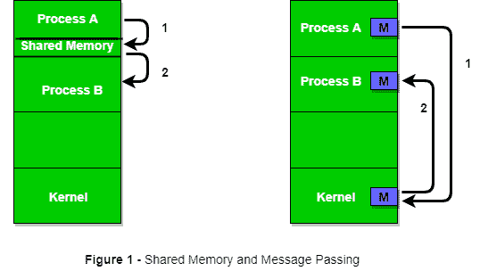
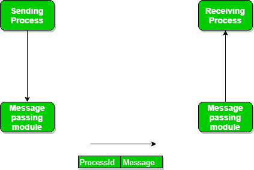

# 进程间通信(IPC)

> 原文:[https://www . geesforgeks . org/进程间通信-ipc/](https://www.geeksforgeeks.org/inter-process-communication-ipc/)

一个过程可以有两种类型:

*   独立流程。
*   合作过程。

一个独立的进程不受其他进程执行的影响，而一个合作的进程可能会受到其他执行进程的影响。尽管人们可以认为那些独立运行的进程将非常有效地执行，但在现实中，有许多情况可以利用合作的性质来提高计算速度、便利性和模块化。进程间通信(IPC)是一种允许进程相互通信并同步其动作的机制。这些过程之间的交流可以看作是它们之间合作的一种方法。进程可以通过两者相互通信:

1.  共用存储器
2.  信息传递

下面的图 1 显示了进程之间通过共享内存方法和消息传递方法进行通信的基本结构。

操作系统可以实现这两种通信方法。首先，我们将讨论通信和消息传递的共享内存方法。使用共享内存的进程之间的通信需要进程共享一些变量，这完全取决于程序员将如何实现它。使用共享内存的一种通信方式可以这样想象:假设进程 1 和进程 2 同时执行，并且它们共享一些资源或使用来自另一个进程的一些信息。Process1 生成关于正在使用的某些计算或资源的信息，并将其作为记录保存在共享内存中。当进程 2 需要使用共享信息时，它将检查存储在共享内存中的记录，并记录进程 1 生成的信息，并相应地采取行动。进程可以使用共享内存从另一个进程中提取信息作为记录，也可以将任何特定信息传递给其他进程。
我们来讨论一个使用共享内存方法的进程间通信的例子。



**i)共享内存方法**

**例:生产者-消费者问题**
有两个过程:生产者和消费者。生产者生产一些产品，消费者消费这些产品。这两个进程共享一个称为缓冲区的公共空间或内存位置，生产者生产的产品存储在缓冲区中，如果需要，消费者可以从缓冲区中消费产品。这个问题有两个版本:第一个被称为无界缓冲区问题，其中生产者可以继续生产项目，并且对缓冲区的大小没有限制；第二个被称为有界缓冲区问题，其中生产者可以在开始等待消费者消费之前生产多达一定数量的项目。我们将讨论有界缓冲区问题。首先，生产者和消费者将共享一些共同的记忆，然后生产者将开始生产物品。如果生产的总项目等于缓冲区的大小，生产者将等待消费者消费它。类似地，消费者将首先检查物品的可用性。如果没有项目可用，消费者将等待生产者生产它。如果有可用的物品，消费者会消费它们。要演示的伪代码如下:
**两个进程之间的共享数据**

## C

```
#define buff_max 25
#define mod %

    struct item{

        // different member of the produced data
        // or consumed data   
        ---------
    }

    // An array is needed for holding the items.
    // This is the shared place which will be 
    // access by both process  
    // item shared_buff [ buff_max ];

    // Two variables which will keep track of
    // the indexes of the items produced by producer
    // and consumer The free index points to
    // the next free index. The full index points to
    // the first full index.
    int free_index = 0;
    int full_index = 0;

```

**生产商流程代码**

## C

```
item nextProduced;

    while(1){

        // check if there is no space
        // for production.
        // if so keep waiting.
        while((free_index+1) mod buff_max == full_index);

        shared_buff[free_index] = nextProduced;
        free_index = (free_index + 1) mod buff_max;
    }
```

**消费者流程代码**

## C

```
item nextConsumed;

    while(1){

        // check if there is an available
        // item  for consumption.
        // if not keep on waiting for
        // get them produced.
        while((free_index == full_index);

        nextConsumed = shared_buff[full_index];
        full_index = (full_index + 1) mod buff_max;
    }
```

在上面的代码中，生产者将在(free_index+1) mod buff max 空闲时再次开始生产，因为如果它不空闲，这意味着仍然有项目可以被消费者消费，因此没有必要生产更多。同样，如果自由索引和完全索引指向同一个索引，这意味着没有要消费的项目。

**ii)消息传递方法**

现在，我们将通过消息传递开始讨论进程之间的通信。在这种方法中，进程在不使用任何类型的共享内存的情况下相互通信。如果两个进程 p1 和 p2 想要相互通信，它们将如下进行:

*   建立通信链路(如果链路已经存在，则无需再次建立。)
*   开始使用基本原语交换消息。
    我们至少需要两个原语:
    –**发送**(消息、目的地)或**发送**(消息)
    –**接收**(消息、主机)或**接收**(消息)



消息大小可以是固定大小，也可以是可变大小。如果是固定大小，对于操作系统设计者来说很容易，但是对于程序员来说很复杂；如果是可变大小，那么对于程序员来说很容易，但是对于操作系统设计者来说很复杂。标准消息可以有两个部分:**头和正文。**
**报头部分**用于存储消息类型、目的地 id、源 id、消息长度和控制信息。控制信息包含的信息有:如果缓冲空间不足怎么办、序列号、优先级。一般来说，消息是用先进先出的方式发送的。

**通过通信链路传递的消息。**
**直接和间接通信链路**
现在，我们将开始讨论实现通信链路的方法。在实现链接时，有一些问题需要记住，例如:

1.  链接是如何建立的？
2.  一个链接可以与两个以上的进程相关联吗？
3.  每对通信进程之间可以有多少个链接？
4.  一个链接的容量是多少？链接可以容纳的消息大小是固定的还是可变的？
5.  链路是单向的还是双向的？

链路具有一定的容量，它决定了可以临时驻留在其中的消息数量，每个链路都有一个与之相关联的队列，该队列可以是零容量、有限容量或无限容量。在零容量情况下，发送方等待，直到接收方通知发送方它已经收到消息。在非零容量的情况下，在发送操作之后，进程不知道是否已经接收到消息。为此，发送方必须与接收方明确通信。链路的实现取决于具体情况，它可以是直接通信链路，也可以是定向通信链路。
**当进程使用特定的进程标识符进行通信时，会实现直接通信链接**，但很难提前识别发送方。
**例如打印服务器。**
**直接通信**是通过共享邮箱(端口)完成的，该共享邮箱由一个消息队列组成。发件人把信息放在邮箱里，收件人去取。

**通过交换消息传递的消息。**

**同步和异步消息传递:**
被阻塞的进程是等待某个事件的进程，例如资源变得可用或输入/输出操作完成。在同一台计算机上的进程之间以及在不同计算机上运行的进程之间，即在网络/分布式系统中，IPC 是可能的。在这两种情况下，在发送消息或尝试接收消息时，进程可能会被阻止，也可能不会被阻止，因此消息传递可能会被阻止，也可能不会被阻止。阻塞被认为是**同步**和**阻塞发送**意味着发送方将被阻塞，直到消息被接收方接收。类似地，**阻塞接收**使接收器阻塞，直到有消息可用。非阻塞被认为是**异步**，非阻塞发送让发送方发送消息并继续。类似地，非阻塞接收让接收方接收有效消息或空消息。经过仔细分析，我们可以得出结论，对于发送者来说，在消息传递后不阻塞是更自然的，因为可能需要将消息发送到不同的进程。但是，如果发送失败，发送方希望接收方确认。类似地，由于来自接收消息的信息可以用于进一步的执行，所以接收器在发出接收之后阻塞是更自然的。同时，如果消息发送继续失败，接收者将不得不无限期等待。这就是为什么我们还要考虑消息传递的另一种可能性。基本上有三种优选组合:

*   阻止发送和阻止接收
*   无阻塞发送和无阻塞接收
*   非阻塞发送和阻塞接收(常用)

**在直接消息传递**中，想要通信的进程必须明确指定通信的接收者或发送者。
例如**发送(p1，消息)**表示将消息发送到 p1。
同样，**接收(p2，消息)**表示从 p2 接收消息。
在这种通信方法中，通信链路自动建立，可以是单向的，也可以是双向的，但一对发送方和接收方之间可以使用一条链路，一对发送方和接收方不应拥有超过一对链路。也可以实现发送和接收之间的对称和不对称，即，或者两个过程将为发送和接收消息而相互命名，或者只有发送方将为发送消息而命名接收方，而不需要接收方为接收消息而命名发送方。这种通信方法的问题是，如果一个进程的名称发生变化，这种方法将不起作用。
**在间接消息传递**中，进程使用邮箱(也称为端口)来发送和接收消息。每个邮箱都有一个唯一的 id，进程只有共享一个邮箱才能通信。只有当进程共享一个公共邮箱，并且一个链接可以与多个进程关联时，才会建立链接。每对进程可以共享几个通信链路，这些链路可以是单向的或双向的。假设两个进程想要通过间接消息传递进行通信，所需的操作是:创建一个邮箱，使用这个邮箱发送和接收消息，然后销毁这个邮箱。使用的标准原语是: **send(A，message)** 这意味着将消息发送到邮箱 A。用于接收消息的原语也以相同的方式工作，例如 **received (A，message)** 。此邮箱实现有问题。假设有两个以上的进程共享同一个邮箱，假设进程 p1 向邮箱发送消息，哪个进程将是接收者？这可以通过强制要求只有两个进程可以共享一个邮箱，或者强制要求在给定时间只允许一个进程执行接收方，或者随机选择任何进程并通知发送方接收方来解决。一个邮箱可以是单个发送者/接收者对的私有邮箱，也可以在多个发送者/接收者对之间共享。端口是这种邮箱的一种实现，它可以有多个发送者和一个接收者。它用于客户端/服务器应用程序(在这种情况下，服务器是接收器)。端口归接收进程所有，由操作系统根据接收进程的请求创建，并且可以在接收进程终止自身时根据同一接收处理器的请求销毁。强制只允许一个进程执行接收可以使用互斥的概念来完成。**创建互斥邮箱**，由 n 个进程共享。发件人没有阻止并发送邮件。执行接收的第一个进程将进入临界区，所有其他进程都将阻塞并等待。
现在，让我们使用消息传递概念来讨论生产者-消费者问题。生产者将项目(消息内部)放入邮箱，当邮箱中至少有一条消息时，消费者可以消费一个项目。代码如下:
**生产者代码**

## C

```
void Producer(void){

        int item;
        Message m;

        while(1){

            receive(Consumer, &m);
            item = produce();
            build_message(&m , item ) ;
            send(Consumer, &m);
        }
    }
```

**消费者代码**

## C

```
void Consumer(void){

        int item;
        Message m;

        while(1){

            receive(Producer, &m);
            item = extracted_item();
            send(Producer, &m);
            consume_item(item);
        }
    }
```

**仪表板组合仪表系统示例**

1.  Posix:使用共享内存方法。
2.  马赫:使用消息传递
3.  Windows XP:使用本地过程调用进行消息传递

**客户端/服务器架构中的通信:**
有多种机制:

*   管
*   (电源)插座
*   远程过程调用

以上三种方法将在后面的文章中讨论，因为它们都是概念性的，值得单独的文章讨论。
**参考文献:**

1.  高尔文等人的操作系统概念。
2.  巴尔-伊兰大学阿里尔·弗兰克的讲稿/ppt

更多参考:
[http://nptel . AC . in/courses/106108101/pdf/讲座 _ Notes/Mod % 207 _ ln . pdf](http://nptel.ac.in/courses/106108101/pdf/Lecture_Notes/Mod%207_LN.pdf)
[【https://www.youtube.com/watch?v=lcRqHwIn5Dk】](https://www.youtube.com/watch?v=lcRqHwIn5Dk)
本文由 **Durgesh Pandey** 供稿。如果你发现任何不正确的地方，或者你想分享更多关于上面讨论的话题的信息，请写评论。如果你喜欢极客博客并想投稿，你也可以写一篇文章并把你的文章邮寄到 contribute@geeksforgeeks.org。看到你的文章出现在极客博客主页上，帮助其他极客。