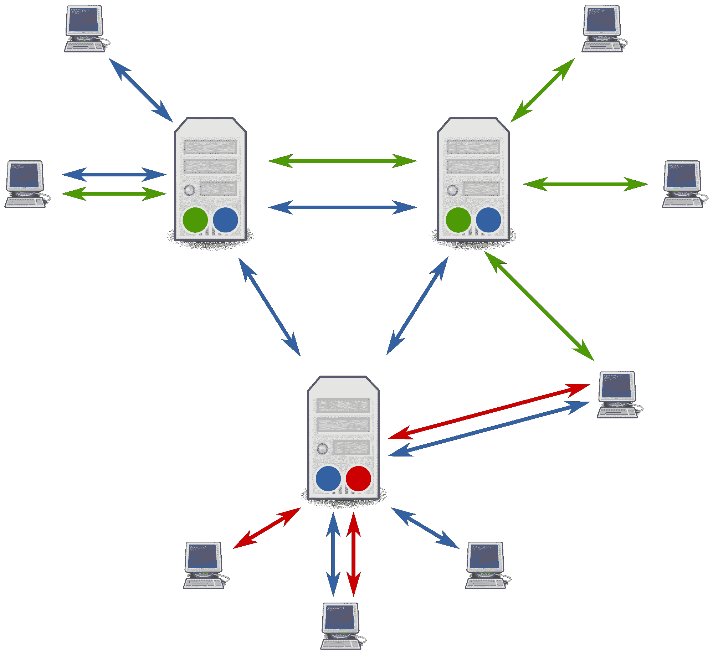

# 分布式系统中的进程间通信

> 原文:[https://www . geesforgeks . org/进程间通信分布式系统/](https://www.geeksforgeeks.org/interprocess-communication-in-distributed-systems/)

**进程间通信**是分布式环境中两个或多个独立进程之间交换数据的过程，称为进程间通信。互联网上的进程间通信提供数据报和流通信。

**进程间通信示例:**

1.  n 个应用程序可以通过网络协议与 X 服务器通信。
2.  像 Apache 这样的服务器会产生子进程来处理请求。
3.  管道是一种形式的 IPC: grep foo 文件|排序

它有两个功能:

1.  **同步:**
    数据交换是同步完成的，这意味着它只有一个时钟脉冲。
2.  **消息传递:**
    进程希望交换信息时。消息传递有几种形式，例如:管道、先进先出、共享内存和消息队列。

**进程间通信的特点:**
在分布式环境/系统中，进程间通信主要有五个特点。

1.  **同步系统调用:**
    在同步系统调用中，发送方和接收方都使用阻塞系统调用来传输数据，这意味着发送方将一直等待，直到收到接收方的确认，而接收方则一直等待，直到消息到达。
2.  **异步系统调用:**
    在异步系统调用中，发送方和接收方都使用非阻塞系统调用来传输数据，这意味着发送方不等待接收方的确认。
3.  **消息目的地:**
    本地端口是计算机内的消息目的地，指定为整数。Aport 只有一个接收器，但有多个发送器。进程可以使用多个端口来接收消息。任何知道端口号的进程都可以向它发送消息。
4.  **信度:**
    定义为有效性和完整性。
5.  **完整性:**
    消息必须在没有损坏和重复的情况下到达目的地。
6.  **有效性:**
    点对点消息服务被定义为可靠的，如果消息被保证不丢失地传递，则称为有效性。
7.  **排序:**
    是以特定的顺序向接收者传递消息的过程。一些应用程序要求消息按照发送者顺序传递，即发送者发送消息的顺序。