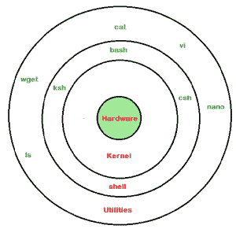
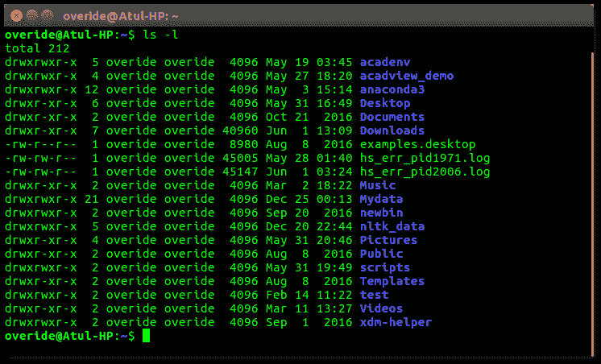
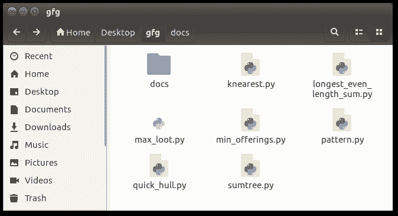
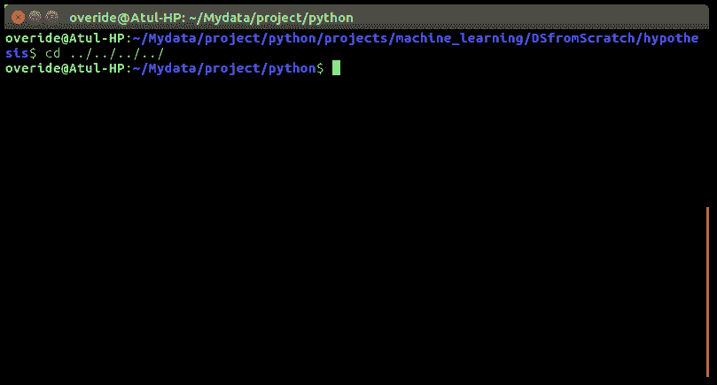
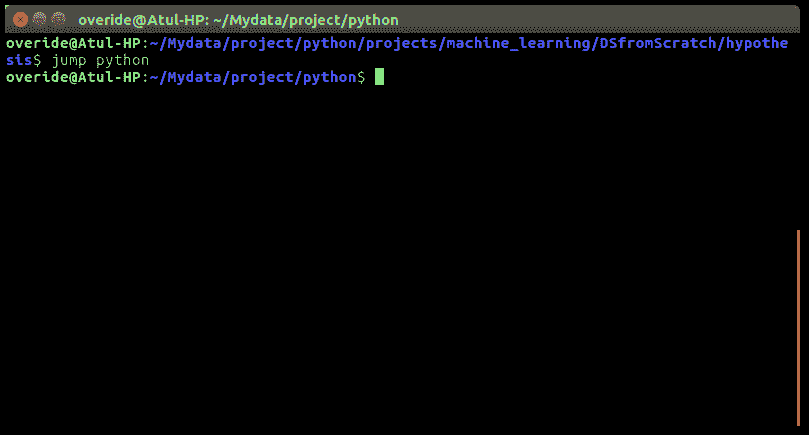

# Linux Shell 和 Shell 脚本介绍

> 原文:[https://www . geesforgeks . org/introduction-Linux-shell-shell-scripting/](https://www.geeksforgeeks.org/introduction-linux-shell-shell-scripting/)

如果你正在使用任何主要的操作系统，你是在间接地与 **shell** 交互。如果你运行的是 Ubuntu、Linux Mint 或者任何其他的 Linux 发行版，那么你每次使用终端的时候都是在和 shell 交互。在本文中，我将讨论 linux shells 和 shell 脚本，因此在理解 shell 脚本之前，我们必须熟悉以下术语–

*   核心
*   壳
*   Terminal

    **什么是内核**

    内核是一个计算机程序，它是计算机操作系统的核心，对系统中的一切都有完全的控制权。它管理 Linux 系统的以下资源–

    *   文件管理
    *   进程管理
    *   输入输出管理
    *   内存管理
    *   设备管理等。

        [**Linus Torvalds**](https://en.wikipedia.org/wiki/Linus_Torvalds)

        [GNU](https://en.wikipedia.org/wiki/GNU)

    **什么是壳牌**

    shell 是一种特殊的用户程序，它为用户使用操作系统服务提供了一个接口。Shell 从用户那里接受人类可读的命令，并将它们转换成内核能够理解的东西。它是一个命令语言解释器，执行从键盘等输入设备或文件中读取的命令。当用户登录或启动终端时，shell 启动。

    

    linux 外壳

    *   命令行外壳
    *   图形外壳

    **命令行外壳**

    用户可以使用命令行界面访问 Shell。提供了一个在 linux/macOS 中称为**终端**或在 Windows 操作系统中称为**命令提示符**的特殊程序，用于键入人类可读的命令，如“cat”、“ls”等。然后它被执行。结果然后在终端上显示给用户。Ubuntu 16.4 系统中的一个终端看起来是这样的–

    

    linux 命令行

    **“ls”**

    **“-l”**

    它将以长列表格式列出当前工作目录中的所有文件。
    对于初学者来说，使用命令行 shell 有点困难，因为很难记住这么多命令。它非常强大，它允许用户将命令存储在一个文件中并一起执行。这样，任何重复的任务都可以很容易地自动化。这些文件在 Windows 中通常称为**批处理文件**，在 Linux/macOS 系统中称为 **Shell** 脚本。

    **图形外壳**

    图形外壳通过允许诸如打开、关闭、移动窗口和调整窗口大小等操作，以及在窗口之间切换焦点，提供了基于图形用户界面操作程序的手段。视窗操作系统或 Ubuntu 操作系统可以作为一个很好的例子，为用户提供与程序交互的图形用户界面。用户不需要为每个操作键入命令。Ubuntu 系统中典型的图形用户界面–

    

    图形用户界面外壳

    有几种外壳可用于 Linux 系统，例如–

    *   [BASH(Bourne more SHell)](https://en.wikipedia.org/wiki/Bash_(Unix_shell))–它是 Linux 系统中使用最广泛的 SHell。它在 Linux 系统和 macOS 中被用作默认登录外壳。也可以安装在 Windows 操作系统上。
    *   [CSH(C SHell)](https://en.wikipedia.org/wiki/C_shell)–C SHell 的语法和用法与 C 编程语言非常相似。
    *   [KSH(Korn SHell)](https://en.wikipedia.org/wiki/Korn_shell)–Korn SHell 也是 POSIX Shell 标准规范等的基础。

    每个 shell 执行相同的工作，但理解不同的命令，并提供不同的内置功能。

    **外壳脚本**

    通常外壳是交互式的，也就是说，它们接受用户输入的命令并执行它们。然而，有时我们想例行执行一堆命令，所以我们每次都在终端输入所有命令。
    由于 shell 也可以从文件中获取命令作为输入，所以我们可以将这些命令写入一个文件中，并可以在 shell 中执行它们，以避免这种重复的工作。这些文件被称为**外壳脚本**或**外壳程序**。Shell 脚本类似于 MS-DOS 中的 **[批处理文件](https://en.wikipedia.org/wiki/Batch_file)** 。每个 shell 脚本都用**保存。sh** 文件扩展名例如 **myscript.sh**

    shell 脚本的语法就像任何其他编程语言一样。如果你有任何编程语言的经验，如 Python，C/C++等。开始使用它会非常容易。
    外壳脚本包含以下元素–

    *   外壳关键词–如果、否则、中断等。
    *   Shell 命令–CD、ls、回声、pwd、触摸等。
    *   功能
    *   控制流程–如果..然后..否则，外壳和壳环等。

    **为什么我们需要 shell 脚本**

    编写 shell 脚本有很多原因–

    *   为了避免重复工作和自动化
    *   系统管理员使用 shell 脚本进行日常备份
    *   系统监控
    *   向外壳添加新功能等。

    **shell 脚本的优势**

    *   命令和语法与直接在命令行中输入的完全相同，因此程序员不需要切换到完全不同的语法
    *   编写 shell 脚本要快得多
    *   快速启动
    *   交互式调试等。

    **shell 脚本的缺点**

    *   容易出现代价高昂的错误，一个错误就可以改变命令，这可能是有害的
    *   执行速度慢
    *   语言语法或实现中的设计缺陷
    *   不太适合大型和复杂的任务
    *   与其他脚本语言不同，提供最小的数据结构。等等

    **使用 Bash shell 进行 Shell 脚本编写的简单演示**

    如果你在终端上工作，一些你在目录中深入遍历的东西。然后，对于路径中出现的几个目录，我们必须执行如下所示的命令，以到达“python”目录–
    

    这是相当令人沮丧的，所以为什么我们不可以有一个实用程序，我们只需要键入目录的名称，我们可以直接跳到那里，而不用执行**CD../**一遍又一遍的命令。将脚本保存为

    ```
    # !/bin/bash

    # A simple bash script to move up to desired directory level directly

    function jump()
    {
        # original value of Internal Field Separator
        OLDIFS=$IFS

        # setting field separator to "/" 
        IFS=/

        # converting working path into array of directories in path
        # eg. /my/path/is/like/this
        # into [, my, path, is, like, this]
        path_arr=($PWD)

        # setting IFS to original value
        IFS=$OLDIFS

        local pos=-1

        # ${path_arr[@]} gives all the values in path_arr
        for dir in "${path_arr[@]}"
        do
            # find the number of directories to move up to
            # reach at target directory 
            pos=$[$pos+1]
            if [ "$1" = "$dir" ];then

                # length of the path_arr
                dir_in_path=${#path_arr[@]}

                #current working directory
                cwd=$PWD
                limit=$[$dir_in_path-$pos-1]
                for ((i=0; i<limit; i++))
                do
                    cwd=$cwd/..
                done
                cd $cwd
                break
            fi
        done
    }
    ```

    **目前我们无法执行 shell 脚本，因为它没有权限。我们必须通过键入以下命令使其可执行–**

    ```
    $ chmod -x path/to/our/file/jump.sh 
    ```

    **现在，为了在每个终端会话中都可以使用它，我们必须将它放入**。bashrc"** 文件。
    **。bashrc"** 是一个 shell 脚本，Bash shell 会在交互启动时运行。. bashrc 文件的目的是提供一个地方，您可以在这里设置变量、函数和别名，定义我们的提示，并定义我们希望在每次打开新终端窗口时使用的其他设置。
    现在打开终端，输入以下命令–**

    ```
    $ echo “source ~/path/to/our/file/jump.sh”>> ~/.bashrc 
    ```

    **现在打开您的终端，通过键入以下命令来尝试新的“跳转”功能-**

    ```
    $ jump dir_name 
    ```

    **就像下图截图一样–
    **

    ****学习 Bash 脚本的资源****

    *   **[https://bash.cyberciti.biz/guide/The_bash_shell](https://bash.cyberciti.biz/guide/The_bash_shell)**
    *   **[http://tldp . org/LDP/ABS/html/](http://tldp.org/LDP/abs/html/)**

    ****参考文献****

    *   **[https://en . Wikipedia . org/wiki/shell _ script](https://en.wikipedia.org/wiki/Shell_script)**
    *   **[https://en . Wikipedia . org/wiki/shell _(计算)](https://en.wikipedia.org/wiki/Shell_(computing))**

    **本文由 **[阿图尔·库马尔](https://www.facebook.com/atul.kr.007)** 供稿。如果你喜欢 GeeksforGeeks 并想投稿，你也可以使用[contribute.geeksforgeeks.org](http://contribute.geeksforgeeks.org)写一篇文章或者把你的文章邮寄到 contribute@geeksforgeeks.org。看到你的文章出现在极客博客主页上，帮助其他极客。如果你发现任何不正确的地方，或者你想分享更多关于上面讨论的话题的信息，请写评论。**