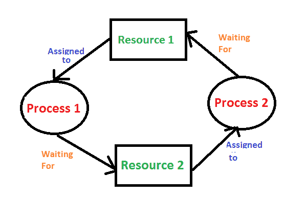
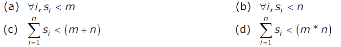

# 操作系统死锁引入

> 原文:[https://www . geesforgeks . org/操作系统死锁引入/](https://www.geeksforgeeks.org/introduction-of-deadlock-in-operating-system/)

操作系统中的进程以下列方式使用资源。
1)请求资源
2)使用资源
3)释放资源

**死锁是一组进程被阻塞的情况，因为每个进程都持有一个资源，并等待其他进程获取另一个资源。
举一个例子，当两列火车在同一条轨道上向对方驶来，而只有一条轨道时，一旦火车在对方前面，它们都不能移动。当有两个或多个进程持有一些资源并等待其他进程持有的资源时，操作系统中也会出现类似的情况。例如，在下图中，流程 1 持有资源 1，等待流程 2 获取的资源 2，流程 2 等待资源 1。** 

****

****如果****以下四个条件同时保持(必要条件)**
***互斥:*** 一个或多个资源不可共享(一次只能有一个进程使用)
***保持并等待:*** 一个进程至少保持一个资源并等待资源。
***无抢占:*** 除非进程释放资源，否则不能从进程中获取资源。
***循环等待:*** 一组流程以循环的形式相互等待。**

****处理死锁的方法**
处理死锁的方法有三种
1)死锁预防或避免:想法是不让系统进入死锁状态。
可以逐个放大每个类别，通过否定上述死锁的必要条件之一来实现预防。
回避本质上是一种未来派。通过使用“回避”策略，我们必须做一个假设。我们需要确保在执行流程之前，我们知道流程需要哪些资源的所有信息。为了避免死锁，我们使用了银行家算法(这反过来又是迪杰斯特拉的礼物)。**

**2)死锁检测和恢复:让死锁发生，一旦发生就做抢占处理。**

**3)完全忽略问题:如果死锁非常罕见，那么让它发生并重新启动系统。这是 Windows 和 UNIX 都采用的方法。**

****练习:**
**1)** 假设 n 个进程，P1，…。Pn 共享 m 个相同的资源单元，可以一次保留和释放一个。工艺 Pi 最大资源需求为 Si，其中 Si > 0。以下哪一项是确保不会发生死锁的充分条件？(GATE CS 2005)** 

****

****(A)**A
**(B)**B
**(C)**C
T9】(D)D**

**解决方法见[https://www.geeksforgeeks.org/operating-systems-set-16/](https://www.geeksforgeeks.org/operating-systems-set-16/)问题 4**

**更多问题参见[死锁测试](https://www.geeksforgeeks.org/deadlock-gq/)。**

****参考文献:**
[【http://www2.latech.edu/~box/os/ch07.pdf】](http://www2.latech.edu/~box/os/ch07.pdf)
[http://www . cs . UIC . edu/~ jbell/course notes/operating systems/7 _ deadlocks . html](http://www.cs.uic.edu/~jbell/CourseNotes/OperatingSystems/7_Deadlocks.html)**

**如果发现有不正确的地方，请写评论，或者想分享更多关于以上讨论话题的信息**