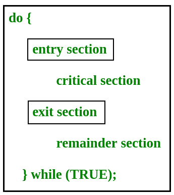
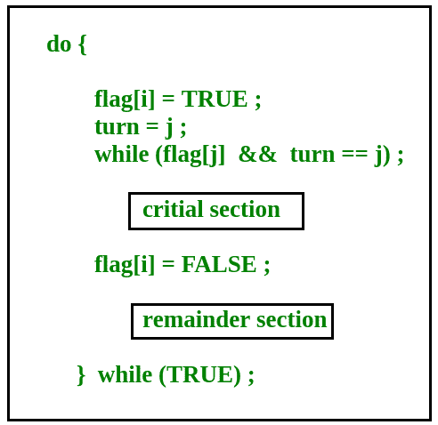

# 流程同步介绍

> 原文:[https://www . geesforgeks . org/进程同步介绍/](https://www.geeksforgeeks.org/introduction-of-process-synchronization/)

基于同步，进程被分为以下两种类型:

*   **独立进程**:一个进程的执行不影响其他进程的执行。
*   **协同流程**:一个流程的执行影响其他流程的执行。

在协作过程的情况下，由于资源在协作过程中是共享的，因此也出现了过程同步问题。

**竞态条件**
当多个进程在该条件下执行相同的代码或访问相同的内存或任何共享变量时，共享变量的输出或值有可能是错误的，因此对于所有进行竞态的进程来说，说我的输出是正确的这种情况称为竞态条件。几个进程同时访问和处理对同一数据的操作，那么结果取决于访问发生的特定顺序。
比赛状态是可能发生在关键路段内的情况。当临界区中多个线程执行的结果根据线程执行的顺序而不同时，就会出现这种情况。

如果将关键部分视为原子指令，则可以避免关键部分中的竞争条件。此外，使用锁或原子变量的适当线程同步可以防止竞争条件。

**关键路段问题**

关键部分是一段代码，一次只能由一个进程访问。关键部分包含需要同步的共享变量，以保持数据变量的一致性。
[](https://www.geeksforgeeks.org/wp-content/uploads/gq/2015/06/critical-section-problem.png)

在进入部分，流程请求进入**关键部分。**

关键部分问题的任何解决方案都必须满足三个要求:

*   **互斥**:如果一个进程正在它的临界区执行，那么在临界区不允许执行其他进程。
*   **进程**:如果临界区没有进程在执行，而其他进程在临界区外等待，那么只有那些剩余区没有执行的进程才能参与决定下一个进入临界区的进程，选择不能无限期推迟。
*   **有界等待**:在一个进程请求进入其关键部分之后，在该请求被批准之前，一个边界必须存在于允许其他进程进入其关键部分的次数上。

**彼得森的解决方案**
彼得森的解决方案是基于经典软件的临界区问题的解决方案。

在彼得森的解决方案中，我们有两个共享变量:

*   布尔标志[i]:初始化为 FALSE，最初没有人对进入临界区感兴趣
*   int turn:轮到进入关键部分的过程。

[](https://www.geeksforgeeks.org/wp-content/uploads/gq/2015/06/peterson.png) 

皮特森的解决方案保留了所有三个条件:

*   互斥是有保证的，因为任何时候只有一个进程可以访问关键部分。
*   进展也是有保证的，因为关键部分之外的进程不会阻止其他进程进入关键部分。
*   Bounded Waiting is preserved as every process gets a fair chance.

    彼得森解决方案的缺点

    *   它包括忙碌的等待
    *   它仅限于两个过程。

    **TestAndSet**
    TestAndSet 是同步问题的硬件解决方案。在 TestAndSet 中，我们有一个共享锁变量，它可以取两个值中的任何一个，0 或 1。

    ```
    0 Unlock
    1 Lock

    ```

    在进入关键部分之前，一个进程查询锁。如果它被锁定，它会继续等待，直到它变得空闲，如果它没有被锁定，它会获取锁并执行关键部分。

    在 TestAndSet 中，互斥和进度被保留，但有界等待不能被保留。

    **问题:**实现流程关键部分的 enter_CS()和 leave_CS()函数使用测试和设置指令实现，如下所示:

    ```
    int TestAndSet(int &lock) {
        int initial = lock;
        lock = 1;
        return initial;
    }

    void enter_CS(X)
    {
      while test-and-set(X) ;
    }

    void leave_CS(X)
    {
      X = 0;
    }

    ```

    在上述解决方案中，X 是与 CS 相关联的存储器位置，并且被初始化为 0。现在考虑以下语句:
    I .以上 CS 问题的解决方案是无死锁的
    II。解决办法是免于饥饿。
    三世。流程按照先进先出的顺序进入控制系统。
    四。多个进程可以同时进入 CS。

    以上哪个说法是正确的？
    (A)一
    (B)二、三
    (C)二、四
    (D)四

    [点击此处查看解决方案](https://www.geeksforgeeks.org/gate-gate-cs-2009-question-33/)。
    真
    T4】信号灯

    信号量是一种信号机制，等待信号量的线程可以由另一个线程发出信号。这与互斥不同，因为互斥只能由调用等待函数的线程发出信号。

    信号量使用两个原子操作，等待和信号来实现进程同步。
    信号量是一个整型变量，只能通过 *wait()* 和 *signal()* 两个操作来访问。
    信号量有两种类型:**二进制信号量**和**计数信号量**

    *   二进制信号量:它们只能是 0 或 1。它们也被称为互斥锁，因为锁可以提供互斥。所有进程都可以共享初始化为 1 的同一个互斥信号量。然后，一个进程必须等到锁变成 0。然后，该进程可以使互斥信号量为 1，并启动其关键部分。当它完成其关键部分时，它可以将互斥信号量的值重置为 0，并且一些其他进程可以进入其关键部分。
    *   计算信号量:它们可以有任何值，并且不受某个域的限制。它们可用于控制对资源的访问，该资源对同时访问的次数有限制。信号量可以初始化为资源的实例数。每当进程想要使用该资源时，它都会检查剩余实例的数量是否大于零，即该进程是否有可用的实例。然后，进程可以进入其临界区，从而将计数信号量的值减少 1。在使用资源实例的过程结束后，它可以离开关键部分，从而将资源的可用实例数增加 1。

    真实的

    **参考文献**
    www . csee . wvu . edu/~ JD mooney/classes/cs 550/notes/tech/mutex/Peterson . html
    [http://iit.qau.edu.pk/books/OS_8th_Edition.pdf](http://iit.qau.edu.pk/books/OS_8th_Edition.pdf)

    如果您发现任何不正确的地方，或者您想分享更多关于上述主题的信息，请写评论