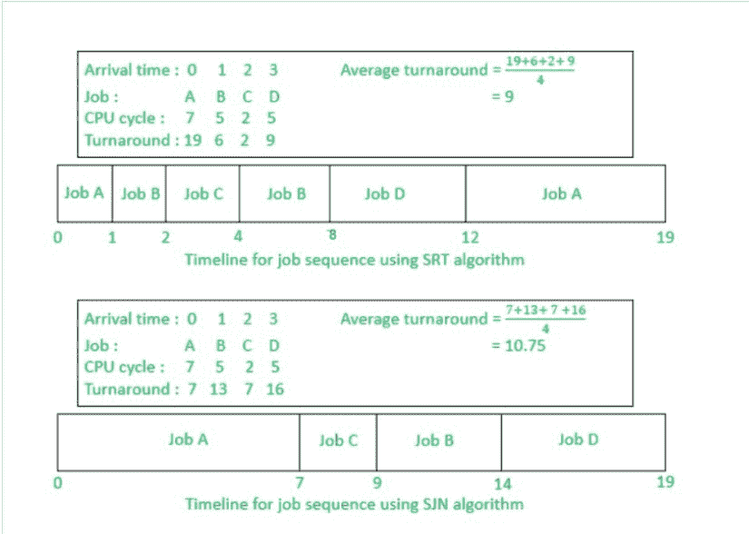

# 最短剩余时间优先(SRTF)算法介绍

> 原文:[https://www . geesforgeks . org/最短剩余时间优先算法介绍/](https://www.geeksforgeeks.org/introduction-of-shortest-remaining-time-first-srtf-algorithm/)

[最短剩余时间优先(SRTF)](https://www.geeksforgeeks.org/program-shortest-job-first-scheduling-set-2srtf-make-changesdoneplease-review/) 是[最短作业下一步(SJN)](https://www.geeksforgeeks.org/program-for-shortest-job-first-or-sjf-cpu-scheduling-set-1-non-preemptive/) 算法的抢先版本，其中处理器被分配给最接近完成的作业。

该算法需要先进的概念和在交互式系统中处理作业所需的 CPU 时间的知识，因此不能在那里实现。但是，在批处理系统中，希望优先考虑短作业，使用 SRT 算法。

然而，SRT 比 SJN 涉及更多的开销，因为操作系统需要频繁监控**就绪**队列中作业的 CPU 时间并执行上下文切换。

如上所述，对于同一组作业，SRT 算法的执行速度比 SJN 算法快。但是，这里忽略了开销费用，即上下文切换所需的时间。当一个作业被抢占时，它的所有处理信息必须保存在它的印刷电路板上，以便以后继续执行，操作系统切换到的另一个作业的印刷电路板上的内容被加载到内存中的寄存器中。这就是所谓的**上下文切换**。

**优势:**
SRTF 算法使作业的处理速度比 SJN 算法更快，因为它的间接费用没有计算在内。

**缺点:**
上下文切换在 SRTF 做的次数比 SJN 多很多，消耗 CPU 宝贵的处理时间。这增加了它的处理时间，减少了它快速处理的优势。