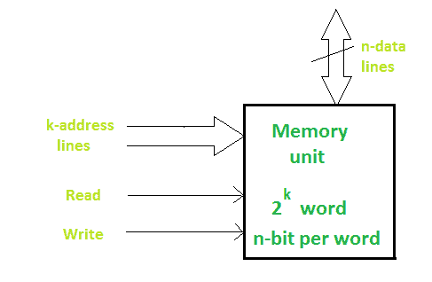

# 内存和内存单元介绍

> 原文:[https://www . geesforgeks . org/内存和内存单元简介/](https://www.geeksforgeeks.org/introduction-to-memory-and-memory-units/)

记忆是由寄存器组成的。存储器中的每个寄存器都是一个存储单元。存储位置也称为存储位置。使用**地址**识别存储位置。一个内存可以存储的总位数是它的**容量**。

存储元件称为**单元**。每个寄存器由存储一位数据的存储元件组成。存储器中的数据分别通过名为**写**和**读**的过程存储和检索。

**字**是存储单元存储二进制信息的一组位。一组 8 位的字称为一个**字节**。
存储单元由指定传输方向的数据线、地址选择线和控制线组成。存储单元的框图如下所示:

数据线提供要存储在存储器中的信息。控制输入指定直接传输。k 地址线指定所选的单词。

当有 k 条地址线时，可以访问 2 k 个存储字。

参见[内存和只读存储器](https://www.geeksforgeeks.org/types-computer-memory-ram-rom/)、[不同类型的内存](https://www.geeksforgeeks.org/different-types-ram-random-access-memory/)、[缓存内存](https://www.geeksforgeeks.org/cache-memory/)和[二级内存](https://www.geeksforgeeks.org/secondary-memory/)