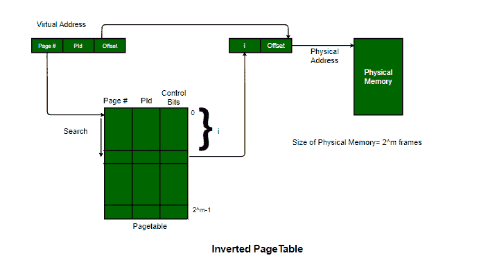

# 操作系统中的倒排页表

> 原文:[https://www . geesforgeks . org/操作系统中的倒页表/](https://www.geeksforgeeks.org/inverted-page-table-in-operating-system/)

先决条件–[分页](https://www.geeksforgeeks.org/operating-system-paging/)、[页表条目](https://www.geeksforgeeks.org/operating-system-page-table-entries/)、[分段](https://www.geeksforgeeks.org/operating-systems-segmentation/)
大多数操作系统为每个进程实现一个单独的页表，即对于在多处理/分时操作系统上运行的“n”个进程，内存中存储有“n”个页表。有时，当一个进程的大小非常大，并且它占用了虚拟内存，那么随着进程的大小，它的页表大小也会大大增加。

```
Example: A process of size 2 GB with:
Page size = 512 Bytes
Size of page table entry = 4 Bytes, then
Number of pages in the process = 2 GB / 512 B = 222
PageTable Size = 222 * 22 = 224 bytes
```

通过这个例子，可以得出结论，对于在一个操作系统中同时运行的多个进程，相当一部分内存只被页表占用。

操作系统还结合了**多级分页方案**，这进一步增加了存储页表所需的空间，并且在存储页表时投入了大量的内存。页表占用的内存量可能是一个巨大的开销，并且总是不可接受的，因为主内存总是一种稀缺资源。人们做出了各种努力来有效地利用内存，并在多道程序设计和有效的中央处理器利用率之间保持良好的平衡。

**倒排页表–**
另一种方法是使用**倒排页表**结构，该结构由主存储器每一帧的一页表条目组成。因此，倒排页表中页表条目的数量减少到物理内存中的帧数，并且使用单个页表来表示所有进程的分页信息。

通过倒排页表，消除了为每个进程存储单个页表的开销，并且只需要固定的内存部分来一起存储所有进程的分页信息。这种技术被称为反向分页，因为索引是根据帧号而不是逻辑页号进行的。页表中的每个条目都包含以下字段。

*   **页码–**指定逻辑地址的页码范围。
*   **进程 id–**一个倒排页表包含所有正在执行的进程的地址空间信息。由于两个不同的进程可以有相似的虚拟地址集，因此在倒排页表中有必要存储每个进程的进程标识，以唯一标识其地址空间。这是通过使用 PId 和页码的组合来完成的。因此，该进程标识充当地址空间标识符，并确保特定进程的虚拟页面正确映射到相应的物理帧。
*   **控制位–**这些位用于存储额外的寻呼相关信息。这些包括有效位、脏位、参考位、保护和锁定信息位。
*   **链式指针–**有时两个或多个进程可能共享一部分主内存。在这种情况下，两个或多个逻辑页映射到同一个页表条目，然后使用链接指针将这些逻辑页的详细信息映射到根页表。

**工作–**倒排页表的操作如下所示。



CPU 生成的虚拟地址包含字段，每个页表条目包含分页相关机制所需的和其他相关信息。当发生存储器引用时，该虚拟地址由存储器映射单元匹配，并且搜索倒排页表以匹配，并且获得相应的帧号。如果在第 i <sup>个</sup>条目中找到匹配，则进程的物理地址*作为真实地址发送，否则如果没有找到匹配，则产生分段故障。*

**注:倒排页表中的条目数=物理地址空间(PAS)中的帧数**

**示例–**倒排页表及其变体在 PowerPC、UltraSPARC 和 IA-64 架构等各种系统中实现。在 RT-PC 上实现 Mach 操作系统也使用了这种技术。

**优缺点:**

*   **减少的内存空间–**
    反向页表通常会将存储页表所需的内存量减少到物理内存的大小界限。最大条目数可以是物理内存中的页面帧数。
*   **更长的查找时间–**
    倒排页表按照帧号的顺序进行排序，但是内存查找是相对于虚拟地址进行的，因此，通常需要更长的时间来找到合适的条目，但是通常这些页表是使用哈希数据结构来实现的，以便更快地进行查找。
*   **共享内存实现困难–**
    由于倒排页表为每帧存储一个条目，因此在页表中实现共享内存变得困难。链接技术用于将多个虚拟地址映射到按帧号顺序指定的条目。