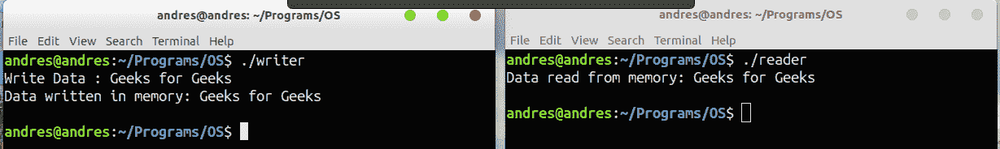

# 通过共享内存进行 IPC

> 原文:[https://www.geeksforgeeks.org/ipc-shared-memory/](https://www.geeksforgeeks.org/ipc-shared-memory/)

[通过共享内存的进程间通信](https://www.geeksforgeeks.org/inter-process-communication/)是两个或多个进程可以访问公共内存的概念。通信是通过共享内存完成的，一个进程所做的更改可以被另一个进程看到。

管道、fifo 和消息队列的问题在于两个进程交换信息。信息必须通过内核。

*   服务器读取输入文件。
*   服务器使用管道、fifo 或消息队列将这些数据写入消息。
*   客户端从 IPC 通道读取数据，同样需要将数据从内核的 IPC 缓冲区复制到客户端的缓冲区。
*   Finally the data is copied from the client’s buffer.

    总共需要四份数据拷贝(两次读取和两次写入)。因此，共享内存提供了一种让两个或多个进程共享一个内存段的方法。使用共享内存，数据只复制两次——从输入文件复制到共享内存，以及从共享内存复制到输出文件。

    使用的系统调用有:

    > **ftok()** :用于生成唯一密钥。
    > 
    > **shm get()**:int shm get(key _ t，size_tsize，intshmflg)；成功完成后，shmget()返回共享内存段的标识符。
    > 
    > **shmat()** :在使用共享内存段之前，您必须使用 shmat()将自己
    > 连接到它。void *shmat(int shmid，void *shmaddr，int shmflg)；
    > shmid 为共享内存 id。shmaddr 指定了要使用的具体地址，但是我们应该将
    > 设置为零，操作系统会自动选择地址。
    > 
    > **shmdt()** :当你使用完共享内存段后，你的程序应该
    > 使用 shmdt()从其中分离出来。int shm dt(void * shmaddr)；
    > 
    > **shmctl()** :脱离共享内存时，不会被破坏。所以，要消灭
    > 就要用到 shmctl()。shmctl(int shmid，IPC_RMID，NULL)；

    写进程的共享内存

    ```
    #include <iostream>
    #include <sys/ipc.h>
    #include <sys/shm.h>
    #include <stdio.h>
    using namespace std;

    int main()
    {
        // ftok to generate unique key
        key_t key = ftok("shmfile",65);

        // shmget returns an identifier in shmid
        int shmid = shmget(key,1024,0666|IPC_CREAT);

        // shmat to attach to shared memory
        char *str = (char*) shmat(shmid,(void*)0,0);

        cout<<"Write Data : ";
        gets(str);

        printf("Data written in memory: %s\n",str);

        //detach from shared memory 
        shmdt(str);

        return 0;
    }
    ```

    读取器进程的共享内存

    ```
    #include <iostream>
    #include <sys/ipc.h>
    #include <sys/shm.h>
    #include <stdio.h>
    using namespace std;

    int main()
    {
        // ftok to generate unique key
        key_t key = ftok("shmfile",65);

        // shmget returns an identifier in shmid
        int shmid = shmget(key,1024,0666|IPC_CREAT);

        // shmat to attach to shared memory
        char *str = (char*) shmat(shmid,(void*)0,0);

        printf("Data read from memory: %s\n",str);

        //detach from shared memory 
        shmdt(str);

        // destroy the shared memory
        shmctl(shmid,IPC_RMID,NULL);

        return 0;
    }
    ```

    输出:
    