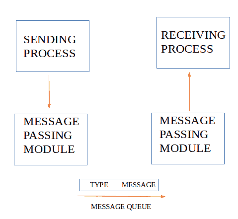
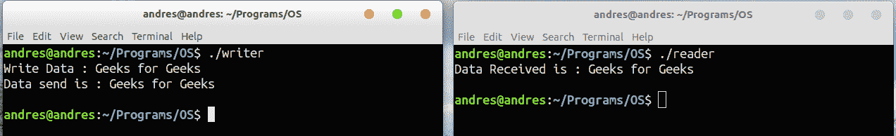

# 使用消息队列的仪表板组合仪表

> 原文:[https://www.geeksforgeeks.org/ipc-using-message-queues/](https://www.geeksforgeeks.org/ipc-using-message-queues/)

先决条件:[进程间通信](https://www.geeksforgeeks.org/inter-process-communication/)
消息队列是存储在内核中并由消息队列标识符标识的消息链表。由 **msgget()** 创建新队列或打开现有队列。
新消息通过 **msgsnd()** 添加到队列末尾。每个消息都有一个长正整数类型字段、一个非负长度和实际数据字节(对应于长度)，当消息被添加到队列中时，所有这些都被指定给 msgsnd()。消息由 **msgrcv()** 从队列中获取。我们不必按照先进先出的顺序获取消息。相反，我们可以根据消息的类型字段获取消息。
所有进程都可以通过访问公共系统消息队列来交换信息。发送进程将一条消息(通过某个(操作系统)消息传递模块)放到另一个进程可以读取的队列中。每个消息都有一个标识或类型，以便进程可以选择合适的消息。进程必须共享一个公共密钥，以便首先访问队列。



用于消息队列的系统调用:

*   **ftok()** :用于生成唯一密钥。
*   **msgget()** :要么返回新创建的消息队列的消息队列标识符，要么返回具有相同键值的队列的标识符。
*   **msgsnd()** :通过调用 msgsnd()将数据放入消息队列。
*   **msgrcv()** :从队列中检索消息。
*   **msgctl()** :对一个队列执行各种操作。一般是用来破坏消息队列。

写入程序的消息队列

## C

```
// C Program for Message Queue (Writer Process)
#include <stdio.h>
#include <sys/ipc.h>
#include <sys/msg.h>
#define MAX 10

// structure for message queue
struct mesg_buffer {
    long mesg_type;
    char mesg_text[100];
} message;

int main()
{
    key_t key;
    int msgid;

    // ftok to generate unique key
    key = ftok("progfile", 65);

    // msgget creates a message queue
    // and returns identifier
    msgid = msgget(key, 0666 | IPC_CREAT);
    message.mesg_type = 1;

    printf("Write Data : ");
    fgets(message.mesg_text,MAX,stdin);

    // msgsnd to send message
    msgsnd(msgid, &message, sizeof(message), 0);

    // display the message
    printf("Data send is : %s \n", message.mesg_text);

    return 0;
}
```

阅读器进程的消息队列

## C

```
// C Program for Message Queue (Reader Process)
#include <stdio.h>
#include <sys/ipc.h>
#include <sys/msg.h>

// structure for message queue
struct mesg_buffer {
    long mesg_type;
    char mesg_text[100];
} message;

int main()
{
    key_t key;
    int msgid;

    // ftok to generate unique key
    key = ftok("progfile", 65);

    // msgget creates a message queue
    // and returns identifier
    msgid = msgget(key, 0666 | IPC_CREAT);

    // msgrcv to receive message
    msgrcv(msgid, &message, sizeof(message), 1, 0);

    // display the message
    printf("Data Received is : %s \n", 
                    message.mesg_text);

    // to destroy the message queue
    msgctl(msgid, IPC_RMID, NULL);

    return 0;
}
```

输出:

