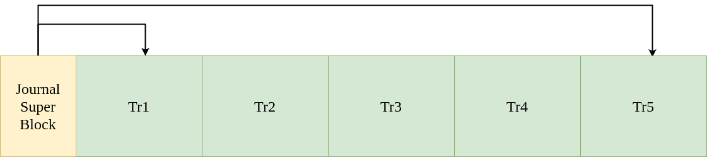

# 日志记录或预写日志记录

> 原文:[https://www . geesforgeks . org/journaling-or-write-pre-logging/](https://www.geeksforgeeks.org/journaling-or-write-ahead-logging/)

**日志记录**，或**提前写日志记录**是解决操作系统中[文件系统不一致](https://www.geeksforgeeks.org/file-system-inconsistency/)问题的一个复杂解决方案。受数据库管理系统的启发，这种方法首先将要执行的操作的摘要写在一个“日志”中，然后再将它们写入磁盘。因此得名“提前写日志”。在崩溃的情况下，操作系统可以简单地检查这个日志，并从它停止的地方继续。这样可以节省多次磁盘扫描来修复不一致性，就像 FSCK 的情况一样。

实现数据日志的系统的好例子包括 Linux ext3 和 ext4 文件系统，以及 Windows NTFS。

**数据日志:**
日志存储在一个叫做日志的简单数据结构中。下图显示了它的结构，由三个组件组成。

1.  **TxB(交易开始区块):**
    这包含交易 ID，或 TID。
2.  **索引节点、位图和数据块(元数据):**
    这三个数据块包含磁盘中要更新的数据块内容的副本。
3.  **TxE(交易结束区块)**
    这只是标志着 TID 认定的交易结束。

一旦请求更新，就会将其写入日志，然后写入文件系统。一旦所有这些写入成功，我们就可以说已经到达**检查点**，更新完成。

**写日志时发生崩溃怎么办？**
有人可能会说日志本身不是原子的。因此，系统如何处理未检查点写入？为了克服这种情况，日志记录分两步进行:同时写入 TxB 和以下三个块，然后写入 TxE。这个过程可以总结如下。

1.  **日志写入:**
    将 TxB、inode、位图和数据块内容写入日志(日志)。
2.  **日志提交:**
    将 TxE 写入日志(日志)。
3.  **检查点:**
    将信息节点、位图和数据块的内容写入磁盘。

日志记录过程中的不同时间点可能会发生崩溃。如果在步骤 1，即在 TxE 之前发生崩溃，我们可以简单地完全跳过这个事务，文件系统保持一致。

如果在步骤 2 发生崩溃，这意味着虽然事务已经被记录，但还没有完全写入磁盘。我们无法确定三个数据块(信息节点、位图和数据块)中的哪一个实际上被更新了，哪一个发生了崩溃。在这种情况下，系统会扫描日志中最近的事务，并再次执行最后一个事务。这确实会导致冗余磁盘写入，但会确保一致性。这个过程叫做**重做日志**。

**将日志用作循环缓冲区:**
由于进行了许多事务处理，日志可能会用完。为了解决这个问题，我们可以使用日志日志作为循环缓冲区，其中较新的事务不断以循环方式替换旧的事务。下图显示了日志的整体视图，tr1 是最早的事务，tr5 是最新的。

超级块维护指向最旧和最新事务的指针。一旦事务完成，它就被标记为“自由”，并且超级块被更新到下一个事务。