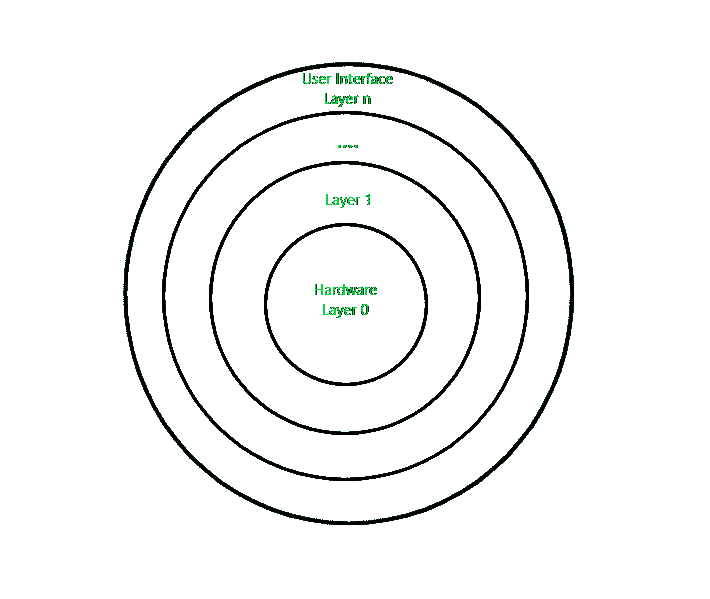

# 分层操作系统

> 原文:[https://www.geeksforgeeks.org/layered-operating-system/](https://www.geeksforgeeks.org/layered-operating-system/)

分层结构是一种系统结构，其中[操作系统](https://www.geeksforgeeks.org/operating-systems/)的不同服务被分成不同的层，其中每一层都有特定的定义明确的任务要执行。它的创建是为了改进现有的结构，如单一结构(UNIX)和简单结构(MS-DOS)。

**示例–**Windows NT 操作系统使用这种分层方法作为其一部分。

**设计分析:**
整个操作系统分为几层(从 0 到 n)，如图所示。每个层都必须有自己特定的功能来执行。这些层的实现有如下一些规则。

1.  最外层必须是用户界面层。
2.  最内层必须是硬件层。
3.  一个特定的层可以访问它下面的所有层，但不能访问它上面的层。也就是说，层 n-1 可以访问从 n-2 到 0 的所有层，但是它不能访问第 n 层。

因此，如果用户层想要与硬件层交互，响应将通过从 n-1 到 1 的所有层。每一层都必须设计和实现成只需要它下面的层提供的服务。

分层操作系统设计

**优点:**
这种设计有几个优点:

1.  **模块化:**
    这种设计促进了模块化，因为每一层只执行它计划执行的任务。
2.  **容易调试:**
    由于图层是离散的，所以很容易调试。假设一个错误发生在 CPU 调度层，所以开发人员只能搜索那个特定的层来调试，不像 Monolithic 系统中所有的服务都在一起。
3.  **轻松更新:**
    在特定图层进行的修改不会影响其他图层。
4.  **无法直接访问硬件:**
    硬件层是设计中存在的最内层。因此，用户可以使用硬件的服务，但不能直接修改或访问它，这与用户可以直接访问硬件的简单系统不同。
5.  **抽象:**
    每一层都与自己的功能有关。所以其他层的功能和实现对它来说是抽象的。

**缺点:**
虽然这个系统比单片和简单设计有几个优点，但也有如下缺点。

1.  **复杂细致的实现:**
    作为一个层可以访问其下各层的服务，所以各层的安排一定要做的细致。例如，后备存储层使用内存管理层的服务。所以必须保持在内存管理层之下。因此，模块化带来了复杂的实现。
2.  **执行速度较慢:**
    如果一个层想要与另一个层交互，它会发送一个请求，该请求必须经过两个交互层之间的所有层。因此，它增加了响应时间，不像单片系统比这更快。因此，层数的增加可能导致非常低效的设计。