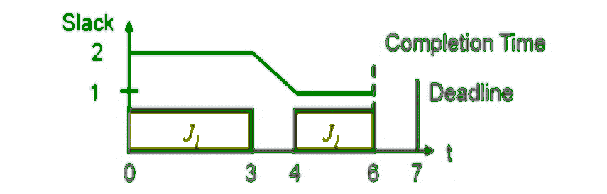
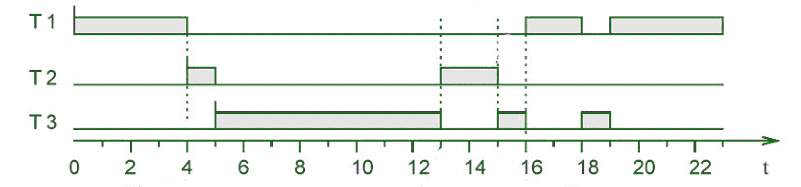

# 实时系统中的最小松弛时间(LST)调度算法

> 原文:[https://www . geesforgeks . org/最小松弛时间-lst-实时调度算法-系统/](https://www.geeksforgeeks.org/least-slack-time-lst-scheduling-algorithm-in-real-time-systems/)

**最小松弛时间(LST)** 是一种用于实时系统的动态优先级驱动调度算法。

在 LST，系统中的所有任务都根据其空闲时间被分配了一定的优先级。松弛时间最少的任务优先级最高，反之亦然。

任务的优先级是动态分配的。

松弛时间可通过以下公式计算:

```
slack_time = ( D - t - e' )
```

这里 **D :** 任务截止时间
T3】t:周期开始时的实时。
**e:**任务剩余执行时间。

具有最小可宽延时间的任务被分派给中央处理器执行，因为它具有最高优先级。

超级周期是甘特图的时间周期，等于系统中所有任务周期的生命周期成本。

在时间 t，任务的可宽延时间相当于(d-t)减去完成任务剩余部分所需的时间。



这是一个复杂的算法，这就是为什么它需要额外的信息，如执行时间和截止日期。最小松弛时间调度算法只有在允许抢占的情况下才能达到最佳效果。当且仅当可运行的任务集存在可行的时间表时，它才能产生可行的时间表。

它与最早截止日期优先不同，因为它要求计划任务的执行时间。因此，有时实现最小松弛时间调度算法是不切实际的，因为实时系统中任务的突发时间很难预测。

与 EDF(最早截止日期优先)调度算法不同，LST 可能会未充分利用 CPU，从而降低效率和吞吐量。

如果两个或多个任务准备在 LST 执行，并且这些任务具有相同的松弛时间或松弛值，则根据先到先得原则将它们分派给处理器。

### 示例:


*   在时间 t=0:只有任务 T1，已经到达。执行 T1 直到时间 t=4。
*   在时间 t=4: T2 已经到达。
    T1 的松弛时间:33-4-6 = 23
    T2 的松弛时间:28-4-3=21
    因此 T2 开始执行直到 T3 到达的时间 t=5。
*   在时间 t = 5:
    T1 的松弛时间:33-5-6 = 22
    T2 的松弛时间:28-5-2 = 21
    T3 的松弛时间:29-5-10=12
    因此 T3 开始执行直到时间 t=13
*   在时间 t = 13:
    T1 的松弛时间:33-13-6 = 14
    T2 的松弛时间:28-13-2 = 13
    T3 的松弛时间:29-13-2=14
    因此 T2 开始执行直到时间 t=15
*   在时间 t = 15:
    T1 的松弛时间:33-15-6 = 12
    T3 的松弛时间:29-15-2=12
    因此 T3 开始执行直到时间 t=16
*   在时间 t = 16:
    T1 的松弛时间:33-16-6 = 11
    T3 的松弛时间:29-16-=12
    因此 T1 开始执行直到时间 t=18，以此类推..

