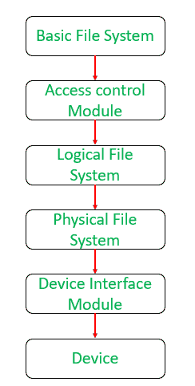

# 文件管理系统中的级别

> 原文:[https://www . geesforgeks . org/levels-in-a-a-file-management-system/](https://www.geeksforgeeks.org/levels-in-a-file-management-system/)

前提–[文件系统](https://www.geeksforgeeks.org/file-systems-in-operating-system/)
文件的管理和设备的管理是相互关联的。下面给出的是用于有效执行输入/输出系统所需功能的层次结构。



名为*基本文件系统*的最高级别模块将提供给它的信息传递给*逻辑文件系统*，后者依次通知与设备管理器一起工作的*物理文件系统*。

使用结构化和模块化编程实现层次结构的每一层，并且信息从较高位置的模块传递到较低位置的模块。通过这种方式，他们执行所需的服务，并沿着链继续通信。链中的最低层与物理设备通信，并与设备管理器交互。

举个例子-

**示例:**将文件 X 中的记录号 17 读入 Y:

x 是先前为输入而打开的直接访问文件的名称，Y 是先前在程序中定义并占据特定存储位置的数据记录的名称。

由于文件 X 已经被打开，文件目录已经被搜索以验证文件的存在。关于文件 X 的相关信息已经被带入操作系统的活动文件表中，这些信息包括文件的大小、它的第一个物理记录的地址、它的保护和访问控制信息。

该信息由*基本文件系统*使用，该系统激活*访问控制验证模块*以验证用户是否被允许执行该操作。如果用户被允许，那么信息和控制被传递到*逻辑文件系统*。如果不允许，则拒绝访问，并且不传递信息和控制。

传递到逻辑文件系统的信息用于使用以下公式将记录号转换为其字节地址:

```
CBA = (RN - 1) * RL
```

该结果和信息被传递到*物理文件系统*，该系统计算所需记录的物理驻留位置。如果该块中有多个记录，它将使用以下公式计算该块中记录的偏移量:

```
block number = integers (byte address / physical block size) 
                    + address of first physical record

offset = remainder (byte address / physical block size)
```

该信息被传递到*设备接口模块*，该模块将块号转换为从物理存储设备检索信息所需的实际圆柱体/表面/记录组合。

一旦找回，设备调度算法就开始发挥作用。信息被放入缓冲区，控制返回到物理文件系统，该系统将信息复制到所需的内存位置。

一旦完成，消息“全部清除”将被传递给所有模块。任何其他命令都以同样的方式处理。当控制到达设备处理程序时，分配模块被调用，因为它负责跟踪未使用的内存区域。

**注意:**
在文件管理系统的每一级，都会发生检查请求是否有效的过程。当文件系统检查文件是否存在时，首先发生在目录级别。下一步发生在访问控制验证模块检查是否允许访问时。下一步发生在逻辑文件系统检查请求的字节是否在文件的限制内时。最后，当设备接口模块检查存储设备是否存在时，进行验证。

因此，每个用户命令的操作都需要文件系统的每个模块的协同努力。