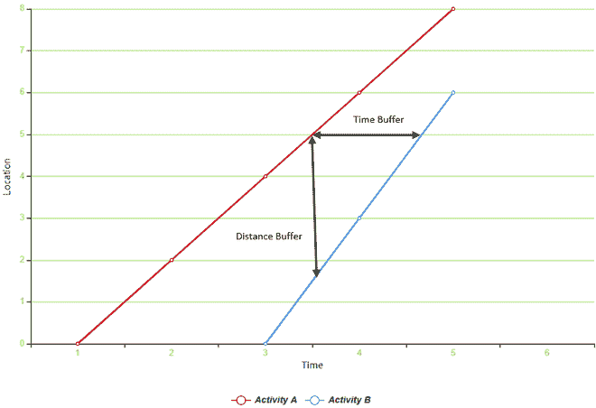

# 操作系统中的线性调度方法

> 原文:[https://www . geesforgeks . org/linear-scheduling-in-method-operating-system/](https://www.geeksforgeeks.org/linear-scheduling-method-in-operating-system/)

**线性调度法**是用横轴表示线性项目长度，纵轴表示项目活动持续时间的图形技术。它也被称为距离-时间调度。根据项目部分的活动顺序，每个活动都按顺序映射到图表上。活动的开始时间和地点显示为活动的起点，活动的结束时间和地点显示为线性时间表中的终点。

在操作系统中，**线性调度方法**最常用于为重复性活动调度资源，在这些活动中，任务按队列顺序进行调度(与 LSM 在公路、铁路、管道和其他建筑项目中的实施相同)。

**它安排活动以确保:**

*   最大资源利用率。
*   最小的过程中断。
*   学习曲线现象效果增强。

**线性调度法要素:**

*   表示开始时间和结束时间的参数(坐标轴参数)。
*   活动地点(地点)。
*   进度测量(交通项目为距离，建筑为楼层等)。

**线性调度方法的实现:**

*   在操作系统中充当调度算法。
*   主要用于公路建设、铁路、机场跑道建设、管道等连续活动。
*   建筑物和其他基础设施建设。
*   基础设施维护等重复性建筑单元。

**操作系统中线性调度方法的实现:**
考虑两个活动，活动 A 和活动 B，都需要执行一组流程。

*   **活动 A :** 系统一启动就启动需要进入 8 个位置，5 秒钟即可完成。
*   **活动 B :** 第 3 秒开始需要进入 6 个位置，2 秒即可完成。

 时间-距离图来说明 LSM 在操作系统中的实现

这两个活动都是以不同的时间间隔从位置 0 开始的，都是以特定的时间间隔访问不同的内存位置，以便执行它们的进程。因此，在两个过程的过程(子活动)成功执行之后，两个活动都终止。

**缓冲区:**
当活动在链上连续进行时，活动之间需要一定的间距。这个间隔用作缓冲，可以是活动之间的距离或时间间隔。

**线性调度方式的优势:**

*   它使资源持续工作。
*   提供有关计划操作方法的更多信息。
*   由于在某些活动中采用网络方式，因此具有优势。

**线性调度方式的缺点:**

*   活动通常不会按顺序进行。
*   这种方法经常给施工经理带来问题。
*   这种方法并不是针对操作系统而优化的。