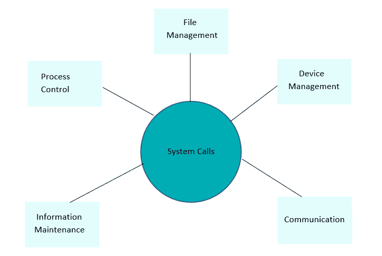

# Linux 系统调用详解

> 原文:[https://www.geeksforgeeks.org/linux-system-call-in-detail/](https://www.geeksforgeeks.org/linux-system-call-in-detail/)

[系统调用](https://www.geeksforgeeks.org/introduction-of-system-call/)是提供进程和操作系统之间接口的过程。它是计算机程序向操作系统内核请求服务的方式。

不同的操作系统执行不同的系统调用。

在 Linux 制作系统中，调用包括将控制权从非特权用户模式转移到特权内核模式；这种转移的细节因架构而异。库负责收集系统调用参数，如果需要，以进行系统调用所需的特殊形式排列这些参数。

**系统调用主要分为 5 类:**

*   过程控制
*   文件管理
*   设备管理
*   信息维护
*   沟通

### **过程控制:**

该系统调用执行进程创建、进程终止等任务。

这下的 Linux 系统调用是 **fork()** 、 **exit()** 、 **exec()。**

*   **叉()**
    *   fork()系统调用创建了一个新的进程。
    *   可以使用 fork()创建一个新的进程，而无需运行新的程序——新的子进程只是继续执行与第一个(父)进程运行的程序完全相同的程序。
    *   它是流程管理中使用最广泛的系统调用之一。
*   **出口()**
    *   程序使用 exit()系统调用来终止其执行。
    *   操作系统回收进程在退出()系统调用后使用的资源。
*   **执行（）**
    *   调用 exec()后，新程序将开始执行
    *   运行一个新程序不需要先创建一个新的进程:任何进程都可以随时调用 exec()。当前运行的程序立即终止，新程序开始在现有进程的上下文中执行。

### **文件管理:**

文件管理系统调用处理文件操作任务，如创建文件、读取和写入等。这下的 Linux 系统调用是**打开()，读取()，写入()，关闭()。**

*   **open():**
    *   打开文件是系统调用。
    *   这个系统调用只是打开文件，要执行读写等操作，我们需要执行不同的系统调用来执行操作。
*   **改为():**
    *   该系统调用以读取模式打开文件
    *   我们不能用这个系统调用编辑文件。
    *   多个进程可以同时对同一个文件执行 read()系统调用。
*   **写():**
    *   该系统调用以写入模式打开文件
    *   我们可以用这个系统调用来编辑文件。
    *   多个进程不能同时对同一文件执行 write()系统调用。
*   **close():**
    *   这个系统调用关闭打开的文件。

### **设备管理:**

设备管理完成设备操作的工作，如从设备缓冲区读取数据、写入设备缓冲区等。这个下的 Linux 系统调用是 **ioctl()。**

*   **ioctl():**
    *   ioctl()被称为输入和输出控制。
    *   ioctl 是对特定于设备的输入/输出操作以及其他无法通过常规系统调用来表达的操作的系统调用。

### **信息维护:**

它处理操作系统和用户程序之间的信息及其传输。此外，操作系统保存了所有进程的信息，系统调用用于访问这些信息。该状态下的系统调用有 **getpid()，报警()，休眠()。**

*   **getpid():t1**
    *   getpid 代表获取进程标识。
    *   函数的作用是:返回调用进程的进程标识。
    *   getpid()函数应该总是成功的，并且不保留任何返回值来指示错误。
*   **报警():**
    *   这个系统调用为信号的传递设置一个闹钟。
    *   它安排将信号传递给调用进程。
*   **睡眠():**
    *   该系统调用将当前正在运行的进程的执行暂停一段时间
    *   同时，在这个时间间隔内，另一个进程有机会执行

### **通信:**

这些类型的系统调用专门用于进程间通信。

两种模型用于进程间通信

1.  消息传递(进程之间交换消息)
2.  共享内存(进程共享内存区域进行通信)

这下的系统调用是 **pipe()，shmget()，mmap()。**

*   **管道():**
    *   管道()系统调用用于在不同的 Linux 进程之间进行通信。
    *   它主要用于进程间通信。
    *   pipe()系统函数用于打开文件描述符。
*   shmget():
    *   shmget 代表共享内存段。
    *   主要用于共享内存通信。
    *   该系统调用用于访问共享内存和消息，以便与进程通信。
*   **mmap():**
    *   此函数调用用于将文件或设备映射或取消映射到内存中。
    *   mmap()系统调用负责将文件内容映射到进程的虚拟内存空间。

这些是 LINUX 操作系统中涉及的各种系统调用。