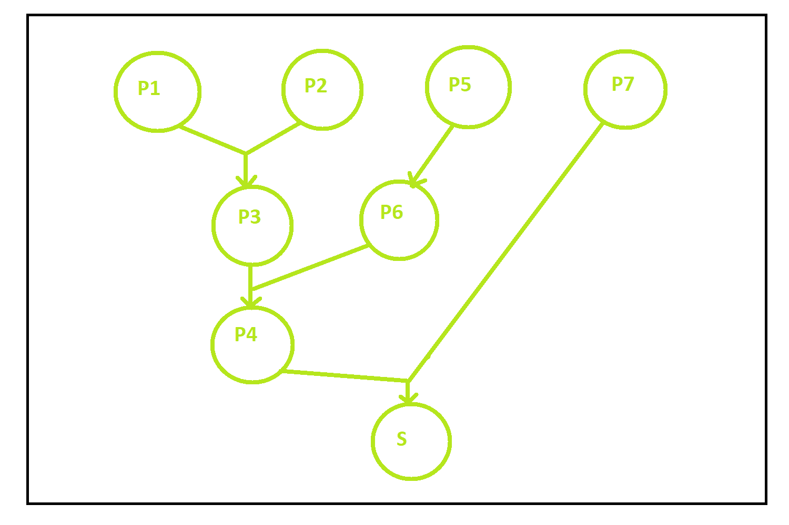
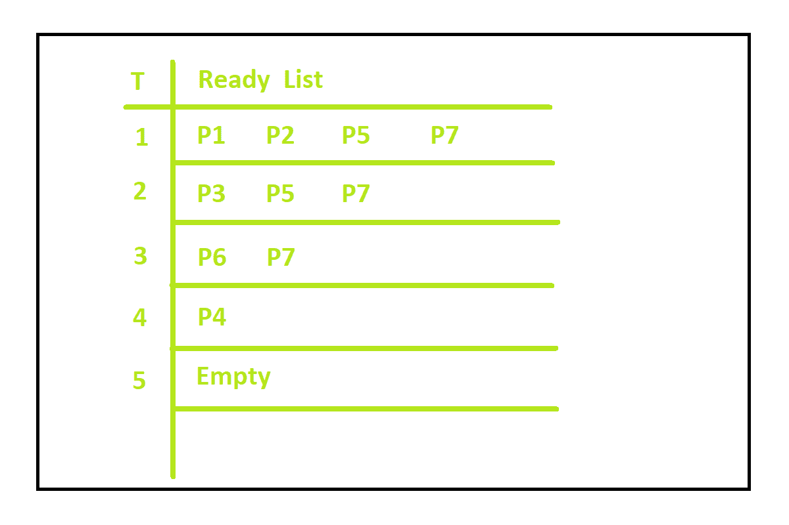
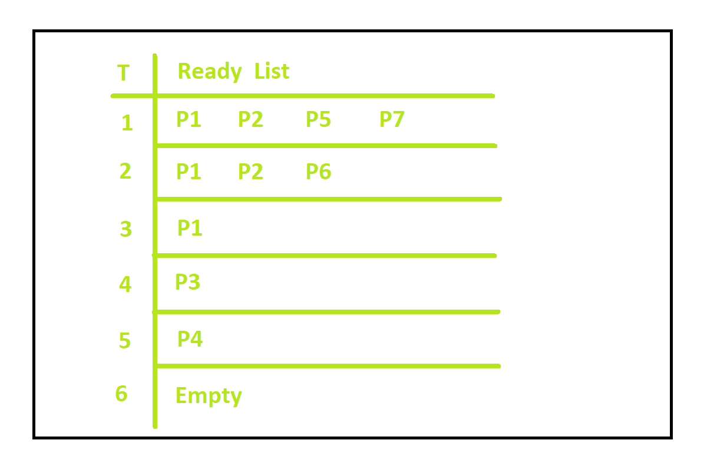

# 操作系统中的列表调度

> 原文:[https://www . geesforgeks . org/list-操作系统中的调度/](https://www.geeksforgeeks.org/list-scheduling-in-operating-system/)

先决条件–[中央处理器调度](https://www.geeksforgeeks.org/cpu-scheduling-in-operating-systems/)

**列表调度**也称为基于优先级列表的调度是一种调度技术，其中通过为进程分配一些优先级来制作进程的有序列表。

所以，基本上发生的事情是，在给定的时间点准备好要执行的进程列表。然后，根据处理器的可用性，即它们是空闲还是忙碌，如果处理器空闲，它们会选择进程并执行它们。

现在让我们用一个例子来理解列表调度。

**示例:**
假设我们有 7 个流程 P1、P2、P3、P4、P5、P6、P7，这样–

1.  P3 依赖于 P1 和 P2 (P3 只有在 P1 和 P2 都执行完毕后才能开始执行。).
2.  P4 依赖于 P3 和 P6 (P4 只有在 P3 和 P6 都执行完毕后才能开始执行。).
3.  P6 依赖五常。

下图显示了依赖关系。

让我们假设我们有两个处理器的约束，并且两个处理器都是空闲的。
由于 P1、P2、P5、P7 是独立的，让我们假设它们最初在就绪列表中等待并准备执行。

**流程的逐步执行:**

1.  我们只有两个空闲的处理器，所以让 P1 和 P2 先执行。
2.  P1 和 P2 不在预备名单上，P3 在预备名单上。所以 P3、P5、P7 现在都在预备名单上
3.  假设在就绪队列中的 3 个进程中，P3 和 P5 接下来被执行，因此 P3 和 P5 从就绪列表中退出，P6 进入就绪列表。P4 不会出现在预备名单中，因为它还取决于尚未执行的 P6。
4.  P6 和 P7 现在在准备名单中。所以 P6 和 P7 接下来被处决。
5.  P6 和 P7 退出就绪列表，P4 进入就绪列表，最后 P4 被执行，所有进程终止。

就绪列表如下所示，每个步骤如图所示:

所以你可以看到，在 4 个单位时间后，整个过程被执行。但是这个时间可能会因操作系统使用的调度机制而异。

说明显示执行时间取决于使用的调度算法。

1.  考虑这样一种情况，即相同的过程首先从执行 P5 和 P7 开始，而不是 P1 和 P2。
2.  之后，P5 和 P7 从就绪列表中出来，P6 进入就绪列表。
3.  P1、P2、P6 现在都在预备名单上。让 P2 和 P6 被处死。
4.  P2 和 P6 在预备名单上。P1 被处决了。
5.  P1 在预备名单上，P3 在预备名单上，然后 P3 被处决。
6.  最后，P4 被执行，所有进程被执行。

该流程的就绪列表如下所示:

所以这次你可以看到，如果我们改变进程执行的顺序，需要 5 个时间单位。

优先级是在调度过程开始之前静态确定的。第一步选择优先级最高的进程，第二步选择可能的最佳资源。可以使用的一些调度策略包括:

*   最长路径算法
*   最长处理时间
*   关键路径法

算法的目标是最大化 CPU 利用率，最小化延迟。因此，无论哪种调度算法有助于实现这一点，都可以根据流程来使用。