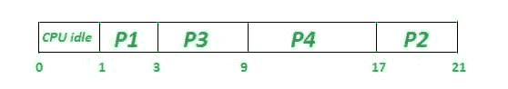
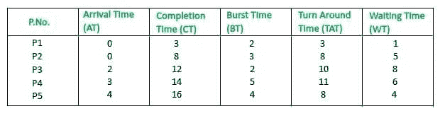

# 最长作业优先(LJF) CPU 调度算法

> 原文:[https://www . geesforgeks . org/最长-作业-第一-ljf-CPU-调度-算法/](https://www.geeksforgeeks.org/longest-job-first-ljf-cpu-scheduling-algorithm/)

前提–[流程管理| CPU 调度](https://www.geeksforgeeks.org/gate-notes-operating-system-process-scheduling/)

**最长作业优先(LJP)** 是一种非抢占式调度算法。该算法基于进程的突发时间。进程根据其突发时间被放入就绪队列，即按照突发时间的降序。顾名思义，该算法基于这样一个事实，即首先处理突发时间最长的进程。只有那些在此之前已经到达系统的进程才被认为是突发时间。其抢先版被称为[最长剩余时间优先(LRTF)算法](https://www.google.com/amp/s/www.geeksforgeeks.org/longest-remaining-time-first-lrtf-cpu-scheduling-algorithm/amp/)。

**程序:**

*   **步骤-1:**
    首先，按照到达时间的递增顺序对流程进行排序。
*   **步骤-2:**
    从所有到达该时间的进程中选择突发时间最高的进程。然后处理它的爆发时间。检查是否有任何其他进程到达，直到该进程完成执行。
*   **步骤-3:**
    重复以上两个步骤，直到所有流程都执行完毕。

**注意-**
如果两个进程具有相同的突发时间，则使用 FCFS 断开连接，即首先到达的进程被首先处理。

**缺点-**

*   对于给定的一组进程，该算法给出了非常高的平均等待时间和平均周转时间。
*   这可能导致车队效应。
*   可能发生的情况是，一个短的进程可能永远不会被执行，而系统继续执行较长的进程。
*   它降低了处理速度，从而降低了系统的效率和利用率。

**我们来考虑以下例子。**

**例-1:** 考虑以下四个过程 P1、P2、P3 和 P4 的到达时间和突发时间表。

```
Process   Arrival time   Burst Time
P1            1 ms          2 ms
P2            2 ms          4 ms
P3            3 ms          6 ms
P4            4 ms          8 ms  
```

**工作:**

1.  t = 1 时，可用流程:P1。因此，选择 P1 并执行 2 毫秒
2.  在 t = 3 时，即 P1 被处决后，可用程序:P3 P2。因此，选择 P3 并执行 6 毫秒(因为英国电信(P3)=6，比英国电信(P2) = 4 高)
3.  t = 9 时，即执行 P3 之后，可用流程:P4 P2。因此，选择 P4 并执行 8 毫秒(因为，英国电信(P4) = 8，英国电信(P2) = 4)
4.  最后执行 P2 4 毫秒的过程

**注意–**
由于在给定的时间间隔内没有进程可用，CPU 将空闲 0 到 1 个单位时间。

甘特图如下:



因为，完成时间可以通过甘特图直接确定

```
Turn Around Time (TAT)
= (Completion Time) - (Arrival Time)

Also, Waiting Time (WT)
= (Turn Around Time) - (Burst Time) 
```

因此，最终表格看起来像，


**输出:**

```
Total Turn Around Time = 40 ms
So, Average Turn Around Time = 40/4 = 10.00 ms

And, Total Waiting Time = 20 ms
So Average Waiting Time = 20/4 = 5.00 ms 
```

**示例-2:** 考虑以下四个进程 P1、P2、P3、P4 和 P5 的到达时间和突发时间表。

```
Process   Arrival time   Burst Time
P1            0 ms          2 ms
P2            0 ms          3 ms
P3            2 ms          2 ms
P4            3 ms          5 ms 
P5            4 ms          4 ms 
```

**工作:**

本例甘特图，


因为，完成时间可以通过甘特图直接确定

```
Turn Around Time (TAT)
= (Completion Time) - (Arrival Time)

Also, Waiting Time (WT)
= (Turn Around Time) - (Burst Time) 
```

因此，最终表格看起来像，



**输出:**

```
Total Turn Around Time = 40 ms
So, Average Turn Around Time = 40/5 = 8 ms

And, Total Waiting Time = 24 ms
So, Average Waiting Time = 24/5 = 4.8 ms 
```