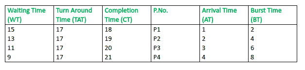
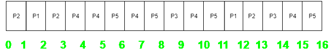
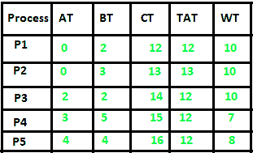

# 最长剩余时间优先(LRTF) CPU 调度算法

> 原文:[https://www . geesforgeks . org/最长剩余时间-第一-lrtf-CPU-调度-算法/](https://www.geeksforgeeks.org/longest-remaining-time-first-lrtf-cpu-scheduling-algorithm/)

先决条件–[进程管理| CPU 调度](https://www.geeksforgeeks.org/gate-notes-operating-system-process-scheduling/)
这是最长作业优先(LJF)调度算法的先发制人版本。在这个调度算法中，我们找到剩余时间最大的进程，然后进行处理。我们在一段时间间隔后检查最大剩余时间(假设每个时间间隔 1 个单位)，以检查是否有另一个具有更多突发时间的进程到达该时间。

**程序:**

*   **步骤-1:** 首先，按照到达时间的递增顺序对流程进行排序。

*   **步骤 2:** 选择到达时间最少但突发时间最多的进程。然后处理 1 个单位。检查是否有任何其他进程到达该执行时间。

*   **步骤-3:** 重复以上两个步骤，直到执行完所有流程。

**例-1:** 考虑以下四个过程 P1、P2、P3 和 P4 的到达时间和突发时间表。

```
Process   Arrival time   Burst Time
P1            1 ms          2 ms
P2            2 ms          4 ms
P3            3 ms          6 ms
P4            4 ms          8 ms  
```

**工作:(输入 1):**

1.  t = 1 时，可用流程:P1。因此，选择 P1 并执行 1 毫秒

2.  t = 2 时，可用流程:P2 P1。因此，选择 P2 并执行 1 毫秒(因为英国电信(P1)=1，小于英国电信(P2) = 4)

3.  t = 3 时，可用流程:P1、P2、P3。因此，选择 P3 并执行 1 毫秒(因为，英国电信(P1) = 1，英国电信(P2) = 3，英国电信(P3) = 6)。

4.  重复以上步骤，直到执行完所有流程。

**注意**由于在给定的时间间隔内没有进程可用，CPU 将空闲 0 到 1 个单位时间。

甘特图如下:


因为，完成时间可以直接通过甘特图来确定，

```
Turn Around Time (TAT)
= (Complition Time) - (Arrival Time)

Also, Waiting Time (WT)
= (Turn Around Time) - (Burst Time) 
```

因此，最终表格看起来像，



**输出:**

```
Total Turn Around Time = 68 ms
So, Average Turn Around Time = 68/4 = 17.00 ms

And, Total Waiting Time = 48 ms
So Average Waiting Time = 48/4 = 12.00 ms 
```

**示例-2:** 考虑以下四个进程 P1、P2、P3、P4 和 P5 的到达时间和突发时间表。

```
Process   Arrival time   Burst Time
P1            0 ms          2 ms
P2            0 ms          3 ms
P3            2 ms          2 ms
P4            3 ms          5 ms 
P5            4 ms          4 ms 
```

类似于示例-1，本示例的甘特图，



因为，完成时间可以直接通过甘特图来确定，

```
Turn Around Time (TAT)
= (Complition Time) - (Arrival Time)

Also, Waiting Time (WT)
= (Turn Around Time) - (Burst Time) 
```

因此，最终表格看起来像，



**输出:**

```
Total Turn Around Time = 61 ms
So, Average Turn Around Time = 61/5 = 12.20 ms

And, Total Waiting Time = 45 ms
So, Average Waiting Time = 45/5 = 9.00 ms 
```