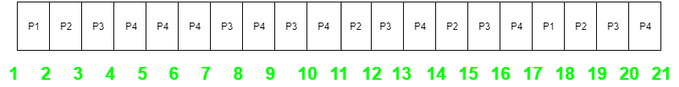

# 最长剩余时间优先(LRTF) CPU 调度程序

> 原文:[https://www . geesforgeks . org/最长剩余时间-第一-lrtf-CPU-调度-程序/](https://www.geeksforgeeks.org/longest-remaining-time-first-lrtf-cpu-scheduling-program/)

先决条件–[CPU 调度|最长剩余时间优先(LRTF)算法](https://www.geeksforgeeks.org/cpu-scheduling-longest-remaining-time-first-lrtf-algorithm/)
我们已经给出了一些具有到达时间和突发时间的进程，我们必须找到给定进程的完成时间(CT)、周转时间(TAT)、平均周转时间(Avg TAT)、等待时间(WT)、平均等待时间(AWT)。

**例:**考虑以下四个过程 P1、P2、P3 和 P4 的到达时间和突发时间表。

```
Process   Arrival time   Burst Time
P1            1 ms          2 ms
P2            2 ms          4 ms
P3            3 ms          6 ms
p4            4 ms          8 ms  
```

甘特图如下:



因为，完成时间可以通过甘特图直接确定

```
Turn Around Time (TAT)
= (Complition Time) - (Arrival Time)

Also, Waiting Time (WT)
= (Turn Around Time) - (Burst Time) 
```

因此，

**输出:**

```
Total Turn Around Time = 68 ms
So, Average Turn Around Time = 68/4 = 17.00 ms

And, Total Waiting Time = 48 ms
So, Average Waiting Time = 12.00 ms 
```

**算法–**

*   **步骤-1:** 创建包含所有必要字段的流程结构，如到达时间、突发时间、完成时间、周转时间、等待时间。
*   **第 2 步:**根据 AT 排序；
*   **步骤-3:** 找到突发时间最长的进程，并对每个单元执行。将总时间增加 1，将该进程的突发时间减少 1。
*   **步骤-4:** 当任意进程还剩 0 BT 时，则更新 CT(该进程 CT 的完成时间为当时的总时间)。
*   **步骤-2:** 计算每个过程的 CT 后，找到 TAT 和 WT。

```
(TAT = CT - AT) 
(WT  = TAT - BT) 
```

**算法实现–**

## C++

```
#include <bits/stdc++.h>

using namespace std;

// creating a structure of a process
struct process {
    int processno;
    int AT;
    int BT;

    // for backup purpose to print in last
    int BTbackup;
    int WT;
    int TAT;
    int CT;
};

// creating a structure of 4 processes
struct process p[4];

// variable to find the total time
int totaltime = 0;
int prefinaltotal = 0;

// comparator function for sort()
bool compare(process p1, process p2)
{
    // compare the Arrival time of two processes
    return p1.AT < p2.AT;
}

// finding the largest Arrival Time among all the available
// process at that time
int findlargest(int at)
{
    int max = 0, i;
    for (i = 0; i < 4; i++) {
        if (p[i].AT <= at) {
            if (p[i].BT > p[max].BT)
                max = i;
        }
    }

    // returning the index of the process having the largest BT
    return max;
}

// function to find the completion time of each process
int findCT()
{

    int index;
    int flag = 0;
    int i = p[0].AT;
    while (1) {
        if (i <= 4) {
            index = findlargest(i);
        }

        else
            index = findlargest(4);
        cout << "Process executing at time " << totaltime
             << " is: P" << index + 1 << "\t";

        p[index].BT -= 1;
        totaltime += 1;
        i++;

        if (p[index].BT == 0) {
            p[index].CT = totaltime;
            cout << " Process P" << p[index].processno
                 << " is completed at " << totaltime;
        }
        cout << endl;

        // loop termination condition
        if (totaltime == prefinaltotal)
            break;
    }
}

int main()
{

    int i;

    // initializing the process number
    for (i = 0; i < 4; i++) {
        p[i].processno = i + 1;
    }

    // cout<<"arrival time of 4 processes : ";
    for (i = 0; i < 4; i++) // taking AT
    {
        p[i].AT = i + 1;
    }

    // cout<<" Burst time of 4 processes : ";
    for (i = 0; i < 4; i++) {

        // assigning {2, 4, 6, 8} as Burst Time to the processes
        // backup for displaying the output in last
        // calculating total required time for terminating
        // the function().
        p[i].BT = 2 * (i + 1);
        p[i].BTbackup = p[i].BT;
        prefinaltotal += p[i].BT;
    }

    // displaying the process before executing
    cout << "PNo\tAT\tBT\n";

    for (i = 0; i < 4; i++) {
        cout << p[i].processno << "\t";
        cout << p[i].AT << "\t";
        cout << p[i].BT << "\t";
        cout << endl;
    }
    cout << endl;

    // sorting process according to Arrival Time
    sort(p, p + 4, compare);

    // calculating initial time when execution starts
    totaltime += p[0].AT;

    // calculating to terminate loop
    prefinaltotal += p[0].AT;
    findCT();
    int totalWT = 0;
    int totalTAT = 0;
    for (i = 0; i < 4; i++) {
        // since, TAT = CT - AT
        p[i].TAT = p[i].CT - p[i].AT;
        p[i].WT = p[i].TAT - p[i].BTbackup;

        // finding total waiting time
        totalWT += p[i].WT;

        // finding total turn around time
        totalTAT += p[i].TAT;
    }

    cout << "After execution of all processes ... \n";

    // after all process executes
    cout << "PNo\tAT\tBT\tCT\tTAT\tWT\n";

    for (i = 0; i < 4; i++) {
        cout << p[i].processno << "\t";
        cout << p[i].AT << "\t";
        cout << p[i].BTbackup << "\t";
        cout << p[i].CT << "\t";
        cout << p[i].TAT << "\t";
        cout << p[i].WT << "\t";
        cout << endl;
    }

    cout << endl;
    cout << "Total TAT = " << totalTAT << endl;
    cout << "Average TAT = " << totalTAT / 4.0 << endl;
    cout << "Total WT = " << totalWT << endl;
    cout << "Average WT = " << totalWT / 4.0 << endl;
    return 0;
}
```

## 蟒蛇 3

```
# Python3 program to implement
# Longest Remaining Time First

# creating a structure of 4 processes
p = []
for i in range(4):
    p.append([0, 0, 0, 0, 0, 0, 0])

# variable to find the total time
totaltime = 0
prefinaltotal = 0

# finding the largest Arrival Time
# among all the available process
# at that time
def findlargest(at):
    max = 0
    for i in range(4):
        if (p[i][1] <= at):
            if (p[i][2] > p[max][2]) :
                max = i

    # returning the index of the
    # process having the largest BT
    return max

# function to find the completion
# time of each process
def findCT(totaltime):
    index = 0
    flag = 0
    i = p[0][1]
    while (1):
        if (i <= 4):
            index = findlargest(i)
        else:
            index = findlargest(4)
        print("Process execute at time ",
                    totaltime, end = " ")
        print(" is: P", index + 1,
                        sep = "", end = " ")
        p[index][2] -= 1
        totaltime += 1
        i += 1
        if (p[index][2] == 0):
                p[index][6] = totaltime
                print("Process P", p[index][0],
                           sep = "", end = " ")
                print(" is completed at ",
                     totaltime, end = " ")
        print()

        # loop termination condition
        if (totaltime == prefinaltotal):
            break

# Driver code
if __name__ =="__main__":

    # initializing the process number
    for i in range(4):
        p[i][0] = i + 1

    for i in range(4): # taking AT
        p[i][1] = i + 1

    for i in range(4):

        # assigning 2, 4, 6, 8 as Burst Time
        # to the processes backup for displaying
        # the output in last calculating total
        # required time for terminating the function().
        p[i][2] = 2 * (i + 1)
        p[i][3] = p[i][2]
        prefinaltotal += p[i][2]

    # displaying the process before executing
    print("PNo\tAT\tBT")

    for i in range(4):
        print(p[i][0], "\t",
              p[i][1], "\t", p[i][2])
    print()

    # sorting process according to Arrival Time
    p = sorted(p, key = lambda p:p[1])

    # calculating initial time when
    # execution starts
    totaltime += p[0][1]

    # calculating to terminate loop
    prefinaltotal += p[0][1]
    findCT(totaltime)
    totalWT = 0
    totalTAT = 0
    for i in range(4):

        # since, TAT = CT - AT
        p[i][5] = p[i][6]- p[i][1]
        p[i][4] = p[i][5] - p[i][3]

        # finding total waiting time
        totalWT += p[i][4]

        # finding total turn around time
        totalTAT += p[i][5]

    print("\nAfter execution of all processes ... ")

    # after all process executes
    print("PNo\tAT\tBT\tCT\tTAT\tWT" )

    for i in range(4):
        print(p[i][0], "\t", p[i][1], "\t",
              p[i][3], "\t", end = " ")
        print(p[i][6], "\t",
              p[i][5], "\t", p[i][4])
    print()
    print("Total TAT = ", totalTAT)
    print("Average TAT = ", totalTAT / 4.0)
    print("Total WT = ", totalWT)
    print("Average WT = ", totalWT / 4.0)

# This code is contributed by
# Shubham Singh(SHUBHAMSINGH10)
```

**输出:**

```
PNo    AT    BT
1    1    2    
2    2    4    
3    3    6    
4    4    8    

Process executing at time 1 is: P1    
Process executing at time 2 is: P2    
Process executing at time 3 is: P3    
Process executing at time 4 is: P4    
Process executing at time 5 is: P4    
Process executing at time 6 is: P4    
Process executing at time 7 is: P3    
Process executing at time 8 is: P4    
Process executing at time 9 is: P3    
Process executing at time 10 is: P4    
Process executing at time 11 is: P2    
Process executing at time 12 is: P3    
Process executing at time 13 is: P4    
Process executing at time 14 is: P2    
Process executing at time 15 is: P3    
Process executing at time 16 is: P4    
Process executing at time 17 is: P1     Process P1 is completed at 18
Process executing at time 18 is: P2     Process P2 is completed at 19
Process executing at time 19 is: P3     Process P3 is completed at 20
Process executing at time 20 is: P4     Process P4 is completed at 21
After execution of all processes ... 
PNo    AT    BT    CT    TAT    WT
1    1    2    18    17    15    
2    2    4    19    17    13    
3    3    6    20    17    11    
4    4    8    21    17    9    

Total TAT = 68
Average TAT = 17
Total WT = 48
Average WT = 12 
```