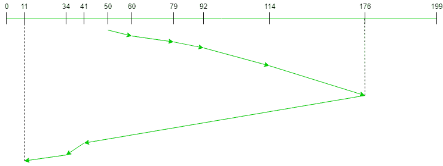

# 查看磁盘调度算法

> 原文:[https://www . geesforgeks . org/look-disk-scheduling-algorithm/](https://www.geeksforgeeks.org/look-disk-scheduling-algorithm/)

先决条件:[磁盘调度算法](https://www.geeksforgeeks.org/disk-scheduling-algorithms/)

给定一组磁盘磁道号和初始磁头位置，如果使用 *LOOK* 磁盘调度算法，我们的任务是找到访问所有请求磁道的寻道操作总数。另外，编写一个程序，使用 *LOOK* 磁盘调度算法找到寻道序列。

**LOOK 磁盘调度算法:**
LOOK 是 [SCAN(电梯)磁盘调度算法](https://www.geeksforgeeks.org/scan-elevator-disk-scheduling-algorithms/)的高级版本，其寻道时间比层次结构中的任何其他算法*(FCFS->SRTF->SCAN->C-SCAN->LOOK)*稍好。LOOK 算法服务请求的方式与 SCAN 算法类似，同时它还“向前看”，好像有更多的磁道需要在同一方向上服务。如果在移动方向上没有未决请求，磁头将反转方向，并开始在相反方向上服务请求。
LOOK 算法性能优于 SCAN 算法的主要原因是，在该算法中，磁头不允许移动到磁盘末端。

**算法:**

1.  Let Request 数组表示一个数组，该数组存储按到达时间升序请求的磁道索引。“head”是磁盘磁头的位置。
2.  给出了磁头移动的初始方向，并且它在相同的方向上服务。
3.  头部在头部移动的方向上一个接一个地服务所有请求。
4.  磁头继续向同一个方向移动，直到这个方向上的所有请求都完成。
5.  在这个方向上移动时，计算轨道到头部的绝对距离。
6.  用此距离增加总寻道计数。
7.  当前维修的履带位置现在成为新的头部位置。
8.  转到第 5 步，直到我们达到这个方向的最后一个要求。
9.  如果我们到达不需要在此方向上服务请求的位置，请反转方向，转到步骤 3，直到请求阵列中的所有磁道都没有得到服务。

**示例:**

```
Input:  
Request sequence = {176, 79, 34, 60, 92, 11, 41, 114}
Initial head position = 50
Direction = right (We are moving from left to right)

Output:
Initial position of head: 50
Total number of seek operations = 291
Seek Sequence is
60
79
92
114
176
41
34
11
```

下图显示了使用查找服务请求的磁道的顺序。



因此，总寻道计数计算如下:

```
= (60-50)+(79-60)+(92-79)
              +(114-92)+(176-114)
              +(176-41)+(41-34)+(34-11)
```

**实现:**
LOOK 算法实现如下。

**注意:**距离变量用于存储磁头与当前磁道位置之间的绝对距离。disk_size 是磁盘的大小。向量左侧和右侧分别存储初始头部位置左侧和右侧的所有请求轨迹。

## C++

```
// C++ program to demonstrate
// LOOK Disk Scheduling algorithm
int size = 8;
#include <bits/stdc++.h>
using namespace std;

// Code by Vikram Chaurasia

int disk_size = 200;

void LOOK(int arr[], int head, string direction)
{
    int seek_count = 0;
    int distance, cur_track;
    vector<int> left, right;
    vector<int> seek_sequence;

    // appending values which are
    // currently at left and right
    // direction from the head.
    for (int i = 0; i < size; i++) {
        if (arr[i] < head)
            left.push_back(arr[i]);
        if (arr[i] > head)
            right.push_back(arr[i]);
    }

    // sorting left and right vectors
    // for servicing tracks in the
    // correct sequence.
    std::sort(left.begin(), left.end());
    std::sort(right.begin(), right.end());

    // run the while loop two times.
    // one by one scanning right
    // and left side of the head
    int run = 2;
    while (run--) {
        if (direction == "left") {
            for (int i = left.size() - 1; i >= 0; i--) {
                cur_track = left[i];

                // appending current track to seek sequence
                seek_sequence.push_back(cur_track);

                // calculate absolute distance
                distance = abs(cur_track - head);

                // increase the total count
                seek_count += distance;

                // accessed track is now the new head
                head = cur_track;
            }
            // reversing the direction
            direction = "right";
        }
        else if (direction == "right") {
            for (int i = 0; i < right.size(); i++) {
                cur_track = right[i];
                // appending current track to seek sequence
                seek_sequence.push_back(cur_track);

                // calculate absolute distance
                distance = abs(cur_track - head);

                // increase the total count
                seek_count += distance;

                // accessed track is now new head
                head = cur_track;
            }
            // reversing the direction
            direction = "left";
        }
    }

    cout << "Total number of seek operations = "
         << seek_count << endl;

    cout << "Seek Sequence is" << endl;

    for (int i = 0; i < seek_sequence.size(); i++) {
        cout << seek_sequence[i] << endl;
    }
}

// Driver code
int main()
{

    // request array
    int arr[size] = { 176, 79, 34, 60,
                      92, 11, 41, 114 };
    int head = 50;
    string direction = "right";

    cout << "Initial position of head: "
         << head << endl;

    LOOK(arr, head, direction);

    return 0;
}
```

## Java 语言(一种计算机语言，尤用于创建网站)

```
// Java program to demonstrate
// LOOK Disk Scheduling algorithm
import java.util.*;

class GFG{

static int size = 8;
static int disk_size = 200;

public static void LOOK(int arr[], int head,
                        String direction)
{
    int seek_count = 0;
    int distance, cur_track;

    Vector<Integer> left = new Vector<Integer>();
    Vector<Integer> right = new Vector<Integer>();
    Vector<Integer> seek_sequence = new Vector<Integer>();

    // Appending values which are
    // currently at left and right
    // direction from the head.
    for(int i = 0; i < size; i++)
    {
        if (arr[i] < head)
            left.add(arr[i]);
        if (arr[i] > head)
            right.add(arr[i]);
    } 

    // Sorting left and right vectors
    // for servicing tracks in the
    // correct sequence.
    Collections.sort(left); 
    Collections.sort(right); 

    // Run the while loop two times.
    // one by one scanning right
    // and left side of the head
    int run = 2;
    while (run-- > 0)
    {
        if (direction == "left")
        {
            for(int i = left.size() - 1;
                    i >= 0; i--)
            {
                cur_track = left.get(i);

                // Appending current track to
                // seek sequence
                seek_sequence.add(cur_track);

                // Calculate absolute distance
                distance = Math.abs(cur_track - head);

                // Increase the total count
                seek_count += distance;

                // Accessed track is now the new head
                head = cur_track;
            }

            // Reversing the direction
            direction = "right";
        }
        else if (direction == "right")
        {
            for(int i = 0; i < right.size(); i++)
            {
                cur_track = right.get(i);

                // Appending current track to
                // seek sequence
                seek_sequence.add(cur_track);

                // Calculate absolute distance
                distance = Math.abs(cur_track - head);

                // Increase the total count
                seek_count += distance;

                // Accessed track is now new head
                head = cur_track;
            }

            // Reversing the direction
            direction = "left";
        }
    }

    System.out.println("Total number of seek " +
                       "operations = " + seek_count);

    System.out.println("Seek Sequence is");

    for(int i = 0; i < seek_sequence.size(); i++)
    {
        System.out.println(seek_sequence.get(i));
    }
}

// Driver code
public static void main(String[] args) throws Exception
{

    // Request array
    int arr[] = { 176, 79, 34, 60,
                  92, 11, 41, 114 };
    int head = 50;
    String direction = "right";

    System.out.println("Initial position of head: " +
                        head);

    LOOK(arr, head, direction);
}
}

// This code is contributed by divyesh072019
```

## 蟒蛇 3

```
# Python3 program to demonstrate
# LOOK Disk Scheduling algorithm
size = 8
disk_size = 200

def LOOK(arr, head, direction):

    seek_count = 0
    distance = 0
    cur_track = 0

    left = []
    right = []

    seek_sequence = []

    # Appending values which are
    # currently at left and right
    # direction from the head.
    for i in range(size):
        if (arr[i] < head):
            left.append(arr[i])
        if (arr[i] > head):
            right.append(arr[i])

    # Sorting left and right vectors
    # for servicing tracks in the
    # correct sequence.
    left.sort()
    right.sort()

    # Run the while loop two times.
    # one by one scanning right
    # and left side of the head
    run = 2
    while (run):
        if (direction == "left"):
            for i in range(len(left) - 1, -1, -1):
                cur_track = left[i]

                # Appending current track to
                # seek sequence
                seek_sequence.append(cur_track)

                # Calculate absolute distance
                distance = abs(cur_track - head)

                # Increase the total count
                seek_count += distance

                # Accessed track is now the new head
                head = cur_track

            # Reversing the direction
            direction = "right"

        elif (direction == "right"):
            for i in range(len(right)):
                cur_track = right[i]

                # Appending current track to
                # seek sequence
                seek_sequence.append(cur_track)

                # Calculate absolute distance
                distance = abs(cur_track - head)

                # Increase the total count
                seek_count += distance

                # Accessed track is now new head
                head = cur_track

            # Reversing the direction
            direction = "left"

        run -= 1

    print("Total number of seek operations =",
          seek_count)
    print("Seek Sequence is")

    for i in range(len(seek_sequence)):
        print(seek_sequence[i])

# Driver code

# Request array
arr = [ 176, 79, 34, 60, 92, 11, 41, 114 ]
head = 50

direction = "right"

print("Initial position of head:", head)

LOOK(arr, head, direction)

# This code is contributed by rag2127
```

## C#

```
// C# program to demonstrate
// LOOK Disk Scheduling algorithm
using System;
using System.Collections.Generic;

class GFG{

static int size = 8;

static void LOOK(int[] arr, int head,
                 string direction)
{
    int seek_count = 0;
    int distance, cur_track;

    List<int> left = new List<int>();
    List<int> right = new List<int>();
    List<int> seek_sequence = new List<int>();

    // Appending values which are
    // currently at left and right
    // direction from the head.
    for(int i = 0; i < size; i++)
    {
        if (arr[i] < head)
            left.Add(arr[i]);
        if (arr[i] > head)
            right.Add(arr[i]);
    }

    // Sorting left and right vectors
    // for servicing tracks in the
    // correct sequence.
    left.Sort(); 
    right.Sort(); 

    // Run the while loop two times.
    // one by one scanning right
    // and left side of the head
    int run = 2;
    while (run-- > 0)
    {
        if (direction == "left")
        {
            for(int i = left.Count - 1; i >= 0; i--)
            {
                cur_track = left[i];

                // Appending current track to
                // seek sequence
                seek_sequence.Add(cur_track);

                // Calculate absolute distance
                distance = Math.Abs(cur_track - head);

                // Increase the total count
                seek_count += distance;

                // Accessed track is now the new head
                head = cur_track;
            }

            // Reversing the direction
            direction = "right";
        }
        else if (direction == "right")
        {
            for(int i = 0; i < right.Count; i++)
            {
                cur_track = right[i];

                // Appending current track to
                // seek sequence
                seek_sequence.Add(cur_track);

                // Calculate absolute distance
                distance = Math.Abs(cur_track - head);

                // Increase the total count
                seek_count += distance;

                // Accessed track is now new head
                head = cur_track;
            }

            // Reversing the direction
            direction = "left";
        }
    }

    Console.WriteLine("Total number of seek " +
                       "operations = " + seek_count);

    Console.WriteLine("Seek Sequence is");

    for(int i = 0; i < seek_sequence.Count; i++)
    {
        Console.WriteLine(seek_sequence[i]);
    }
}

// Driver code
static void Main()
{

    // Request array
    int[] arr = { 176, 79, 34, 60,
                  92, 11, 41, 114 };
    int head = 50;
    string direction = "right";

    Console.WriteLine("Initial position of head: " +
                       head);

    LOOK(arr, head, direction);
}
}

// This code is contributed by divyeshrabadiya07
```

## java 描述语言

```
<script>
    // Javascript program to demonstrate
    // LOOK Disk Scheduling algorithm

    let size = 8;

    function LOOK(arr, head, direction)
    {
        let seek_count = 0;
        let distance, cur_track;

        let left = [];
        let right = [];
        let seek_sequence = [];

        // Appending values which are
        // currently at left and right
        // direction from the head.
        for(let i = 0; i < size; i++)
        {
            if (arr[i] < head)
                left.push(arr[i]);
            if (arr[i] > head)
                right.push(arr[i]);
        }

        // Sorting left and right vectors
        // for servicing tracks in the
        // correct sequence.
        left.sort(function(a, b){return a - b});
        right.sort(function(a, b){return a - b});

        // Run the while loop two times.
        // one by one scanning right
        // and left side of the head
        let run = 2;
        while (run-- > 0)
        {
            if (direction == "left")
            {
                for(let i = left.length - 1; i >= 0; i--)
                {
                    cur_track = left[i];

                    // Appending current track to
                    // seek sequence
                    seek_sequence.push(cur_track);

                    // Calculate absolute distance
                    distance = Math.abs(cur_track - head);

                    // Increase the total count
                    seek_count += distance;

                    // Accessed track is now the new head
                    head = cur_track;
                }

                // Reversing the direction
                direction = "right";
            }
            else if (direction == "right")
            {
                for(let i = 0; i < right.length; i++)
                {
                    cur_track = right[i];

                    // Appending current track to
                    // seek sequence
                    seek_sequence.push(cur_track);

                    // Calculate absolute distance
                    distance = Math.abs(cur_track - head);

                    // Increase the total count
                    seek_count += distance;

                    // Accessed track is now new head
                    head = cur_track;
                }

                // Reversing the direction
                direction = "left";
            }
        }

        document.write("Total number of seek " +
            "operations = " + seek_count + "</br>");

        document.write("Seek Sequence is" + "</br>");

        for(let i = 0; i < seek_sequence.length; i++)
        {
            document.write(seek_sequence[i] + "</br>");
        }
    }

    // Request array

    let arr = [176, 79, 34, 60, 92, 11, 41, 114];
    let head = 50;
    let direction = "right";

    document.write("Initial position of head: " + head + "</br>");

    LOOK(arr, head, direction);

</script>
```

**输出:**

```
Initial position of head: 50
Total number of seek operations = 291
Seek Sequence is
60
79
92
114
176
41
34
11
```