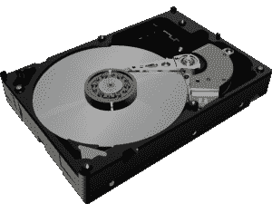

# 磁盘存储器

> 原文:[https://www.geeksforgeeks.org/magnetic-disk-memory/](https://www.geeksforgeeks.org/magnetic-disk-memory/)

**磁盘**是二级存储器的一种，它是一种覆盖有磁性涂层的扁平圆盘，用于保存信息。它用于存储各种程序和文件。一个方向上的极化信息用 1 表示，反之亦然。方向由 0 表示。

磁盘比内存便宜，可以存储大量数据，但由于二级内存，数据访问速度比主存慢。数据可以在磁盘存储器中修改或删除。它还允许随机访问数据。

图–磁盘

以上就是磁盘存储器的各种优缺点。

**优势:-**
这些是经济的内存
数据的轻松直接访问成为可能。
它可以存储大量数据。
数据传输速率比磁带好。
与磁带相比，它不太容易损坏数据。

**缺点:-**
这些比 RAM 便宜，但比磁带存储器贵。
需要干净无尘的环境存放。
这些不适合顺序访问。