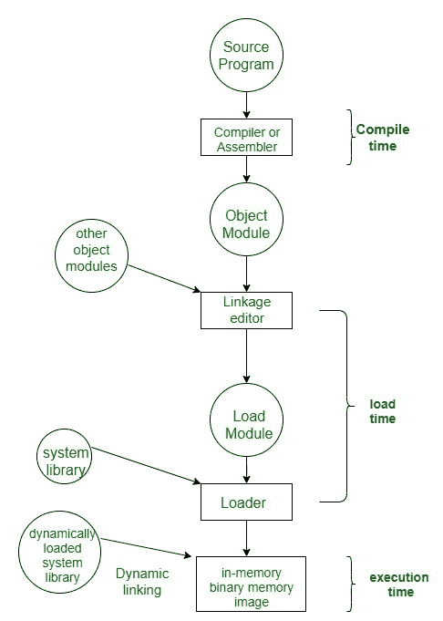
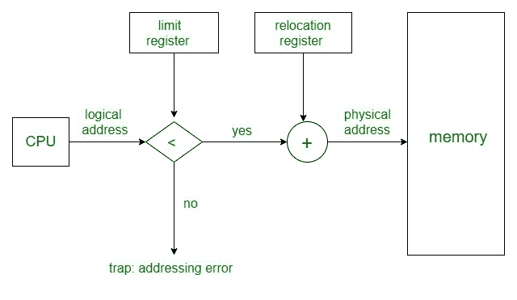

# 内存分配技术|将虚拟地址映射到物理地址

> 原文:[https://www . geesforgeks . org/memory-allocation-technologies-mapping-virtual-address-to-physical-address/](https://www.geeksforgeeks.org/memory-allocation-techniques-mapping-virtual-addresses-to-physical-addresses/)

先决条件:[内存管理系统的要求](https://www.geeksforgeeks.org/requirements-of-memory-management-system/)、[逻辑和物理地址](https://www.geeksforgeeks.org/logical-and-physical-address-in-operating-system/)

**【内存分配技巧:**
为了存储数据和管理进程，我们需要大容量的内存，同时，我们需要尽可能快地访问数据。但是如果我们增加内存的大小，访问时间也会增加，我们知道 CPU 总是为二级内存生成地址，即逻辑地址。但是我们想要访问主存储器，所以我们需要将逻辑地址转换成物理地址。
主内存与用户进程和操作系统交互。所以我们需要高效利用主存。主内存被划分为不重叠的内存区域，称为分区。

主内存可以通过两种方式进行广泛分配–

1.  [连续内存分配](https://www.geeksforgeeks.org/implementation-of-contiguous-memory-management-techniques/)
2.  [非连续内存分配](https://www.geeksforgeeks.org/non-contiguous-allocation-in-operating-system/)

**连续内存分配可以分为两种方式:**

1.  [固定分区方案](https://www.geeksforgeeks.org/fixed-or-static-partitioning-in-operating-system/)
2.  [可变分区方案。](https://www.geeksforgeeks.org/variable-or-dynamic-partitioning-in-operating-system/)

**在连续内存分配中使用不同的分区分配方法–**

1.  [首次安装](https://www.geeksforgeeks.org/first-fit-allocation-in-operating-systems/)
2.  [最佳匹配](https://www.geeksforgeeks.org/best-fit-allocation-in-operating-system/)
3.  [最差配合](https://www.geeksforgeeks.org/worst-fit-allocation-in-operating-systems/)
4.  [下一次配合](https://www.geeksforgeeks.org/program-for-next-fit-algorithm-in-memory-management/)

**非连续内存分配可以分为多种方式:**

1.  [T1】寻呼 T3】](https://www.geeksforgeeks.org/paging-in-operating-system/)
2.  [多级寻呼](https://www.geeksforgeeks.org/multilevel-paging-in-operating-system/)
3.  [倒排分页](https://www.geeksforgeeks.org/inverted-page-table-in-operating-system/)
4.  [分段](https://www.geeksforgeeks.org/segmentation-in-operating-system/)
5.  [分段寻呼](https://www.geeksforgeeks.org/paged-segmentation-and-segmented-paging/)

**MMU(内存管理单元):**
虚拟地址和物理地址之间的运行时映射由称为 MMU 的硬件设备完成。
在内存管理中，操作系统会处理进程，并在磁盘和内存之间移动进程以供执行。它跟踪可用和使用的内存。

**MMU 方案:**

```
 CPU------- MMU------Memory 
```


使用重定位寄存器的动态重定位。

1.  中央处理器将为 eg: 346 生成逻辑地址
2.  MMU 将为 eg: 14000 生成一个重定位寄存器(基寄存器)
3.  在内存中，物理地址位于例如:(346+14000= 14346)

当地址被发送到存储器时，重定位寄存器中的值被加到用户进程生成的每个地址上。用户程序永远看不到真实的物理地址。该程序可以创建指向位置 346 的指针，将其存储在内存中，对其进行操作，并将其与其他地址进行比较——所有这些都类似于数字 346。
用户程序只生成逻辑地址。但是，这些逻辑地址在使用前必须映射到物理地址。

**地址绑定:**
地址绑定是从一个地址空间映射到另一个地址空间的过程。逻辑地址是中央处理器在执行过程中生成的地址，而物理地址是指内存单元中的位置(加载到内存中的位置)。逻辑地址经过 MMU 或地址转换单元的转换。这个过程的输出是 RAM 中代码/数据的适当物理地址或位置。

地址绑定可以通过三种不同的方式完成:

**编译时间–**
如果你知道在编译期间，进程将驻留在内存中的什么地方，那么就会生成一个绝对地址。即在编译期间，物理地址被嵌入到程序的可执行文件中。将可执行文件作为进程加载到内存中非常快。但是，如果生成的地址空间被其他进程占用，那么程序就会崩溃，需要重新编译程序来改变地址空间。

**加载时间–**
如果在编译时不知道进程将驻留在哪里，那么将生成一个可重定位的地址。加载程序将可重定位地址转换为绝对地址。加载程序将主内存中进程的基址添加到所有逻辑地址中，以生成一个绝对地址。在这种情况下，如果进程的基址改变，那么我们需要再次重新加载进程。

**执行时间–**
指令在内存中，由中央处理器处理。此时可以分配和/或解除分配额外的存储器。如果在执行过程中可以将一个进程从一个内存移动到另一个内存，则使用此选项(动态链接-在加载或运行时完成的链接)。例如——压实。



**将虚拟地址映射到物理地址:**
在 Contiguous memory allocation 中，将虚拟地址映射到物理地址并不是一件难事，因为如果我们从辅助内存中取出一个进程，并将其复制到主内存中，这些地址将以连续的方式存储，因此如果我们知道该进程的基址，就可以找出下一个地址。

内存管理单元是两个寄存器的组合–

1.  基本寄存器(重定位寄存器)
2.  极限寄存器。

**基址寄存器–**包含进程的起始物理地址。
**限制寄存器**-提到相对于进程所占区域的基址的限制。

由中央处理器产生的逻辑地址首先由限制寄存器检查，如果产生的逻辑地址的值小于限制寄存器的值，则存储在重定位寄存器中的基址被添加到逻辑地址中，以获得存储单元的物理地址。
如果逻辑地址值大于限制寄存器，则 CPU 陷阱到 OS，OS 给出致命错误终止程序。



在非连续内存分配中，进程可以分配到可用空间的任何位置。非连续内存分配中的地址转换很困难。
在非连续内存分配中有几种用于地址转换的技术，如[](https://www.geeksforgeeks.org/paging-in-operating-system/)[多级分页](https://www.geeksforgeeks.org/multilevel-paging-in-operating-system/)[反向分页](https://www.geeksforgeeks.org/inverted-page-table-in-operating-system/)[分段](https://www.geeksforgeeks.org/segmentation-in-operating-system/)[分段分页](https://www.geeksforgeeks.org/paged-segmentation-and-segmented-paging/) 。这些技术需要不同的数据结构和硬件支持，比如 TLB。