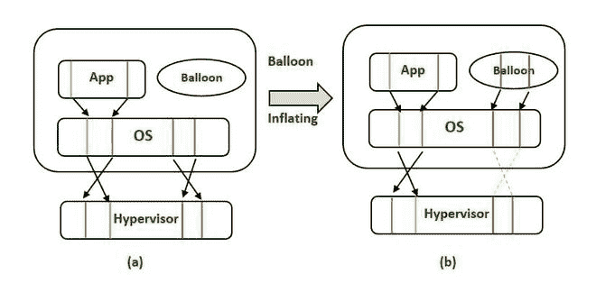
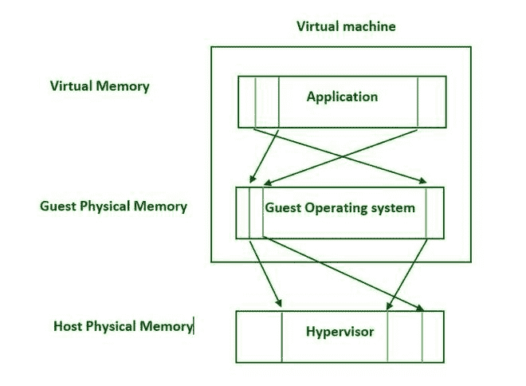

# 操作系统内存膨胀

> 原文:[https://www.geeksforgeeks.org/memory-ballooning-in-os/](https://www.geeksforgeeks.org/memory-ballooning-in-os/)

**内存膨胀:**
内存膨胀是大多数虚拟化平台的一个特性，目的是更有效地利用虚拟服务器的物理内存。内存膨胀是现代虚拟化数据存储体系结构的一个关键组成部分。由于物理和虚拟资产都需要内存资源，因此需要各种方法来申请、释放和回收内存。

内存膨胀是一种利用虚拟机内存的常见虚拟化技术。内存膨胀是大多数虚拟化平台中的内存管理功能，它允许主机系统通过利用或回收以前分配给各种虚拟机的未使用内存来人工扩展其内存池。

这是通过在客户操作系统上安装气球驱动程序来实现的，当虚拟机管理程序需要通过气球回收内存时，虚拟机管理程序会与之通信。

你可以认为这是在更大程度上“拉伸”常规的身体记忆。这使得具有 32 GB 内存的服务器能够承载多达 64 GB 的虚拟机(实际里程将因工作负载而异)。

**什么是虚拟机管理程序？**
内存膨胀发生在虚拟化虚拟机管理程序的环境中。虚拟机管理程序是通过为软件提供虚拟抽象层来允许虚拟机运行的技术。

如今，几种虚拟机管理程序技术被广泛使用，包括 VMware ESXi、微软 Hyper-V 以及开源 Xen 和 KVM 技术。每个虚拟机管理程序都可以用来启用来宾虚拟机，这些虚拟机以虚拟化的方式运行操作系统和应用程序。

虚拟机管理程序在运行的来宾虚拟机之间使用驱动程序来处理各种需求，例如虚拟 CPU、磁盘空间和内存等资源限制。气球驱动程序跨虚拟机运行，允许虚拟机管理程序将内存从一个虚拟机重新分配给另一个虚拟机。

**内存膨胀的过程:**
理解虚拟机管理程序如何工作与理解内存膨胀过程密不可分。虚拟机管理程序抽象有限的系统资源，然后将它们分配给正在运行的虚拟机进程。

*   **主机物理内存–**
    下面的服务器或云平台安装了一定数量的系统内存，这代表了可用内存的绝对总量。
*   **来宾物理内存–**
    为了向正在运行的虚拟机提供资源，虚拟机管理程序获得了主机物理内存的一部分。虚拟机管理程序可用的最大内存量称为来宾物理内存。
*   **来宾虚拟内存–**
    虚拟机管理程序将其总内存资源的一部分分配给正在运行的来宾虚拟机作为虚拟内存。

在内存膨胀模型中，例如，一个虚拟机分配了 8 GB 的来宾虚拟内存，但没有使用它，可以将其中一些内存重新分配给另一个需要额外内存的运行虚拟机。

气球驱动程序在内存从一个虚拟机移动到下一个虚拟机时跟踪内存分配。内存膨胀的主要目标是为虚拟机提供所需的内存，以满足进程或应用程序需求的激增。即使通常没有足够的内存分配给它，也会出现这种情况。

**内存膨胀问题:**

1.  **高气球内存利用率–**
    高利用率是可能出现的潜在问题之一。气球驱动程序可能会消耗大量内存，以至于虚拟机管理程序没有足够的资源以最高性能运行。

2.  **性能–**
    如果多个虚拟机同时请求激增的内存，随着虚拟机管理程序通过内存交换技术获取资源，CPU 和物理磁盘的使用可能会激增，从而进一步降低整体系统性能。

**记忆膨胀的重要性:**

1.  **资源优化–**
    内存膨胀从当前没有使用所有可用内存的虚拟机中获取内存，然后将未使用的内存重新分配给需要额外资源的虚拟机。

2.  **内存可用性–**
    内存膨胀与因需求或进程激增而无法为虚拟机提供所需资源相反，它会在需要时提供更多内存。

3.  **更低的成本–**
    内存效率降低了部署更多物理服务器或分配更多物理内存的需求，这将带来额外的运营和能源成本。