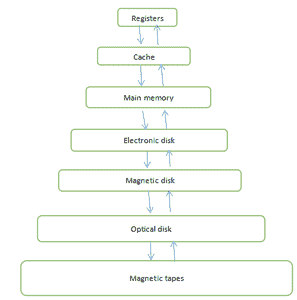
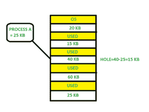
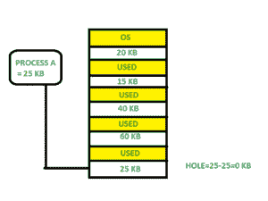
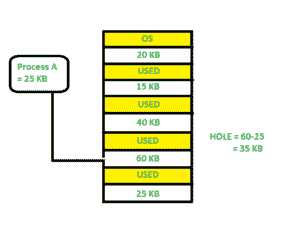

# 操作系统中的内存管理

> 原文:[https://www . geesforgeks . org/操作系统内存管理/](https://www.geeksforgeeks.org/memory-management-in-operating-system/)

术语内存可以定义为特定格式的数据集合。它用于存储指令和已处理的数据。存储器由一个大的数组或一组字或字节组成，每个字或字节都有自己的位置。计算机系统的主要动机是执行程序。这些程序以及它们访问的信息在执行过程中应该在主存储器中。中央处理器根据程序计数器的值从内存中获取指令。

为了实现一定程度的多道程序设计和内存的适当利用，内存管理非常重要。内存管理方法有很多，反映了各种方法，每种算法的有效性取决于情况。

> 在这里，我们将讨论以下内存管理主题:
> 
> *   什么是主存
> *   什么是内存管理
> *   为什么需要内存管理
> *   逻辑地址空间和物理地址空间
> *   静态和动态负载
> *   静态和动态链接
> *   交换
> *   连续内存分配
>     *   存储器分配
>         *   第一次拟合
>         *   最佳配合
>         *   最不合身
>     *   分裂
>         *   内部碎片
>         *   外部碎片
>     *   分页

**现在之前，我们开始内存管理让我们知道什么是主内存。**

### 什么是主内存:

主存储器对现代计算机的运行至关重要。主存储器是一个大的字或字节数组，大小从几十万到几十亿不等。主内存是由中央处理器和输入/输出设备共享的快速可用信息的存储库。主存储器是处理器有效利用程序和信息时保存它们的地方。主存储器与处理器相关联，因此将指令和信息移入和移出处理器的速度极快。主存储器也被称为随机存取存储器。该存储器是易失性存储器。当电源中断时，内存会丢失数据。



图 1:内存层次结构

### 什么是内存管理:

在多道程序计算机中，操作系统驻留在一部分内存中，其余部分由多个进程使用。在不同进程之间细分内存的任务称为内存管理。内存管理是操作系统中的一种方法，用于在进程执行期间管理主内存和磁盘之间的操作。内存管理的主要目的是实现内存的高效利用。

### 为什么需要内存管理:

*   在进程执行前后分配和取消分配内存。
*   跟踪进程使用的内存空间。
*   尽量减少碎片问题。
*   为了正确利用主存。
*   在执行过程中保持数据完整性。

**现在我们讨论逻辑地址空间和物理地址空间的概念:**

### 逻辑和物理地址空间:

**逻辑地址空间:**CPU 产生的地址称为“逻辑地址”。它也被称为虚拟地址。逻辑地址空间可以定义为进程的大小。逻辑地址可以改变。

**物理地址空间:**存储器单元看到的地址(即加载到存储器的存储器地址寄存器中的地址)通常被称为“物理地址”。物理地址也称为真实地址。对应于这些逻辑地址的所有物理地址的集合称为物理地址空间。物理地址由内存管理单元计算。从虚拟地址到物理地址的运行时映射由硬件设备内存管理单元完成。物理地址始终保持不变。

### 静态和动态负载:

将进程加载到主内存是由加载程序完成的。有两种不同类型的加载:

*   **静态加载** :-将整个程序加载到固定地址。它需要更多的内存空间。
*   **动态加载** :-一个进程的整个程序和所有数据必须在物理内存中，进程才能执行。因此，进程的大小受限于物理内存的大小。为了获得适当的内存利用率，使用了动态加载。在动态加载中，例程在被调用之前不会被加载。所有例程都以可重定位的加载格式驻留在磁盘上。动态加载的优点之一是从不加载未使用的例程。当需要大量代码来有效处理时，这种加载非常有用。

### 静态和动态链接:

为了执行链接任务，使用了链接器。链接器是一个程序，它获取一个或多个由编译器生成的目标文件，并将它们组合成一个可执行文件。

*   **静态链接:**在静态链接中，链接器将所有必要的程序模块组合成单个可执行程序。因此不存在运行时依赖性。有些操作系统只支持静态链接，在静态链接中，系统语言库被视为任何其他对象模块。
*   **动态链接:**动态链接的基本概念类似于动态加载。在动态链接中，每个适当的库例程引用都包含“存根”。存根是一小段代码。当存根被执行时，它检查所需的例程是否已经在内存中。如果不可用，则程序将例程加载到内存中。

### 交换:

当一个进程被执行时，它必须已经存在于的记忆中。交换是将进程从主内存临时交换到二级内存的过程，比二级内存快。交换允许运行更多的进程，并且可以一次装入内存。交换的主要部分是传输时间，总时间与交换的内存量成正比。交换也称为转出，转入，因为如果一个优先级较高的进程到达并想要服务，内存管理器可以将优先级较低的进程转出，然后加载并执行优先级较高的进程。在完成较高优先级的工作后，较低优先级的进程在内存中交换回来，继续进行执行进程。


### 连续内存分配:

主内存应该同时支持操作系统和不同的客户端进程。因此，内存分配成为操作系统中的一项重要任务。内存通常分为两个分区:一个用于常驻操作系统，一个用于用户进程。我们通常需要几个用户进程同时驻留在内存中。因此，我们需要考虑如何为输入队列中等待进入内存的进程分配可用内存。在相邻内存分配中，每个进程都包含在一个连续的内存段中。


### 内存分配:

为了获得适当的内存利用率，内存分配必须以高效的方式分配。分配内存最简单的方法之一是将内存分成几个固定大小的分区，每个分区恰好包含一个进程。因此，多道程序设计的程度是通过分区的数量获得的。

**多分区分配**:该方法从输入队列中选择一个进程，加载到空闲分区中。当进程终止时，该分区可用于其他进程。

**固定分区分配:**在这种方法中，操作系统维护一个表，该表指示哪些内存部分可用，哪些被进程占用。最初，所有内存都可供用户进程使用，并被视为一大块可用内存。这种可用的内存被称为“孔”。当进程到达并需要内存时，我们会寻找一个足够大的洞来存储这个进程。如果需求得到满足，我们就分配内存来处理，否则就保留剩余的内存来满足未来的请求。在分配内存时，有时会出现动态存储分配问题，这涉及到如何满足来自空闲孔列表的大小为 n 的请求。这个问题有一些解决方案:

**首次拟合:-**

在第一次装配中，第一个可用的自由孔满足分配的工艺要求。



在此图中，40 KB 内存块是第一个可以存储进程 A(大小为 25 KB)的可用空闲空间，因为前两个块没有足够的内存空间。

**最佳拟合:-**

在最合适的情况下，分配足够大的最小孔来处理需求。为此，我们搜索整个列表，除非列表是按大小排序的。



在这个例子中，首先，我们遍历完整的列表，发现最后一个孔 25KB 是最适合工艺 A(尺寸 25KB)的孔。

与其他内存分配技术相比，这种方法的内存利用率最高。

**最差配合:-** 在最差配合中，分配最大的可用孔进行加工。这种方法会产生最大的剩余孔。



在本例中，进程 A(大小为 25 KB)被分配给最大的可用内存块 60KB。在最糟糕的情况下，内存利用率低是一个主要问题。

### 碎片:

碎片被定义为当进程在执行后从内存中加载和移除时，它会创建一个小的自由洞。这些孔不能被分配给新的进程，因为孔没有被组合或者没有满足进程的内存要求。为了实现一定程度的多道程序设计，我们必须减少内存浪费或碎片问题。在操作系统中，有两种类型的碎片:

**内部碎裂:**

当分配给进程的内存块超过其请求的大小时，就会发生内部碎片。因此，一些未使用的空间被剩余，并产生内部碎片问题。

示例:假设有一个固定的分区用于内存分配，内存中有不同大小的块 3MB、6MB 和 7MB 空间。现在，一个 2MB 大小的新进程 p4 出现了，对内存块的需求增加了。它获得了一个 3MB 的内存块，但是 1MB 的内存块是一种浪费，并且它也不能被分配给其他进程。这叫做内部分裂。

**外部碎片:**

在外部碎片中，我们有一个空闲的内存块，但我们不能将其分配给进程，因为块不是连续的。

示例:假设(考虑上面的示例)三个进程 p1、p2、p3 分别具有 2MB、4MB 和 7MB 的大小。现在，他们分别分配了大小为 3MB、6MB 和 7MB 的内存块。分配完进程 p1 后，进程 p2 留下了 1MB 和 2MB。假设一个新的进程 p4 来了，需要一个可用的 3MB 内存块，但是我们不能分配它，因为空闲内存空间不是连续的。这被称为外部碎片。

第一个和最适合的内存分配系统都会受到外部碎片的影响。为了克服外部碎片问题，使用了压缩。在压缩技术中，所有的空闲内存空间组合在一起形成一个大块。所以，这个空间可以被其他进程有效利用。

外部碎片的另一个可能的解决方案是允许进程的逻辑地址空间不连续，从而允许进程在物理内存可用的情况下被分配物理内存。

### 分页:

分页是一种内存管理方案，无需连续分配物理内存。这个方案允许进程的物理地址空间是非连续的。

*   逻辑地址或虚拟地址(以位表示):由中央处理器产生的地址
*   逻辑地址空间或虚拟地址空间(用字或字节表示):程序产生的所有逻辑地址的集合
*   物理地址(以位表示):内存单元上实际可用的地址
*   物理地址空间(用字或字节表示):对应于逻辑地址的所有物理地址的集合

**示例:**

*   如果逻辑地址= 31 位，那么逻辑地址空间= 2 <sup>31</sup> 字= 2 G 字(1 G = 2 <sup>30</sup>
*   如果逻辑地址空间= 128 M 字= 2 <sup>7</sup> * 2 <sup>20</sup> 字，则逻辑地址=日志 <sub>2</sub> 2 <sup>27</sup> = 27 位
*   如果物理地址= 22 位，那么物理地址空间= 2 <sup>22</sup> 字= 4 M 字(1 M = 2 <sup>20</sup> )
*   如果物理地址空间= 16 M 字= 2 <sup>4</sup> * 2 <sup>20</sup> 字，那么物理地址=日志 <sub>2</sub> 2 <sup>24</sup> = 24 位

从虚拟地址到物理地址的映射是由作为硬件设备的内存管理单元完成的，这种映射被称为分页技术。

*   物理地址空间在概念上分为几个固定大小的块，称为**帧**。
*   逻辑地址空间也被分割成固定大小的块，称为**页**。
*   页面大小=框架大小

让我们考虑一个例子:

*   物理地址= 12 位，那么物理地址空间= 4 K 个字
*   逻辑地址= 13 位，那么逻辑地址空间= 8 K 个字
*   页面大小=框架大小= 1 K 字(假设)


中央处理器产生的地址分为

*   **页码(p):** 在逻辑地址空间或页码中表示页面所需的位数
*   **页偏移(d):** 在逻辑地址空间的页或页大小中表示特定字所需的位数或页或页偏移的字数。

物理地址分为

*   **帧号(f):** 表示物理地址空间帧或帧号帧所需的位数
*   **帧偏移(d):** 在物理地址空间的帧或帧大小中表示特定字所需的位数或帧或帧偏移的字数。

页表的硬件实现可以通过使用专用寄存器来完成。但是只有当页表很小时，页表寄存器的使用才是令人满意的。如果页表包含大量条目，那么我们可以使用 TLB(翻译后备缓冲器)，一种特殊的、小的、快速的查找硬件缓存。

*   TLB 是一种联想式的高速记忆。
*   TLB 的每个条目由两部分组成:标签和值。
*   当使用该内存时，一个项目将同时与所有标签进行比较。 如果找到物品，则返回对应的值。


```
Main memory access time = m
If page table are kept in main memory,
Effective access time = m(for page table) + m(for particular page in page table)
```


更多详情，必读 [**操作系统**分页](https://www.geeksforgeeks.org/paging-in-operating-system/)