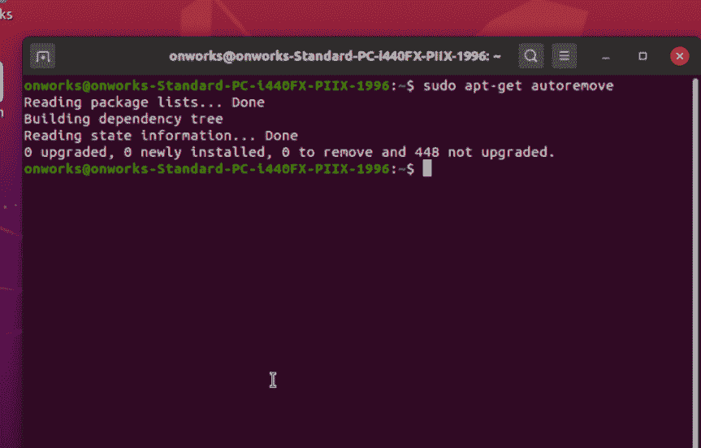
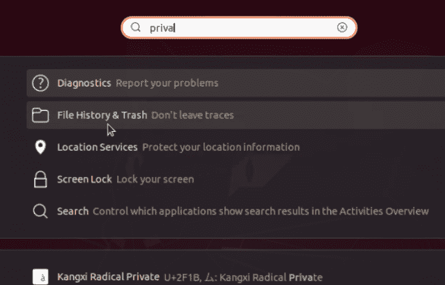
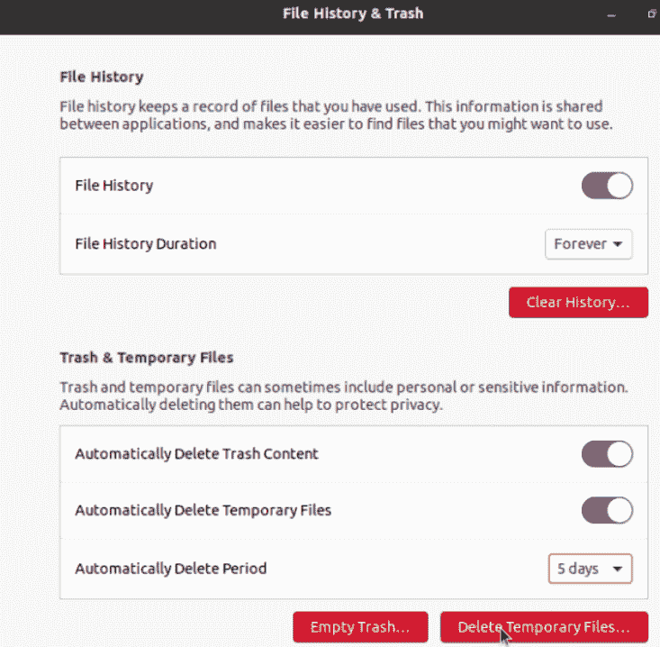
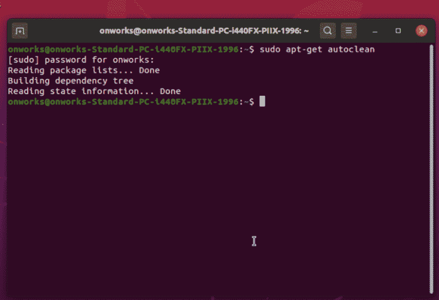

# 从 Ubuntu 清除临时文件的方法

> 原文:[https://www . geeksforgeeks . org/methods-to-clean-暂存-files-from-ubuntu/](https://www.geeksforgeeks.org/methods-to-clean-temporary-files-from-ubuntu/)

在本文中，我们将学习如何从 Ubuntu 中清除临时文件。
我们先来看看到底什么是临时文件。

**临时文件:**
临时文件是在创建或修改文件时为保存信息而创建的文件。
现在我们来看看为什么需要清理或删除临时文件。
应用程序通常将临时文件存储在电脑硬盘上。
它们应该在作业或程序完成时被处理掉。这是因为它在手册中已经过时或保存关闭，导致永久记录。他们并不总是删除自己。

一段时间后，这些文件会开始占用大量空间。如果硬盘空间不足，清理临时文件是释放硬盘空间的好方法。

**现在，让我们讨论一些清理临时文件的方法。**

**方法 1 :**

1.  我们可以使用命令“ ***”来清理临时文件。***
2.  打开终端，键入命令 sudo apt-get autoremove。
3.  系统会提示您输入密码，然后按回车键。
4.  你完蛋了。临时文件被删除。

使用自动移动

**方法二:**

1.  我们可以自动清理临时文件。
2.  在搜索栏中，开始输入**隐私**，然后您将能够看到标签历史和垃圾桶。
3.  点击历史和垃圾。
4.  现在将清除临时文件选项切换为是。
5.  设置清理临时文件的时间段。
6.  你完蛋了。

因此，现在您不需要手动清理您的临时文件，它们将根据您设置的时间段自动清理。
你也可以开启自动清理垃圾文件的选项。

**方法 3 :**

1.  我们可以使用命令“sudo apt-get autoclean”来清理临时文件。
2.  打开终端，键入命令 sudo apt-get autoclean。
3.  系统会提示您输入密码，然后按回车键。
4.  你完蛋了。临时文件被删除。

使用 autoclean 命令