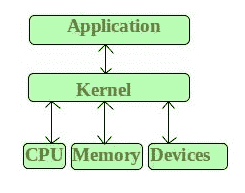
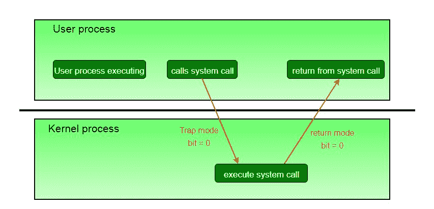
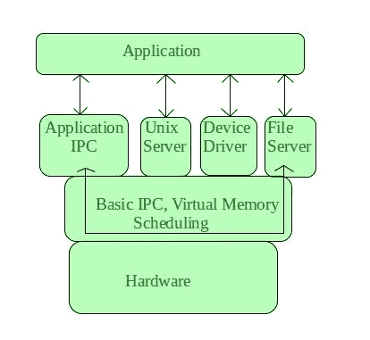

# 操作系统中的微内核

> 原文:[https://www . geesforgeks . org/操作系统中的微内核/](https://www.geeksforgeeks.org/microkernel-in-operating-systems/)

**内核**是操作系统管理系统资源的核心部分。它还充当应用程序和计算机硬件之间的桥梁。它是启动时(引导加载程序之后)加载的第一批程序之一。

**<u>CPU 运行的内核模式和用户模式</u>**
CPU 只有在内核模式下才能执行某些指令。这些指令称为特权指令。它们允许特殊操作的实现，用户程序的执行可以与操作系统的功能或另一个用户程序的活动接口。例如，管理内存保护的指令。

*   当中央处理器在内核中执行时，操作系统将它置于内核模式，这样内核就可以执行一些特殊的操作。
*   当用户程序正在执行时，操作系统将中央处理器置于用户模式，因此用户程序无法与操作系统程序接口。
*   用户级指令不需要特殊权限。例子有添加、推送等。

模式的概念可以扩展到两个以上，需要不止一个支持虚拟化的模式位 CPU 使用这些额外的位之一来指示虚拟机管理器 VMM 何时控制系统。VMM 拥有比普通用户程序更多的特权，但没有完整内核那么多。

系统调用通常以软件中断的形式实现，这使得硬件的中断处理程序将控制转移到适当的中断处理程序，该中断处理程序是操作系统的一部分，在过程中将模式位切换到内核模式。中断处理程序准确地检查产生了哪个中断，如果合适的话检查附加参数(通常通过寄存器传递)，然后调用合适的内核服务例程来处理系统调用请求的服务。

用户程序试图执行非法指令(特权指令或不存在的指令)或访问禁止的内存区域，也会产生软件中断，这些中断被中断处理程序捕获，控制被转移到操作系统，操作系统会发出适当的错误消息，可能会将数据转储到日志(核心)文件供以后分析，然后终止违规程序。

**什么是微内核？**
微内核是内核的分类之一。作为一个内核，它管理所有的系统资源。但是在微内核中，**用户服务**和**内核服务**在不同的地址空间中实现。用户服务保存在**用户地址空间**中，内核服务保存在**内核地址空间**中，这样也减少了内核的大小和操作系统的大小。

它提供最少的进程和内存管理服务。客户端程序/应用程序与运行在用户地址空间的服务之间的通信是通过消息传递建立的，降低了微内核的执行速度。操作系统**保持不受影响**，因为用户服务和内核服务是隔离的，所以如果任何用户服务失败，它不会影响内核服务。因此，它增加了微内核的优势之一。它很容易**扩展**，也就是说，如果要添加任何新的服务，它们将被添加到用户地址空间，因此不需要修改内核空间。它还便携、安全、可靠。

**微内核架构–**
由于内核是操作系统的核心部分，所以它只用于处理最重要的服务。因此，在这种体系结构中，只有最重要的服务在内核中，其余的操作系统服务在系统应用程序中。因此，用户能够与系统应用程序中那些不太重要的服务进行交互。而微内核则全权负责操作系统最重要的服务，它们的命名如下:

*   进程间通信
*   内存管理
*   中央处理器调度

**微内核的优势–**

*   这个内核的架构很小，而且是孤立的，因此它可以更好地运行。
*   系统的扩展更容易，它只是简单地添加到系统应用程序中，而不会干扰内核。

**Eclipse IDE** 是微内核架构的一个很好的例子。

接下来阅读–[单片内核和与微内核](https://www.geeksforgeeks.org/operating-system-monolithic-kernel-key-differences-microkernel/)
的主要区别