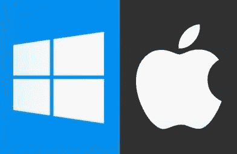
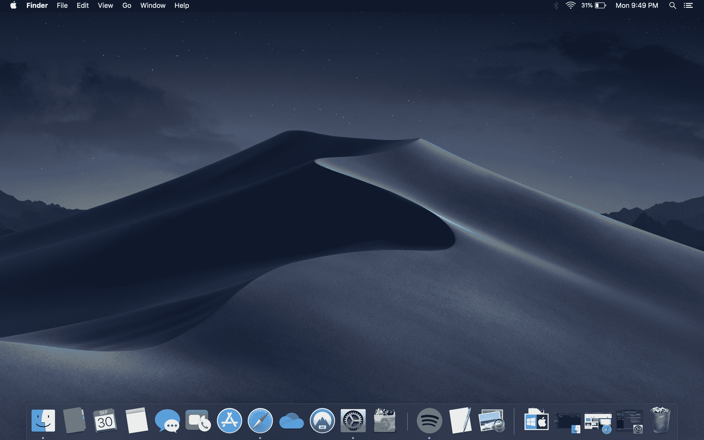
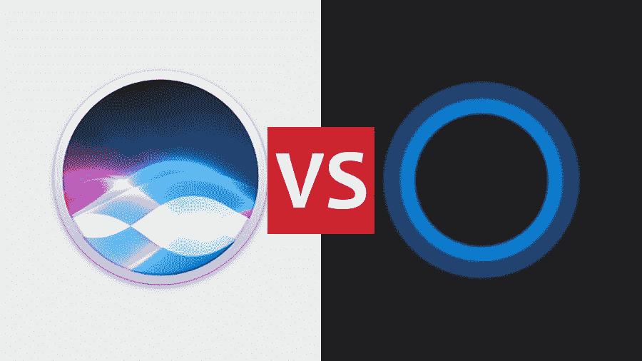
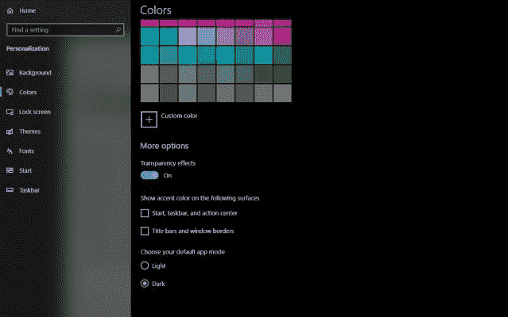
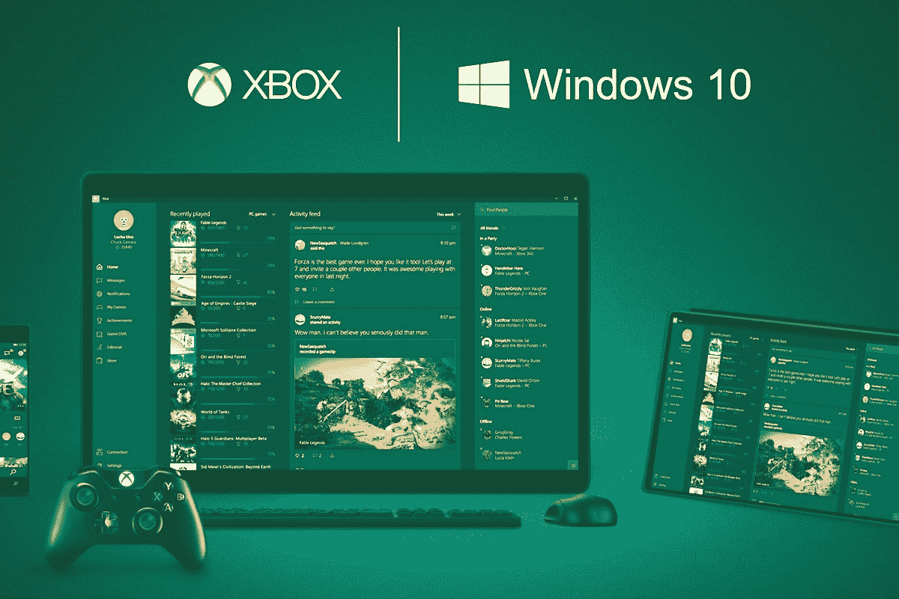

# 微软 Windows (10) Vs macOS (Mojave)

> 原文:[https://www . geesforgeks . org/Microsoft-windows-10-vs-macos-mojave/](https://www.geeksforgeeks.org/microsoft-windows-10-vs-macos-mojave/)

进入 21 世纪，我们都见证了微软视窗系列操作系统和苹果广受好评的苹果电脑的发展。这两者都从它们开始的地方走过了漫长的道路。然而，到目前为止，与苹果电脑相比，微软的视窗系统在世界上占有很大的市场份额。然而，关于哪种操作系统更好的争论从一开始就一直在进行，似乎永远不会结束。考虑到苹果的产品价格很少便宜，这是为了让读者清楚这两者中哪一个是更好的选择。

**设计:**
虽然这些年 Windows 变得越来越圆滑，但从设计、用户界面、实际可用性来说，macOS 确实是更好的选择。苹果是改进现有产品的首选。在使用 macOS 的同时，你会感受到苹果多年来为改进操作系统所付出的努力。另一方面，Windows 已经走了很长很长的路，但仍然是 macOS 很久以前就有的设计特性。归根结底，macOS 用它的坞站打败了 windows。坞站可以从任何地方轻松访问，即使是在全屏应用程序中，相比之下，windows 的“peek”功能我认为用处不大。
从设计角度来看，MacOS 比 windows 稍有优势。

**虚拟助手:**
苹果在 2010 年发布了虚拟助手 Siri，微软在 2015 年晚些时候推出了 Cortana，此举震惊了全球。到 Cortana 发布时，Siri 已经变得更加精致，在两者之间做出选择时，它是每个人的选择。在尝试了这两种方法后，我得出结论，苹果的 Siri 是这里的发展方向。Siri 几乎神奇地与苹果生态系统协同工作，而微软的 Coratana 看起来很普通，没有与任何移动操作系统集成，这在 2019 年也是如此。这对许多人来说将是一个交易破坏者。

当涉及到棘手的问题时，没有一个虚拟助手是完美的，但是 Siri 似乎可以更好地处理问题，而 Cortana 只是带我进入网页。
需要虚拟助手吗？Siri 才是正道。

**黑暗模式:**
随着黑暗模式成为 2019 年的热门话题，苹果和微软在这方面都有着不相上下的表现。随着 macOS Mojave 的发布，苹果为其 macOS 带来了全系统的黑暗模式。微软在后来的 Windows 10 更新中也为其 Windows 带来了黑暗模式。这两种黑暗模式看起来都很精致，它们扩展到了系统应用和其他用户界面元素。
这是一条领带。

**游戏:**
在游戏方面，Windows 碾压苹果的 macOS。苹果商店上有一些普通的游戏，其他开发人员也有一些，在游戏方面，苹果操作系统真的没有什么可提供的。

众所周知，苹果没有为其基本系列的苹果电脑配备强大的内部设备，这导致这些基本系列的苹果电脑变得无法玩游戏。正因为如此，大多数开发者倾向于不为 macOS 发布他们的游戏。我试着在我的 MacBook Pro 上玩了几个游戏(2019 年年中)，体验很糟糕，即使在中等设置下，机器也会掉很多帧。

虽然 WineBottler 和外部 GPU 等选项仍然存在，但我不认为许多人会被这些吸引。此外，微软在 XBOX 和视窗之间的无缝集成也值得称赞。
微软的 Windows 进行游戏回合。

**Finder vs Windows Explorer:**
这归结于个人喜好。虽然 macOS 中的 Finder 感觉比 Windows 资源管理器快得多，但有些人倾向于更喜欢 Windows 资源管理器。我个人在使用 Windows 资源管理器时遇到过一些问题，比如必须准确地点击一个文件的名称才能将其删除，否则该文件将无法被选中，这有点烦人，但是这些年来 Windows 资源管理器已经变得非常好了。

**耐用性和更新:**
我们都知道 macOS 是和苹果的 Macs 和 MacBooks 捆绑在一起的，Windows 大部分可以安装在任何机器上。虽然可以构建黑客软件，但考虑到这是非法的，这并不是一个好主意。苹果的 MacBooks 往往比运行微软视窗系统的机器持续时间长得多，后者往往会随着时间的推移而变慢。这是个人经历。

苹果在软件更新方面做得非常好，例如，即使是 2011 年末，MacBooks 也收到了最后一款 macOS 的更新，macOS High Sierra。

**物有所值:**
说到物有所值，macOS 和苹果的产品被认为更偏向于高端。毫无疑问，微软的视窗系统提供了更好的性价比。
Windows 取此轮。

**隐私:**
苹果对用户隐私的强势掌控，让 iOS 和 macOS 成为目前最安全的操作系统之一。微软当然在隐私方面有所改善，但在用户隐私方面，它与苹果相去甚远。

**结论:**
如果用户隐私、更好的整体体验、好的虚拟助手对你来说很重要，那就去买 macOS。然而，如果你不太关心用户隐私，玩游戏，需要更好的性价比，没有比微软的视窗系列操作系统更好的选择了。