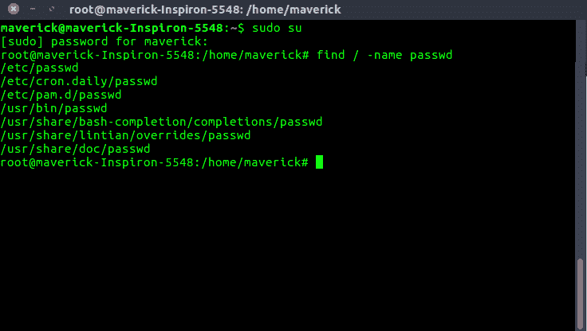

# Linux 中的 mindepth 和 max depth find()命令，用于将搜索限制在特定目录。

> 原文:[https://www . geesforgeks . org/mind epth-maxdepth-Linux-find-command-limiting-search-specific-directory/](https://www.geeksforgeeks.org/mindepth-maxdepth-linux-find-command-limiting-search-specific-directory/)

**如何在 Linux 中限制搜索指定目录？**
在 Linux 中有一个命令可以在目录层次结构中搜索文件，这个目录层次结构被称为 ***【查找】*** 。它通过根据优先级规则从左到右计算给定的表达式来搜索以每个给定的起始点为根的目录树，直到结果已知为止(对于 and 操作，左侧为 false，对于 or 操作，左侧为 true)，此时 find 移动到下一个文件名。如果没有指定起点，`。是假设的。
默认情况下，find 命令递归地沿着整个目录树向下传播，这既耗时又耗费资源。但是可以指定目录遍历的深度(分别是 *mindepth* 和 *maxdepth* )。

**mind epth 和 maxdepth 是什么级别？**

*   **最大深度级别**:在起点以下目录的大多数级别(非负整数)下降。*-最大深度 0* 表示仅将测试和动作应用于起点本身。
*   **注意级别**:不要在低于级别(非负整数)的级别进行任何测试或操作。-mindepth 1 表示处理除起始点以外的所有文件。

**下面给出一些例子来说明如何使用 *mindepth* 和*maxdepth*T5 来指定目录遍历的深度**

*   从根目录开始，在所有子目录下查找 passwd 文件。

    ```
    find / -name passwd
    ```

    ```
    
    ```

*   在根目录下一级找到 passwd 文件。(即根目录—第 1 级，一个子目录—第 2 级)

    ```
    find / -maxdepth 2 -name passwd
    ```

*   在根目录下和两层以下找到 passwd 文件。(即根目录—第 1 级，以及两个子目录—第 2 级和第 3 级)

    ```
    find / -maxdepth 3 -name passwd
    ```

*   查找子目录级别 2 和 4 之间的密码文件。

    ```
    find / -mindepth 3 -maxdepth 5 -name passwd
    ```

**在 linux 中限制搜索目录还有另外两种方式:**

***   可做文件内的字符串查找**

**grep 示例:**

```
You can search the current directory with grep as follows:

To check whether a directory exists or not

Find the directory under root directory.

Find the directory under root and one levels down.

```

5.  **ack Ack is designed as a replacement for 99% of the uses of grep. Ack searches the named input FILEs (or standard input if no files are named, or the file name – is given) for lines containing a match to the given PATTERN. By default, ack prints the matching lines.
    Ack can also list files that would be searched, without actually searching them, to let you take advantage of ack’s file-type filtering capabilities. Ack does not have a max-depth option

    **确认示例:**

    ```
    To check a particular directory under the root

    ```

    参考: [Linux 手册页](http://man7.org/linux/man-pages/man1/find.1.html)

    本文由 **[基什莱·维尔马](https://www.linkedin.com/in/kishlayverma/)** 供稿。如果你喜欢 GeeksforGeeks 并想投稿，你也可以使用[contribute.geeksforgeeks.org](http://contribute.geeksforgeeks.org)写一篇文章或者把你的文章邮寄到 contribute@geeksforgeeks.org。看到你的文章出现在极客博客主页上，帮助其他极客。

    如果你发现任何不正确的地方，或者你想分享更多关于上面讨论的话题的信息，请写评论。**