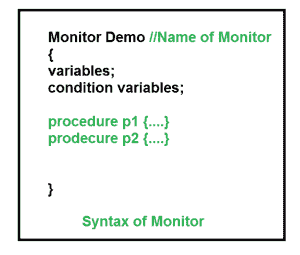

# 进程同步中的监视器

> 原文:[https://www . geesforgeks . org/monitors-in-process-synchronization/](https://www.geeksforgeeks.org/monitors-in-process-synchronization/)

监视器是实现进程同步的方法之一。编程语言支持监视器，以实现进程之间的互斥。例如 Java Synchronized 方法。Java 提供了 wait()和 notify()构造。

1.  它是组合在一种特殊模块或包中的条件变量和过程的集合。
2.  在监视器外部运行的进程不能访问监视器的内部变量，但可以调用监视器的过程。
3.  一次只有一个进程可以在监视器中执行代码。

**语法:**

[](https://media.geeksforgeeks.org/wp-content/cdn-uploads/gq/2015/06/monitors.png)

**条件变量:**
对监视器的条件变量进行两种不同的操作。

```
Wait.
signal.

```

假设我们有 2 个条件变量
**条件 x，y；//声明变量**

**等待操作**
x.wait():暂停对任何条件变量执行等待操作的进程。挂起的进程被放在该条件变量的块队列中。

**注意:**每个条件变量都有其唯一的块队列。

**信号操作**
x.signal():当一个进程对条件变量进行信号操作时，其中一个被阻塞的进程有机会。

```
If (x block queue empty)
  // Ignore signal
else
  // Resume a process from block queue.
```

**Monitor 的优势:**
与使用信号量等技术相比，Monitor 的优势在于使并行编程变得更容易，更不容易出错。

**Monitor 的缺点:**
Monitor 必须作为编程语言的一部分来实现。编译器必须为它们生成代码。这给编译器带来了额外的负担，即必须知道哪些操作系统工具可用于控制对并发进程中关键部分的访问。一些确实支持监视器的语言有 Java、C#、Visual Basic、Ada 和并发 Euclid。

如果您发现任何不正确的地方，或者您想分享更多关于上面讨论的主题的信息，请写评论