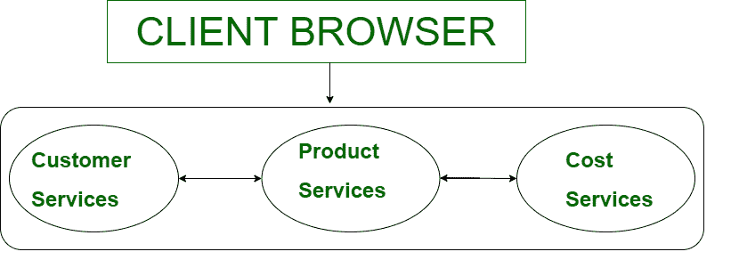

# 单片架构

> 原文:[https://www.geeksforgeeks.org/monolithic-architecture/](https://www.geeksforgeeks.org/monolithic-architecture/)

在学习**微服务**之前，我们一直都知道为什么现在不用单片架构。这将有助于我们更清楚地了解微服务。

**单片架构**就像一个大容器，一个 app 的所有软件组件都是组装紧密耦合的，即每个组件完全相互依赖。

**例:**
我们举一个电商网站的例子——

如示例所示，应用程序提供的所有服务(客户服务、成本服务、产品服务)都是直接连接的。因此，如果我们想改变代码或其他东西，我们也必须改变所有的服务。

**劣势:**

1.  **大型复杂应用:**
    对于单片中的大型复杂应用，由于相互依赖，维护起来比较困难。
2.  **缓慢开发:**
    这是因为，要修改一个应用程序，我们必须重新部署整个应用程序，而不是更新部分。它需要更多的时间或缓慢的发展。
3.  **不可伸缩:**
    应用程序的每个副本都会访问漏洞数据，这使得内存消耗更大。我们无法独立缩放每个组件。
4.  **不可靠:**
    如果一个服务宕机，那么它会影响应用程序提供的所有服务。这是因为应用程序的所有服务都是相互连接的。
5.  **呆板:**
    真的很难采用新技术。这是因为我们必须改变孔应用技术。