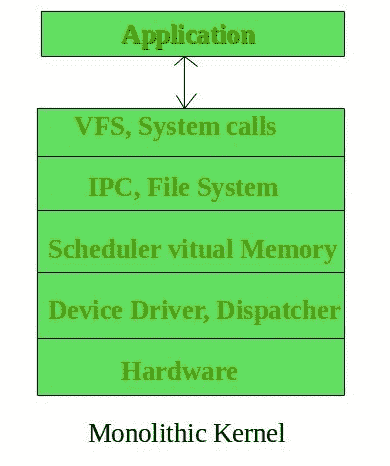
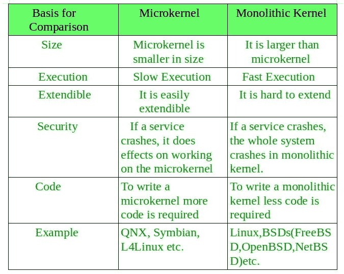

# 单片内核和与微内核的关键区别

> 原文:[https://www . geesforgeks . org/monolithic-kernel-and-key-differences-from-micro kernel/](https://www.geeksforgeeks.org/monolithic-kernel-and-key-differences-from-microkernel/)

除了微内核，**单片内核**是内核的另一个分类。和微内核一样，这个也管理应用和硬件之间的系统资源，但是**用户服务**和**内核服务**是在同一个地址空间下实现的。它增加了内核的大小，从而也增加了操作系统的大小。

该内核通过系统调用提供 CPU 调度、内存管理、文件管理等操作系统功能。由于两种服务都在相同的地址空间下实现，这使得操作系统的执行速度更快。

下面是单片内核的图示:

如果任何服务失败，整个系统就会崩溃，这是这个内核的缺点之一。如果用户添加新服务，整个操作系统需要修改。

**单片内核的优势–**

*   拥有单片内核的主要优势之一是，它通过系统调用提供 CPU 调度、内存管理、文件管理和其他操作系统功能。
*   另一个是它是一个完全在单个地址空间中运行的大型进程。
*   它是一个单一的静态二进制文件。一些基于单片内核的操作系统的例子有 Unix、Linux、开放虚拟机、XTS-400、z/TPF。

**单片内核的缺点–**

*   单一内核的一个主要缺点是，如果任何一个服务失败了，就会导致整个系统失败。
*   如果用户必须添加任何新服务。用户需要修改整个操作系统。

**单片内核和微内核的主要区别–**

