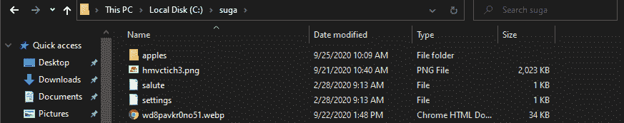
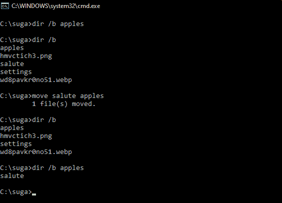
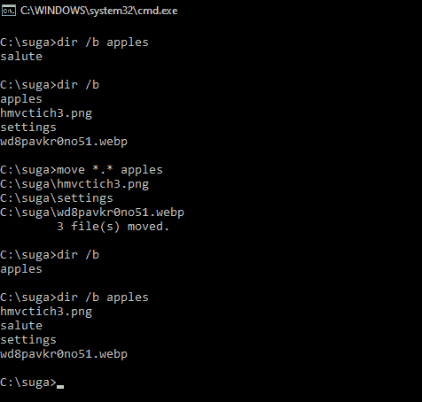
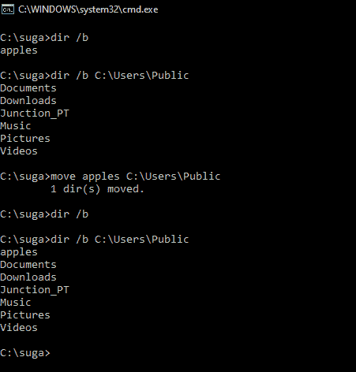

# 移动 cmd 命令

> 原文:[https://www.geeksforgeeks.org/move-cmd-command/](https://www.geeksforgeeks.org/move-cmd-command/)

移动是在 Windows 命令解释器(cmd)中找到的内部命令，用于移动文件和文件夹/目录。该命令比常规移动操作更健壮，因为它允许通过在源路径中包含通配符来进行模式匹配。

该命令是一个非常通用的命令，在几乎所有操作系统中都可以使用(以这样或那样的形式)(使用不同的别名)。在本文中，我们将学习移动命令，并了解它的各种用途/应用。

**命令描述:**

```
MOVE [/Y | /-Y] [drive:][path]dirname1 dirname2 
```

*   **【驱动器:】【路径】文件名 1–**
    指定要移动的文件的位置和名称。

*   **目的地–**
    指定文件的新位置。目标可以由驱动器号和冒号、目录名或其组合组成。如果您只移动一个文件，如果您想在移动文件时重命名该文件，也可以包含一个文件名。*   **【驱动器:】【路径】目录名 1–**
    指定要重命名的目录。*   **目录名 2–**
    指定目录的新名称。*   **/Y–**
    取消确认是否要覆盖现有目标文件的提示。*   **/Y –**
    Causes prompting to confirm you want to overwrite an existing destination file.

    开关 **/Y** 可能存在于 COPYCMD 环境变量中。这可以在命令行上用/-Y 覆盖。默认为覆盖时提示，除非从批处理脚本中执行移动命令。执行**移动/？**在 cmd 中。

    上面的文字刚开始有点隐晦，但命令确实很基础，遵循了最小蓝图。

    **语法:**

    ```
    MOVE [options] (Source) (Target) 
    ```

    **键:**

    *   **【选项】–**
        一个可选标志，用/Y 或/-Y 表示，用于抑制覆盖文件的确认提示。默认为覆盖时提示，除非从批处理脚本中执行移动命令。
    *   **(来源)–**
        用于移动文件的路径。此路径可以包含通配符(*？)在小路上。如果要移动的文件多于，则使用通配符。
    *   **(目标)–**
        文件新位置的路径。

    **使用命令:**
    在本节中，我们将以下面的目录为例演示移动命令的用法。

    

    **将文件从一个文件夹移动到另一个文件夹:**

    ```
    move source_path destination_path
    ```

    *   **source _ path–**
        是我们愿意移动的文件的路径，destination_path 是我们希望文件移动到的位置。

    **示例:**

    

    *   **目录/b** 命令用于列出目录中的所有文件和文件夹。
    *   在上例中，我们将一个名为 salute 的无扩展名文件从 **C:\suga** 移动到了**C:\ suga \ apple**目录。

    **将多个文件从一个路径移动到另一个路径:**

    ```
    move source_path destination_path
    ```

    *   **source _ path–**
        这是一个包含通配符的路径，允许将多个文件作为源。destination_path 现在是移动文件所在目录的路径(不应包含通配符)。

    **示例:**

    

    *   在上面的例子中，我们已经移动了 C:\suga 文件夹中与模式*匹配的所有文件。*到 C:\ suga \ apple 目录。
    *   应该注意，source_path 中的通配符应该与文件匹配，否则会导致 source_path 为空，并出现后续错误。

    **将目录从一个路径移动到另一个路径:**

    ```
    move source_dir_path Destination_dir_path
    ```

    *   **source _ dir _ path–**
        它是我们要移动到的目录的路径，destination_dir_path 是它要移动到的新位置。

    **示例:**

    

    *   在上面的例子中，我们已经将**C:\ suga \ apple**目录移动到了 **C:\Users\Public** 目录。
    *   可以使用将多个文件从一个路径移动到另一个路径中所述的方法来移动多个目录(只需稍加修改即可用于目录)。

    **将文件移动到另一个已经存在同名文件的文件夹:**

    有两种方法可以解决这种情况–

    1.  中止移动过程。
    2.  继续移动过程，用新文件覆盖现有文件。

    默认情况下，遇到名称冲突时，移动命令会提示用户，询问他是要用新文件重写现有文件，还是停止移动过程(通过“是/否”提示)。要中止移动过程，用户只需在提示输入中输入 N，说明文件不应被覆盖。搜索用户输入(覆盖文件)的提示如下

    ```
    Overwrite {full_file_path}? (Yes/No/All): 
    ```

    当用户在提示中输入 N 时，输出如下所示–

    ```
    Overwrite {full_file_path}? (Yes/No/All): N

    0 file(s) moved.
    ```

    当用户在提示中输入“是”时，输出显示如下

    ```
    Overwrite {full_file_path}? (Yes/No/All): Y

    1 file(s) moved.
    ```

    要通过覆盖现有文件来继续移动过程(在所有名称冲突中)，需要在命令中添加一个 **/Y** 开关，如下所示–

    ```
    move /Y source_path destination_path  
    ```