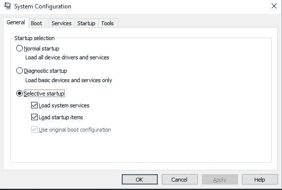

# MSConfig 完整表单

> 原文:[https://www.geeksforgeeks.org/msconfig-full-form/](https://www.geeksforgeeks.org/msconfig-full-form/)

**MSConfig** 代表**微软系统配置实用程序**。它是执行微软配置实用程序(Windows 版本< Vista)或系统配置(Vista 之后的所有 Windows 操作系统)的别名。它是 windows 启动过程中的故障排除工具。Msconfig 是在 Windows 98 中引入的，此后在所有主要的 Windows 操作系统版本中都有出现。它用于在 Windows 操作系统上配置启动过程。该实用程序可用于限制/产生启动服务，可用于禁用启动程序，还可用于更改系统启动参数。

#### 正在启动 MSConfig

**第一步:**在桌面时，按热键`**Win + R**`打开*运行*窗口。

**第二步:**在前述提示的文本框中输入`msconfig`，按回车键。

**第三步:**应该会打开一个名为**系统配置**的窗口，如图所示

#### 优势

*   可用于安全模式引导，仅允许在启动时加载选择性的应用程序或驱动程序，从而允许诊断任何与启动相关的问题
*   通过禁用**引导**标签中的某些设置，可用于启用快速启动
*   提供了一种简单的方法来访问一些窗口功能，如*更改 UAC 设置、事件查看器、命令提示符、系统还原*等。
*   可用于指定引导时/引导后使用的资源数量。
*   可用于解决与启动相关的问题

#### 不足之处

*   Windows 操作系统较新版本上的 **Msconfig** 包含某些过时的功能，例如**启动选项卡**
*   可以从**服务**选项卡中禁用*基本*微软服务，这可能会进一步导致操作系统不稳定
*   可以从**启动**或**服务**选项卡禁用某些设备驱动程序，这可能会导致设备出现故障。《出埃及记》可以从 **msconfig** 禁用*图形驱动程序*服务，导致驱动程序在启动时无法初始化。这导致启动时只有基本驱动程序或没有驱动程序，这可能导致某些功能无法正常工作，例如亮度调节。
*   **msconfig** 的某些特性是短暂的，因此它们只存在于某个版本的 **msconfig** 上。《出埃及记》Windows ME 上的 MSConfig 有一个名为*环境变量*的选项卡，用户可以在其中访问、修改或删除其操作系统的非易失性环境变量。但是这个特性在最近的实用程序迭代中已经找不到了。

**Msconfig** 本身不会对 OS 造成任何伤害。相反，它是一个无可挑剔的实用程序，用于解决与启动相关的问题，甚至有助于访问某些基本的 windows 功能，但应谨慎使用**。**