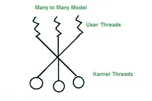
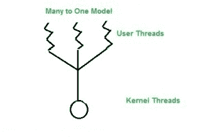
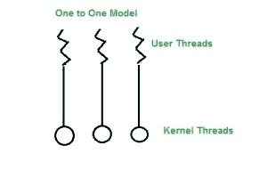

# 流程管理中的多线程模型

> 原文:[https://www . geesforgeks . org/多线程-进程中模型-管理/](https://www.geeksforgeeks.org/multi-threading-models-in-process-management/)

多线程——是多个线程同时执行的过程。

许多操作系统以组合方式支持内核线程和用户线程。这种系统的例子是 Solaris。多线程模型有三种类型。

```
Many to many model.
Many to one model.
one to one model.
```

**多对多模型**

在这个模型中，我们有多个用户线程复用到相同或更少数量的内核级线程。内核级线程的数量是特定于机器的，这个模型的优点是如果一个用户线程被阻塞，我们可以将其他用户线程调度到其他内核线程。因此，如果特定线程被阻塞，系统不会阻塞。

它是最好的多线程模型。



**多对一模式**

在这个模型中，我们有多个用户线程映射到一个内核线程。在这个模型中，当用户线程进行阻塞系统调用时，整个进程都会阻塞。由于我们一次只有一个内核线程和一个用户线程可以访问内核，所以多个线程不能同时访问多处理器。

线程管理是在用户级别完成的，因此效率更高。



**一对一模型**
在这个模型中，内核和用户线程之间是一对一的关系。在这个模型中，多个线程可以在多个处理器上运行。这个模型的问题是创建一个用户线程需要相应的内核线程。

由于每个用户线程连接到不同的内核，如果任何用户线程进行阻塞系统调用，其他用户线程不会被阻塞。



如果发现有不正确的地方，请写评论，或者想分享更多关于以上讨论话题的信息