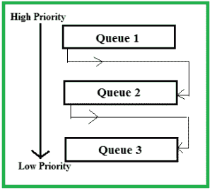

# 多级反馈队列调度(MLFQ) CPU 调度

> 原文:[https://www . geesforgeks . org/多级-反馈-队列-调度-mlfq-CPU-调度/](https://www.geeksforgeeks.org/multilevel-feedback-queue-scheduling-mlfq-cpu-scheduling/)

**先决条件–**[CPU 调度](https://www.geeksforgeeks.org/gate-notes-operating-system-process-scheduling/)、[多级队列调度](https://www.geeksforgeeks.org/operating-system-multilevel-queue-scheduling/)
该调度类似于多级队列(MLQ)调度，但在此过程中可以在队列之间移动。**多级反馈队列调度(MLFQ)** 不断分析进程的行为(执行时间)，并根据其改变优先级。现在，看下面的图表和解释来正确理解它。

现在让我们假设队列 1 和 2 分别遵循时间量为 4 和 8 的循环，队列 3 遵循 FCFS。MFQS 的一个实现如下–

1.  当一个进程开始执行时，它首先进入队列 1。
2.  在队列 1 中，进程执行 4 个单元，如果它在这 4 个单元中完成，或者它在这 4 个单元中为输入/输出操作提供了中央处理器，则该进程的优先级不会改变，如果它再次进入就绪队列，则它再次在队列 1 中开始执行。
3.  如果队列 1 中的进程没有在 4 个单元内完成，那么它的优先级会降低，并转移到队列 2。
4.  以上第 2 点和第 3 点对于队列 2 进程也是正确的，但是时间量是 8 个单位。在一般情况下，如果一个进程没有在一个时间段内完成，那么它被转移到较低优先级队列。
5.  在最后一个队列中，进程以 FCFS 方式进行调度。
6.  低优先级队列中的进程只能在高优先级队列为空时执行。
7.  在较低优先级队列中运行的进程被到达较高优先级队列的进程中断。

上面的实现可能有所不同，例如最后一个队列也可以遵循循环调度。

**上述实现中的问题–**由于一些短进程占用了所有的 CPU 时间，较低优先级队列中的进程可能会遭受饥饿。
**解决方案–**一个简单的解决方案是定期提高所有进程的优先级，并将它们全部放入最高优先级队列中。

**这么复杂的调度有什么需求？**

*   首先，它比多级队列调度更灵活。
*   为了优化周转时间，需要像 SJF 这样的算法，这些算法需要进程的运行时间来调度它们。但是进程的运行时间是事先不知道的。MFQS 运行一个时间量子的过程，然后它可以改变它的优先级(如果这是一个漫长的过程)。因此，它从过程的过去行为中学习，然后预测其未来行为。这样，它会先尝试运行一个较短的流程，从而优化周转时间。
*   MFQS 还缩短了响应时间。

**示例–**
考虑一个有 CPU 限制进程的系统，它需要 40 秒的突发时间。使用多级反馈队列调度算法，队列时间量为“2”秒，在每一级增加“5”秒。那么进程将被中断多少次，进程将在哪个队列上终止执行？

**解决方案–**
流程 P 总执行时间需要 40 秒。
在队列 1 执行 2 秒，然后中断并转移到队列 2。
在队列 2 执行 7 秒，然后中断并转移到队列 3。
在队列 3 执行 12 秒，然后中断并转移到队列 4。
在队列 4 执行 17 秒，然后中断并转移到队列 5。
在队列 5 中，它执行 2 秒钟，然后完成。
因此，该过程中断 4 次，并在队列 5 上完成。

**优势:**

1.  它更灵活。
2.  它允许不同的进程在不同的队列之间移动。
3.  它通过将等待较低优先级队列时间过长的进程移动到较高优先级队列来防止饥饿。

**缺点:**

1.  对于最佳调度器的选择，需要一些其他的方法来选择值。
2.  这会产生更多的 CPU 开销。
3.  这是最复杂的算法。

本文由 **Ashish Sharma** 供稿。如果你喜欢 GeeksforGeeks 并想投稿，你也可以使用[write.geeksforgeeks.org](https://write.geeksforgeeks.org)写一篇文章或者把你的文章邮寄到 review-team@geeksforgeeks.org。看到你的文章出现在极客博客主页上，帮助其他极客。

如果你发现任何不正确的地方，或者你想分享更多关于上面讨论的话题的信息，请写评论。