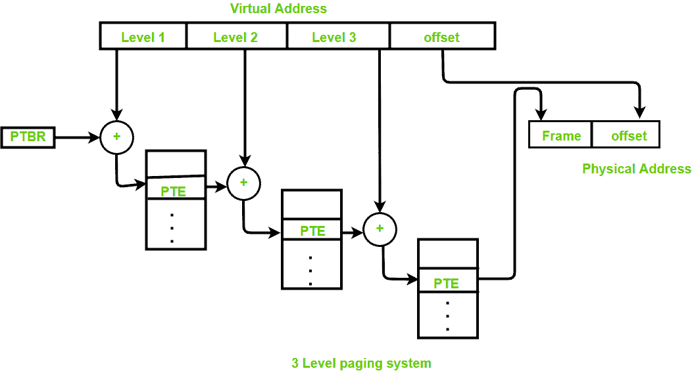
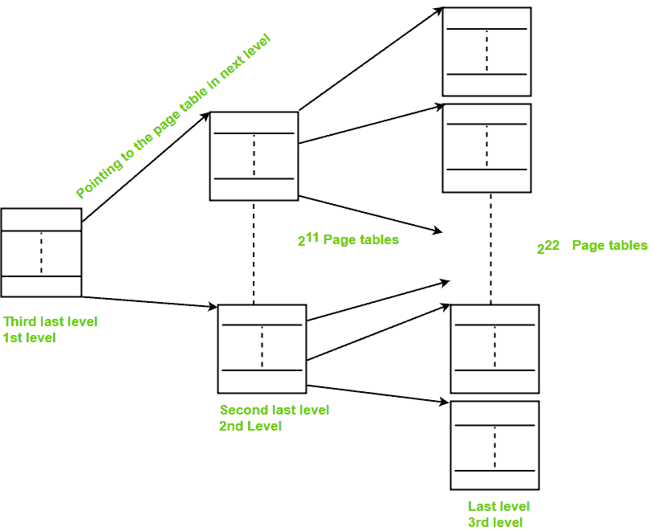

# 操作系统中的多级分页

> 原文:[https://www . geesforgeks . org/多级操作系统分页/](https://www.geeksforgeeks.org/multilevel-paging-in-operating-system/)

先决条件–[分页](https://www.geeksforgeeks.org/operating-system-paging/)
**多级分页**是一种分页方案，由两级或两级以上的页表以分层方式组成。它也被称为分层分页。1 级页表的条目是指向 2 级页表的指针，2 级页表的条目是指向 3 级页表的指针，以此类推。最后一级页面表的条目存储实际的框架信息。一级包含单页表，该表地址存储在页表基址寄存器中。

<u>虚拟地址:</u>


在多级分页中，无论分页的级别如何，所有的页表都将存储在主存储器中。因此需要多次内存访问才能获取页面帧的物理地址。所需的每个级别都有一个访问权限。除外的每个页表条目**最后一级页表条目包含下一级页表的基址。**



参考实际页面框架:

*   对 1 级页表中 PTE 的引用= PTBR 值+虚拟地址中存在的 1 级偏移量。
*   二级页表中对 PTE 的引用=基址(存在于一级 PTE 中)+二级偏移量(存在于 VA 中)。
*   3 级页表中对 PTE 的引用=基址(存在于 2 级 PTE 中)+3 级偏移量(存在于 VA 中)。
*   实际页面帧地址= PTE(存在于第 3 层)。

一般来说，页表的大小将等于页面的大小。

**假设:**
字节可寻址存储器，n 是用于表示虚拟地址的位数。

**重要公式:**

```
Number of entries in page table: 
= (virtual address space size) / (page size) 
= Number of pages

Virtual address space size: 
= 2n B 

Size of page table: 
<>= (number of entries in page table)*(size of PTE) 
```

如果页面表格大小>所需大小，则再创建一级。

**缺点:**
访问地址转换表的额外内存引用会使程序变慢两倍或更多。使用转换后备缓冲器(TLB)通过存储页表条目来加速地址转换。

**例:**
问:考虑一个物理内存为 8GB，页面大小为 8KB，虚拟地址为 46 位的虚拟内存系统。*假设每一页表格都完全适合一页*。如果页表条目大小为 4B，那么需要多少级页表。

**说明:**

```
Page size = 8KB = 213 B
Virtual address space size = 246 B
PTE = 4B = 22 B

Number of pages or number of entries in page table, 
= (virtual address space size) / (page size) 
= 246B/213 B 
= 233 
```

页表的大小，

```
= (number of entries in page table)*(size of PTE) 
= 233*22 B 
= 235 B 
```

为了再创造一个层次，

```
Size of page table > page size

Number of page tables in last level, 
= 235 B / 213 B 
= 222 
```

这些表的基址存储在页表[倒数第二级]中。



```
Size of page table [second last level] 
= 222*22B 
= 224B 
```

要再创建一级，请选择页面表的
大小【第二个最后一级】>页面大小

```
Number of page tables in second last level 
= 224B/213 B 
= 211 
```

这些表的基址存储在页表中[第三个最后一级]

```
Size of page table [third last level] 
= 211*22 B 
= 213 B 
= page size 
```

**要求∴ 3 级。**

参考资料–威廉·史泰林的《操作系统》一书